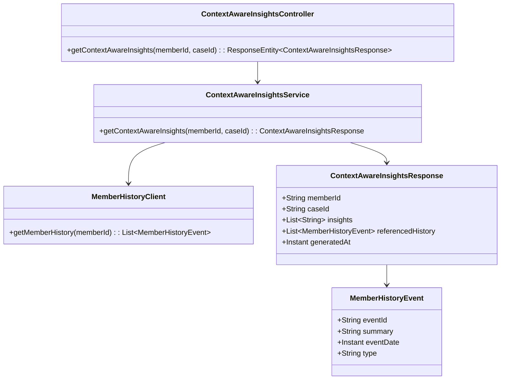
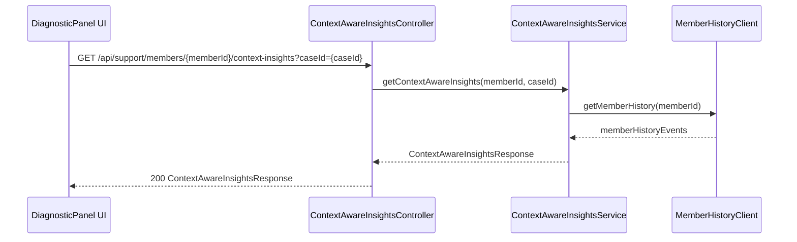
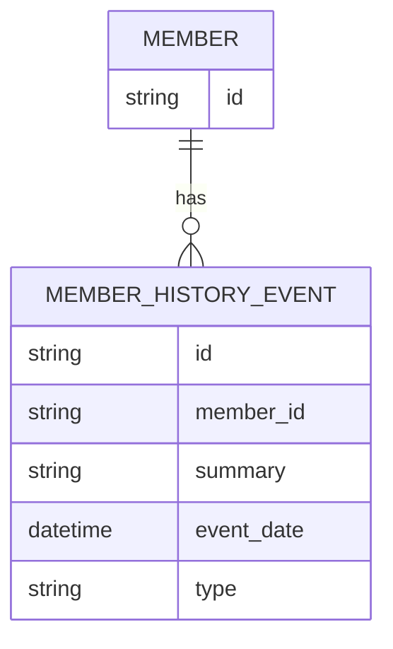

# Repository: APB_Demo
# Branch: intdemotesting2
# Folder: LLD

1. Objective
The objective is to provide AI-generated diagnostic insights that incorporate member history and context for current support issues. The system will fetch and analyze prior interactions and historical data to inform more accurate and personalized resolutions. This ensures that support agents receive context-aware recommendations directly within the diagnostic panel.

2. Backend Spring Boot API Details
2.1. API Model
2.1.1. Common Components/Services
- ContextAwareInsightsService: Service to generate AI insights using member history and current case context.
- MemberHistoryClient: Component responsible for retrieving member historical interactions and flags.

2.1.2. API Details
| Operation                     | REST Method | Type   | URL                                              | Request JSON                                                                                                     | Response JSON                                                                                                                                 |
|-------------------------------|------------|--------|--------------------------------------------------|------------------------------------------------------------------------------------------------------------------|----------------------------------------------------------------------------------------------------------------------------------------------|
| Get context-aware insights    | GET        | Public | /api/support/members/{memberId}/context-insights | N/A                                                                                                              | {"memberId": string, "caseId": string, "insights": [string], "referencedHistory": [{"eventId": string, "summary": string}], "generatedAt": string} |

2.1.3. Exceptions
- MemberNotFoundException: Thrown when the specified memberId does not exist.
- MemberHistoryUnavailableException: Thrown when member history data cannot be retrieved.

2.2. Functional Design
2.2.1. Class Diagram

2.2.2. UML Sequence Diagram

2.2.3. Components
| Component Name                    | Description                                                               | Existing/New |
|----------------------------------|---------------------------------------------------------------------------|-------------|
| ContextAwareInsightsController   | REST controller to expose context-aware insights endpoint.               | New         |
| ContextAwareInsightsService      | Service that orchestrates member history retrieval and AI insight logic. | New         |
| MemberHistoryClient              | Client to fetch member historical interactions from existing systems.    | New         |
| MemberHistoryEvent               | DTO representing a historical interaction or event.                      | New         |
| ContextAwareInsightsResponse     | DTO for returning context-aware insights and referenced history.         | New         |

2.3. Service Layer Business Logic
- Service architecture & DI: ContextAwareInsightsService is injected into ContextAwareInsightsController. MemberHistoryClient is injected into ContextAwareInsightsService.
- Workflow: When requested, the service calls MemberHistoryClient to obtain member history, filters relevant events, invokes AI logic (assumed to be internal) to generate insights referencing those events, and returns them to the caller.
- Caching strategy: Optional short-lived cache (e.g., 5 minutes) on member history to reduce repeated fetches during the same interaction.
- Validation rules: Validate that memberId and caseId are provided and that member exists.

Validation rules
| Field Name | Validation                             | Error Message                   | Class Used                      |
|-----------|----------------------------------------|--------------------------------|---------------------------------|
| memberId  | Required, must refer to existing member | "Member not found"            | ContextAwareInsightsService     |
| caseId    | Required, non-empty                    | "CaseId must be provided"     | ContextAwareInsightsController  |

2.4. Service Integrations
| System                 | Integrated For                                | Integration Type |
|------------------------|-----------------------------------------------|------------------|
| Member History System  | Retrieving prior interactions and history     | Synchronous      |
| AI Insights Generator  | Generating context-aware diagnostic insights  | Synchronous      |

3. Front End React Details
3.1. UI Component Architecture
- Component hierarchy: DiagnosticPanelPage contains ContextAwareInsightsPanel.
- Data flow: ContextAwareInsightsPanel receives memberId and caseId as props from DiagnosticPanelPage, calls the context-insights API, and displays insights and referenced history.
- State management: Local component state using React hooks for loading, error, and data.
- Props interfaces: ContextAwareInsightsPanelProps: { memberId: string; caseId: string }.
- Routing: DiagnosticPanelPage is mounted on /support/members/:memberId/cases/:caseId/diagnostic.

3.2. UI Specifications
- Wireframes/pages: ContextAwareInsightsPanel shows a list of AI insights and an expandable section listing referenced historical events with summaries and dates.
- Responsive breakpoints: On small screens, insights and history sections stack vertically; on wider screens, they can appear side by side.
- Form structures with validation: No input forms; all data is read-only.
- User interaction patterns: Agents can expand/collapse the history section and click an event to see more details if provided.

3.3. API Integration
- HTTP client configuration: Uses shared Axios instance with base URL and auth headers.
- Call patterns and error handling: On mount, ContextAwareInsightsPanel invokes GET /api/support/members/{memberId}/context-insights?caseId=...; on success, it renders insights; on failure, it shows an inline error with retry action.
- Loading states: A spinner or skeleton is shown while data is loading.
- Data transformation: The response is mapped to local view models for insights and history list items.

4. Database Details
4.1. ER Model

4.2. Database Validations
- NOT NULL constraints on member_id, summary, event_date, and type.
- Foreign key from MEMBER_HISTORY_EVENT.member_id to MEMBER.id.

5. Non-Functional Requirements
5.1. Performance
- Context-aware insights retrieval should respond within 1 second under normal load.
- Member history retrieval should be optimized via indexing on member_id.

5.2. Security (Authentication & Authorization)
- Only authenticated support agents can access context-aware insights.
- Access must be restricted to members and cases that the agent is authorized to view.

5.3. Logging (Application, Audit, Monitoring)
- Log each context-aware insight request with memberId and caseId at INFO level.
- Log failures to retrieve member history at WARN/ERROR with minimal context.
- Capture metrics on response times and error rates.

6. Dependencies
- Spring Boot Web starter.
- Spring Data JPA or HTTP client for MemberHistoryClient.
- React with Axios (or equivalent HTTP client).

7. Assumptions
- Member history is retrievable via an existing service exposed to MemberHistoryClient.
- AI insights generation logic is accessible as an internal synchronous call within ContextAwareInsightsService.
