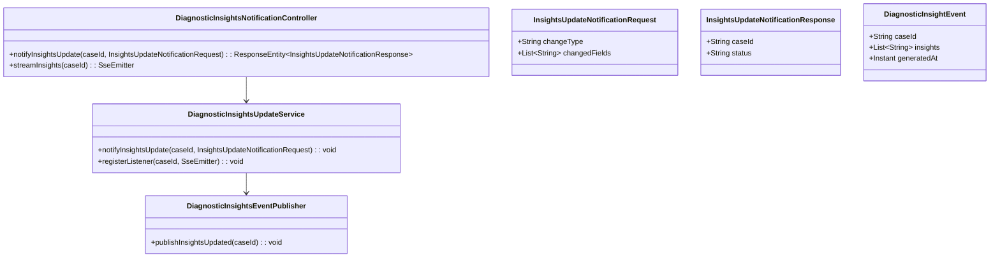
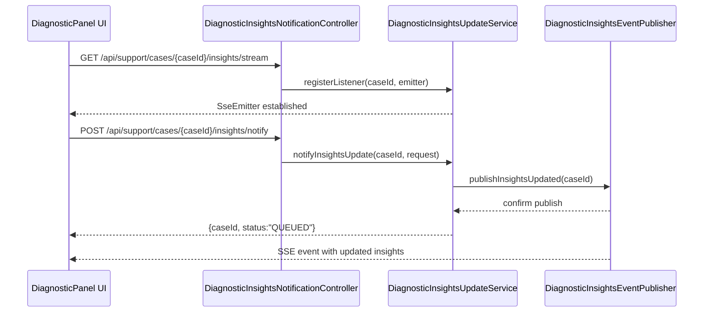
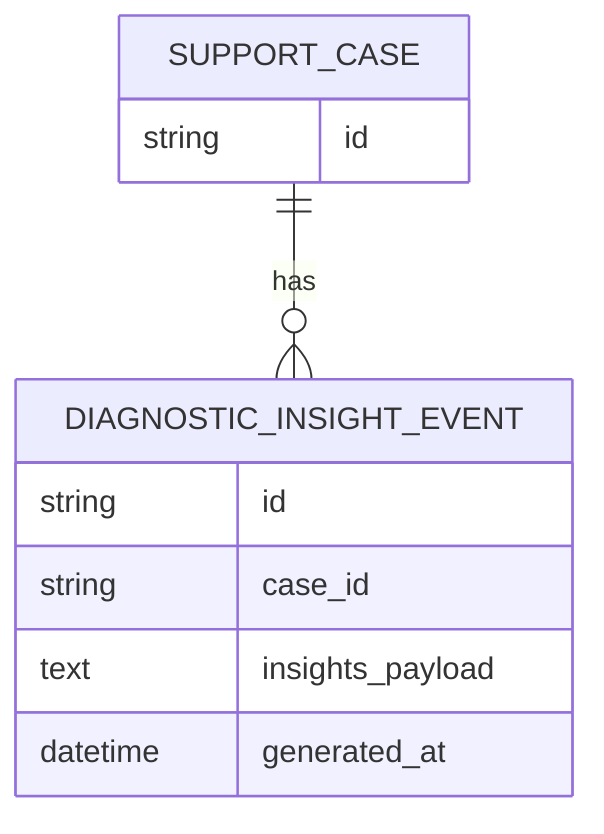

# Repository: APB_Demo
# Branch: intdemotesting2
# Folder: LLD

1. Objective
The objective is to support real-time updates of AI diagnostic insights within the diagnostic panel when case or member data changes. The system will listen for case context updates and refresh AI insights dynamically without requiring a full page reload. This ensures support agents always act on the most current information while handling member issues.

2. Backend Spring Boot API Details
2.1. API Model
2.1.1. Common Components/Services
- DiagnosticInsightsUpdateService: Service to produce updated insights when case or member context changes.
- DiagnosticInsightsEventPublisher: Component responsible for publishing insight update events to a real-time channel.

2.1.2. API Details
| Operation                        | REST Method | Type   | URL                                         | Request JSON                                                                                               | Response JSON                                                                                                               |
|----------------------------------|------------|--------|---------------------------------------------|------------------------------------------------------------------------------------------------------------|----------------------------------------------------------------------------------------------------------------------------|
| Notify insights update           | POST       | Public | /api/support/cases/{caseId}/insights/notify | {"changeType": "CASE_UPDATE"|"MEMBER_CONTEXT_UPDATE", "changedFields": [string]}                                         | {"caseId": string, "status": "QUEUED"}                                                                                  |
| Subscribe to insights updates    | GET        | Public | /api/support/cases/{caseId}/insights/stream | N/A                                                                                                        | Server-Sent Events stream where each event data is {"caseId": string, "insights": [string], "generatedAt": string}      |

2.1.3. Exceptions
- CaseNotFoundException: Thrown when the specified caseId is not found when notifying insights update.
- InsightsStreamUnavailableException: Thrown when the real-time insights stream cannot be established.

2.2. Functional Design
2.2.1. Class Diagram

2.2.2. UML Sequence Diagram

2.2.3. Components
| Component Name                             | Description                                                                      | Existing/New |
|-------------------------------------------|----------------------------------------------------------------------------------|-------------|
| DiagnosticInsightsNotificationController  | REST controller for insights update notifications and streaming.                | New         |
| DiagnosticInsightsUpdateService           | Service that manages insights update requests and SSE listeners.               | New         |
| DiagnosticInsightsEventPublisher          | Component that publishes updated insights to connected clients.                 | New         |
| InsightsUpdateNotificationRequest         | DTO for describing context changes triggering insight refresh.                  | New         |
| InsightsUpdateNotificationResponse        | DTO for acknowledging insight update notifications.                             | New         |
| DiagnosticInsightEvent                    | DTO representing an insights update event for streaming.                        | New         |

2.3. Service Layer Business Logic
- Service architecture & DI: DiagnosticInsightsUpdateService is injected into DiagnosticInsightsNotificationController. DiagnosticInsightsEventPublisher is injected into DiagnosticInsightsUpdateService.
- Workflow: When case or member context changes, a POST notify is sent; the service validates case existence and invokes the publisher, which pushes updated insights via existing AI insight generation logic to all active SSE listeners for that case.
- Caching strategy: Short-lived in-memory cache of latest insights per caseId can be maintained within DiagnosticInsightsUpdateService to re-send on new subscriptions.
- Validation rules: Validate that changeType is supported and changedFields is non-empty when provided.

Validation rules
| Field Name    | Validation                                | Error Message                                          | Class Used                           |
|---------------|-------------------------------------------|-------------------------------------------------------|--------------------------------------|
| caseId        | Must refer to existing support case       | "Case not found"                                     | DiagnosticInsightsUpdateService      |
| changeType    | Required, must be a known value           | "Unsupported change type"                            | InsightsUpdateNotificationRequest    |

2.4. Service Integrations
| System                  | Integrated For                                      | Integration Type |
|-------------------------|-----------------------------------------------------|------------------|
| AI Insights Generator   | Regenerating insights on case/member context change | Synchronous      |

3. Front End React Details
3.1. UI Component Architecture
- Component hierarchy: DiagnosticPanelPage includes DiagnosticInsightsPanel which establishes and manages the SSE subscription.
- Data flow: DiagnosticInsightsPanel opens an SSE connection to /api/support/cases/{caseId}/insights/stream and updates its local state when new DiagnosticInsightEvent messages arrive, re-rendering insights list.
- State management: Local state with React hooks in DiagnosticInsightsPanel; insights are stored as an array of strings or structured objects.
- Props interfaces: DiagnosticInsightsPanelProps: { caseId: string }.
- Routing: DiagnosticPanelPage is rendered under the existing route /support/cases/:caseId/diagnostic.

3.2. UI Specifications
- Wireframes/pages: DiagnosticInsightsPanel shows a scrollable list of current AI insights with timestamps.
- Responsive breakpoints: Panel width adapts to parent; on narrow screens insights list occupies full width and stacks vertically.
- Form structures with validation: No additional forms; context changes are triggered by existing UI components.
- User interaction patterns: Insights refresh automatically; show a subtle "Updated" indicator when new insights arrive.

3.3. API Integration
- HTTP client configuration: Uses EventSource (or compatible polyfill) for SSE connections alongside existing HTTP client for notify POST.
- Call patterns and error handling: On mount, DiagnosticInsightsPanel opens SSE; on error or disconnect, it retries with backoff; notify calls handle 2xx/4xx/5xx with inline error logging.
- Loading states: Display a loading indicator while initial SSE connection is being established; show a message if stream cannot be reached.
- Data transformation: SSE data is parsed from JSON into DiagnosticInsightEvent objects before updating state.

4. Database Details
4.1. ER Model

4.2. Database Validations
- NOT NULL constraints on case_id, insights_payload, and generated_at.
- Foreign key from DIAGNOSTIC_INSIGHT_EVENT.case_id to SUPPORT_CASE.id.

5. Non-Functional Requirements
5.1. Performance
- SSE updates should be delivered to clients within 2 seconds of context changes under normal load.
- Server must support multiple concurrent SSE connections per support team without significant degradation.

5.2. Security (Authentication & Authorization)
- SSE and notify endpoints require authenticated support agents.
- SSE connections must be tied to user sessions and not share data across cases a user is not authorized to access.

5.3. Logging (Application, Audit, Monitoring)
- Log SSE connection open/close events at DEBUG level.
- Log insight refresh notifications at INFO level with caseId.
- Provide metrics on active SSE connections and update delivery latency.

6. Dependencies
- Spring Boot Web starter.
- Spring Web MVC with Server-Sent Events support.
- Existing AI insights generation module.
- React with EventSource API support.

7. Assumptions
- AI insights generation is already available as a synchronous service.
- The same diagnostic panel route is reused for real-time updates.
- SSE is acceptable as the real-time transport in the current environment.
