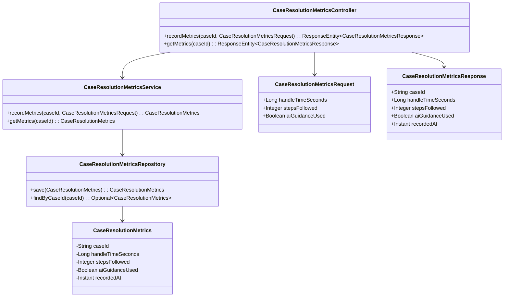
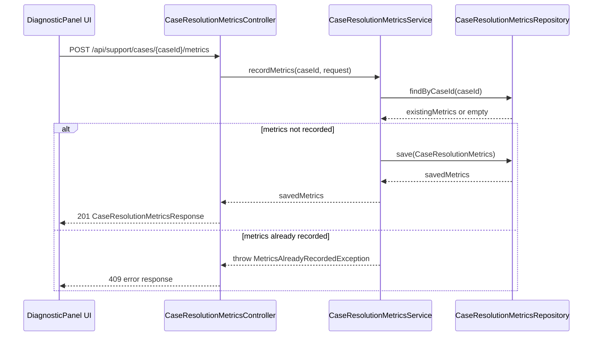
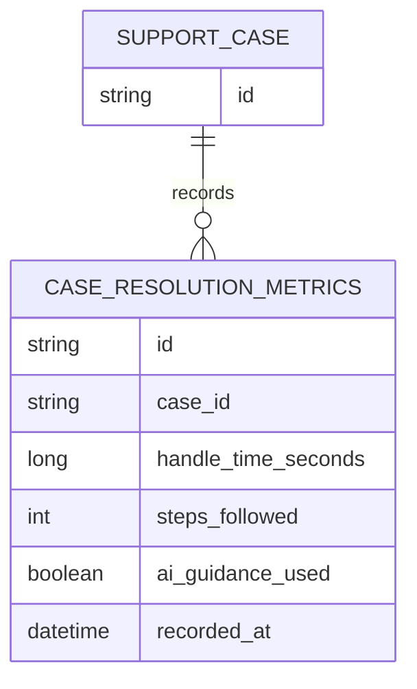

# Repository: APB_Demo
# Branch: intdemotesting2
# Folder: LLD

1. Objective
The objective is to capture how AI-assisted diagnostic guidance impacts resolution efficiency for support cases. The system will record handle time and adherence to AI-generated steps when agents close cases using the diagnostic panel. These metrics will support reporting and continuous improvement of support performance.

2. Backend Spring Boot API Details
2.1. API Model
2.1.1. Common Components/Services
- CaseResolutionMetricsService: Service to record and retrieve resolution efficiency metrics related to AI-guided case resolutions.
- CaseResolutionMetricsRepository: Spring Data repository to persist CaseResolutionMetrics entities.

2.1.2. API Details
| Operation                         | REST Method | Type   | URL                                      | Request JSON                                                                                                                   | Response JSON                                                                                       |
|-----------------------------------|------------|--------|------------------------------------------|--------------------------------------------------------------------------------------------------------------------------------|------------------------------------------------------------------------------------------------------|
| Record case resolution metrics    | POST       | Public | /api/support/cases/{caseId}/metrics      | {"handleTimeSeconds": number, "stepsFollowed": number, "aiGuidanceUsed": boolean}                                         | {"caseId": string, "handleTimeSeconds": number, "stepsFollowed": number, "aiGuidanceUsed": boolean, "recordedAt": string} |
| Get case resolution metrics       | GET        | Public | /api/support/cases/{caseId}/metrics      | N/A                                                                                                                            | {"caseId": string, "handleTimeSeconds": number, "stepsFollowed": number, "aiGuidanceUsed": boolean, "recordedAt": string} |

2.1.3. Exceptions
- CaseNotFoundException: Thrown when the specified caseId does not correspond to an existing support case.
- MetricsAlreadyRecordedException: Thrown when attempting to record metrics for a case that already has metrics recorded.

2.2. Functional Design
2.2.1. Class Diagram

2.2.2. UML Sequence Diagram

2.2.3. Components
| Component Name                    | Description                                                           | Existing/New |
|----------------------------------|-----------------------------------------------------------------------|-------------|
| CaseResolutionMetricsController  | REST controller to handle case resolution metrics APIs.               | New         |
| CaseResolutionMetricsService     | Service containing business logic for metrics recording and lookup.  | New         |
| CaseResolutionMetricsRepository  | Repository for persistence of CaseResolutionMetrics entities.        | New         |
| CaseResolutionMetrics            | Entity representing resolution efficiency metrics for a case.        | New         |
| CaseResolutionMetricsRequest     | DTO for incoming metrics data from UI.                               | New         |
| CaseResolutionMetricsResponse    | DTO for outgoing metrics data to UI.                                 | New         |

2.3. Service Layer Business Logic
- Service architecture & DI: CaseResolutionMetricsService is a Spring @Service injected into CaseResolutionMetricsController. CaseResolutionMetricsRepository is injected into CaseResolutionMetricsService using constructor-based dependency injection.
- Workflow: When a case is closed via the diagnostic panel and AI guidance has been used, the UI sends a POST request with handleTimeSeconds, stepsFollowed, and aiGuidanceUsed. The service checks if metrics already exist for the caseId; if not, it creates a CaseResolutionMetrics entity with the current timestamp and persists it.
- Caching strategy: No caching is applied to metrics writes; simple read-through access is used for GET operations for consistency.
- Validation rules: Validate that handleTimeSeconds > 0, stepsFollowed >= 0, and aiGuidanceUsed is not null.

Validation rules
| Field Name        | Validation                                 | Error Message                                      | Class Used                      |
|-------------------|--------------------------------------------|---------------------------------------------------|---------------------------------|
| handleTimeSeconds | Required, > 0                              | "Handle time must be greater than zero"          | CaseResolutionMetricsRequest    |
| stepsFollowed     | Required, >= 0                             | "Steps followed must be zero or positive"        | CaseResolutionMetricsRequest    |
| aiGuidanceUsed    | Required, boolean                          | "AI guidance flag must be provided"              | CaseResolutionMetricsRequest    |
| caseId            | Must refer to existing support case        | "Case not found"                                 | CaseResolutionMetricsService    |

2.4. Service Integrations
| System             | Integrated For                               | Integration Type |
|--------------------|----------------------------------------------|------------------|
| Support Case Store | Validating existence of support caseId       | Synchronous      |

3. Front End React Details
3.1. UI Component Architecture
- Component hierarchy: DiagnosticPanelPage contains CaseResolutionMetricsSummary and CaseResolutionMetricsRecorder components.
- Data flow: DiagnosticPanelPage fetches case context and passes caseId and AI usage data as props to CaseResolutionMetricsRecorder. CaseResolutionMetricsRecorder invokes the metrics API and informs DiagnosticPanelPage via callbacks.
- State management: Local component state using React hooks in DiagnosticPanelPage and CaseResolutionMetricsRecorder; no global store is introduced.
- Props interfaces:
  - CaseResolutionMetricsRecorderProps: { caseId: string; handleTimeSeconds: number; stepsFollowed: number; aiGuidanceUsed: boolean; onMetricsRecorded: (response) => void; }
- Routing: DiagnosticPanelPage is mounted under an existing diagnostic route, e.g., /support/cases/:caseId/diagnostic.

3.2. UI Specifications
- Wireframes/pages: CaseResolutionMetricsSummary displays read-only metrics if present; CaseResolutionMetricsRecorder has a simple form that is submitted automatically on case closure.
- Responsive breakpoints: Components follow existing panel layout; content is stacked vertically on small screens and inline on larger screens using CSS flexbox.
- Form structures with validation: The metrics recorder uses a hidden or minimal form with fields handleTimeSeconds, stepsFollowed, and aiGuidanceUsed. Client-side validation ensures numeric fields are non-negative before submission.
- User interaction patterns: On case closure, the UI triggers metrics recording; success is silent or shows a non-intrusive toast, errors are logged and shown as a small inline message.

3.3. API Integration
- HTTP client configuration: Uses a shared Axios instance (or fetch wrapper) configured with base URL and authentication headers.
- Call patterns and error handling: CaseResolutionMetricsRecorder performs POST /api/support/cases/{caseId}/metrics; on 201, it calls onMetricsRecorded; on 4xx/5xx, it displays an inline error message.
- Loading states: A local loading flag disables the case closure action until the metrics call completes or times out.
- Data transformation: Maps internal timing/steps counters to CaseResolutionMetricsRequest JSON before sending.

4. Database Details
4.1. ER Model

4.2. Database Validations
- Enforce NOT NULL on case_id, handle_time_seconds, steps_followed, ai_guidance_used, and recorded_at.
- Add a unique constraint on case_id in CASE_RESOLUTION_METRICS to prevent duplicate metrics per case.
- Define a foreign key from CASE_RESOLUTION_METRICS.case_id to SUPPORT_CASE.id.

5. Non-Functional Requirements
5.1. Performance
- Metrics recording should complete within 500 ms under normal load.
- Write path is expected to be low volume; no special optimization beyond efficient indexing on case_id is needed.

5.2. Security (Authentication & Authorization)
- Only authenticated support agents with appropriate roles can call the metrics APIs.
- CaseResolutionMetricsController endpoints are protected via existing security configuration with role-based access control.

5.3. Logging (Application, Audit, Monitoring)
- Log metric recording attempts with caseId and aiGuidanceUsed flag at INFO level.
- Log errors at WARN or ERROR with minimal case context.
- Expose basic counters (number of metrics recorded) via application metrics for monitoring.

6. Dependencies
- Spring Boot Web starter.
- Spring Data JPA.
- Existing security/authentication module.
- React with Axios (or equivalent HTTP client).

7. Assumptions
- A SUPPORT_CASE entity and storage already exist and are accessible.
- Case closure is the trigger point where metrics should be recorded.
- Only one metrics record per case is required.
