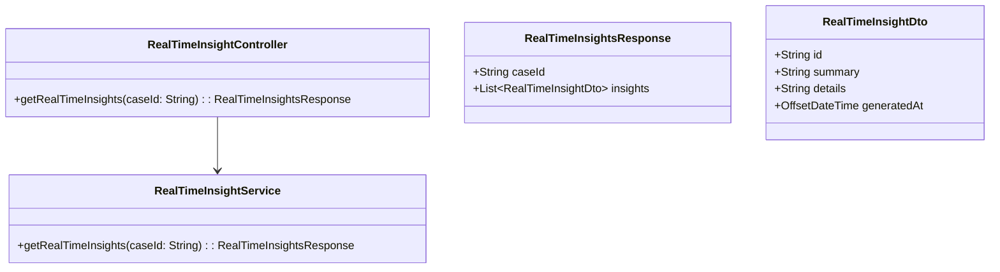
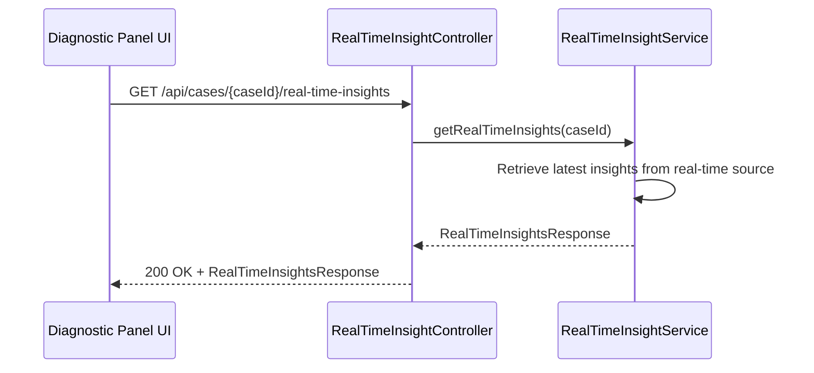
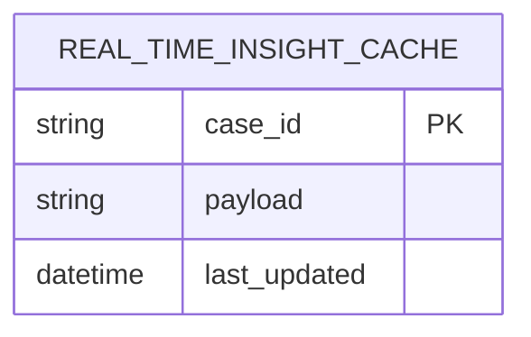

# Repository: APB_Demo
# Branch: intdemotesting3
# Folder: LLD

1. Objective
The objective is to display real-time AI-generated diagnostic insights for a member’s active case in the diagnostic panel. The feature aims to help agents quickly understand member issues and reduce handling time by surfacing relevant insights as soon as data is available. The design must handle streaming or frequent updates while remaining responsive and easy to use.

2. Backend Spring Boot API Details
2.1. API Model
2.1.1. Common Components/Services
- RealTimeInsightController: Exposes endpoints for retrieving current diagnostic insights for a case.
- RealTimeInsightService: Manages retrieval and refresh of real-time insights.

2.1.2. API Details
| Operation                           | REST Method | Type  | URL                                      | Request JSON | Response JSON                                                                                                  |
|-------------------------------------|------------|-------|------------------------------------------|-------------|-----------------------------------------------------------------------------------------------------------------|
| Get real-time diagnostic insights   | GET        | Query | /api/cases/{caseId}/real-time-insights   | N/A         | {"caseId":"string","insights":[{"id":"string","summary":"string","details":"string","generatedAt":"datetime"}]} |

2.1.3. Exceptions
- RealTimeInsightNotAvailableException: Thrown when no real-time insight stream is available for the case.
- RealTimeInsightServiceException: Thrown when retrieval of real-time insights fails.

2.2. Functional Design
2.2.1. Class Diagram

2.2.2. UML Sequence Diagram

2.2.3. Components
| Component Name             | Description                                                                    | Existing/New |
|---------------------------|--------------------------------------------------------------------------------|--------------|
| RealTimeInsightController | REST controller for retrieving real-time diagnostic insights for a case.      | New          |
| RealTimeInsightService    | Service that retrieves latest insights from a real-time data source.          | New          |

2.3. Service Layer Business Logic
RealTimeInsightService will query a real-time insight source (e.g., streaming platform or in-memory store) to fetch the latest insights for the caseId. It will package the data into RealTimeInsightsResponse and ensure that only a recent subset of insights is returned to avoid overwhelming the UI. Dependency injection will use Spring annotations with constructor-based injection.

Validation rules
| Field Name | Validation                 | Error Message                      | Class Used                 |
|-----------|---------------------------|------------------------------------|----------------------------|
| caseId    | Must be non-null, non-blank| "caseId must not be blank"        | RealTimeInsightController  |

2.4. Service Integrations
| System             | Integrated For                                      | Integration Type |
|-------------------|-----------------------------------------------------|------------------|
| RealTimeInsightBus | Fetching latest diagnostic insights for a case     | Messaging/REST   |

3. Front End React Details
3.1. UI Component Architecture
The DiagnosticPanel will maintain a RealTimeInsightList component to display real-time insights for the active case. State will be managed via a custom hook useRealTimeInsights that either polls the backend endpoint or subscribes to server-sent events/WebSockets to keep insights updated. Data flows from DiagnosticPanel down to RealTimeInsightList and its child RealTimeInsightItem components via props.

3.2. UI Specifications
RealTimeInsightList will present a vertical list of insights showing summary and optional details, with the most recent insights at the top. Each insight will display a generatedAt timestamp and a concise explanation, and older insights can collapse to keep the view focused. The layout will be responsive, ensuring readable text on narrow panels, and may include a small indicator icon to signal when fresh insights arrive.

3.3. API Integration
The useRealTimeInsights hook will use the shared HTTP client and, where supported, browser EventSource or WebSocket clients to subscribe to real-time updates. In a minimal implementation, the hook will fall back to periodic polling of GET /api/cases/{caseId}/real-time-insights at a configured interval. Errors will be reported as non-blocking UI notifications, and the hook will include basic backoff logic to avoid overloading the backend when failures occur.

4. Database Details
4.1. ER Model

4.2. Database Validations
- case_id must be unique and non-null if caching is used.
- payload size should be bounded to prevent storing arbitrarily large insight data.

5. Non-Functional Requirements
5.1. Performance
The real-time endpoint should respond in under 300ms for typical payload sizes, assuming the real-time source is responsive. Polling or streaming frequency must be balanced to provide timely updates without overwhelming the backend.

5.2. Security (Authentication & Authorization)
Only authenticated agents with access to the member’s case may retrieve real-time insights. Any streaming connection (e.g., WebSocket) must reuse existing authentication tokens and be closed when the agent’s session ends.

5.3. Logging (Application, Audit, Monitoring)
Application logs will include caseId and the number of insights returned per call to aid debugging. Monitoring will track connection counts, error rates, and latency for real-time insight retrieval and streaming endpoints.

6. Dependencies
- Spring Boot Web starter and optionally Spring WebFlux for streaming support.
- Spring Security for securing the endpoints and streams.
- React hooks and components for RealTimeInsightList and RealTimeInsightItem.
- Axios or browser-native EventSource/WebSocket for real-time communication.

7. Assumptions
- A RealTimeInsightBus or equivalent data source already exists and provides up-to-date insights per case.
- For this story, real-time is approximated via polling if full streaming cannot be implemented.
- The number of real-time insights per case is manageable and does not require pagination.
