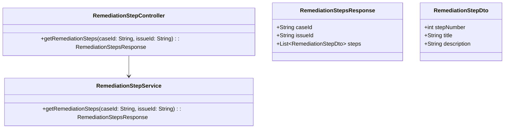
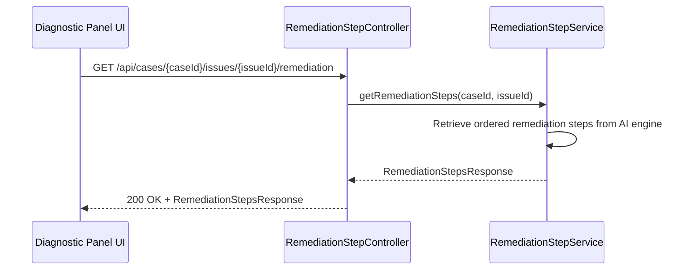
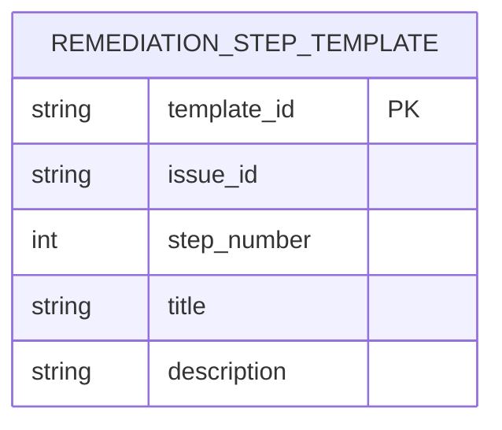

# Repository: APB_Demo
# Branch: intdemotesting3
# Folder: LLD

1. Objective
The objective is to provide AI-generated step-by-step remediation instructions for identified issues within the diagnostic panel. These steps help agents resolve member issues consistently and accurately by following an ordered list. The design must allow agents to mark steps as completed while maintaining a simple, intuitive workflow.

2. Backend Spring Boot API Details
2.1. API Model
2.1.1. Common Components/Services
- RemediationStepController: Exposes endpoints to retrieve AI-generated remediation steps for a case issue.
- RemediationStepService: Orchestrates retrieval and ordering of remediation steps.

2.1.2. API Details
| Operation                             | REST Method | Type  | URL                                               | Request JSON | Response JSON                                                                                           |
|---------------------------------------|------------|-------|---------------------------------------------------|-------------|----------------------------------------------------------------------------------------------------------|
| Get remediation steps for an issue    | GET        | Query | /api/cases/{caseId}/issues/{issueId}/remediation | N/A         | {"caseId":"string","issueId":"string","steps":[{"stepNumber":1,"title":"string","description":"string"}]} |

2.1.3. Exceptions
- RemediationNotAvailableException: Thrown when no remediation steps are available for the given issue.
- RemediationServiceException: Thrown when AI remediation generation fails.

2.2. Functional Design
2.2.1. Class Diagram

2.2.2. UML Sequence Diagram

2.2.3. Components
| Component Name            | Description                                                                   | Existing/New |
|--------------------------|-------------------------------------------------------------------------------|--------------|
| RemediationStepController| REST controller providing remediation steps for a case issue.                | New          |
| RemediationStepService   | Service that retrieves and orders remediation steps.                         | New          |

2.3. Service Layer Business Logic
RemediationStepService will call the AI remediation engine or an internal rules engine to retrieve recommended steps for a given issue. It will ensure steps are ordered by stepNumber and that titles and descriptions are concise for display. Dependency injection will use Spring @Service and @RestController annotations with constructor injection.

Validation rules
| Field Name | Validation                 | Error Message                      | Class Used               |
|-----------|---------------------------|------------------------------------|--------------------------|
| caseId    | Must be non-null, non-blank| "caseId must not be blank"        | RemediationStepController|
| issueId   | Must be non-null, non-blank| "issueId must not be blank"       | RemediationStepController|

2.4. Service Integrations
| System            | Integrated For                                   | Integration Type |
|------------------|--------------------------------------------------|------------------|
| AIRemediationEngine | Generating AI remediation steps for issues    | REST (synchronous)|

3. Front End React Details
3.1. UI Component Architecture
A RemediationStepsPanel component will be added to the diagnostic panel to display the ordered list of steps. State for remediation steps will be held in the DiagnosticPanel and passed down to RemediationStepsPanel as props, while each step is rendered by a RemediationStepItem component that tracks local completion state. A custom hook useRemediationSteps will handle data fetching based on caseId and issueId.

3.2. UI Specifications
RemediationStepsPanel will render a numbered list of steps with titles and descriptions, with each step including a checkbox or toggle for marking completion. Completed steps will display with a visual indicator such as strike-through text or a checkmark icon, and the list should maintain order even as steps are marked complete. The panel will support vertical scrolling for a long list and adapt to narrow layouts by stacking content.

3.3. API Integration
The useRemediationSteps hook will call GET /api/cases/{caseId}/issues/{issueId}/remediation using the shared HTTP client. It will manage loading and error states and expose functions to refresh the steps when needed. Completion state will be local to the UI and not persisted as part of this story.

4. Database Details
4.1. ER Model

4.2. Database Validations
- template_id must be unique and non-null.
- step_number must be positive and ordered for a given issue_id.

5. Non-Functional Requirements
5.1. Performance
Remediation step retrieval should complete within 700ms, including round-trip to AIRemediationEngine. The service should handle multiple concurrent requests by agents without significant deterioration in response times.

5.2. Security (Authentication & Authorization)
Access is limited to authenticated agents with rights to view the relevant case and issue. Existing authorization rules for case and issue visibility will be reused.

5.3. Logging (Application, Audit, Monitoring)
Application logs will record remediation retrieval attempts and failures, including caseId and issueId. Monitoring will track latency and error rates for the remediation endpoint.

6. Dependencies
- Spring Boot Web starter for REST API development.
- Spring Security for securing endpoints.
- React components for RemediationStepsPanel and RemediationStepItem.
- Axios (or equivalent HTTP client) for issuing remediation API requests.

7. Assumptions
- AIRemediationEngine is available and can provide remediation steps for a given issueId.
- Step completion state is UI-only and not persisted in this iteration.
- The number of steps per issue is moderate and can be displayed without pagination.
