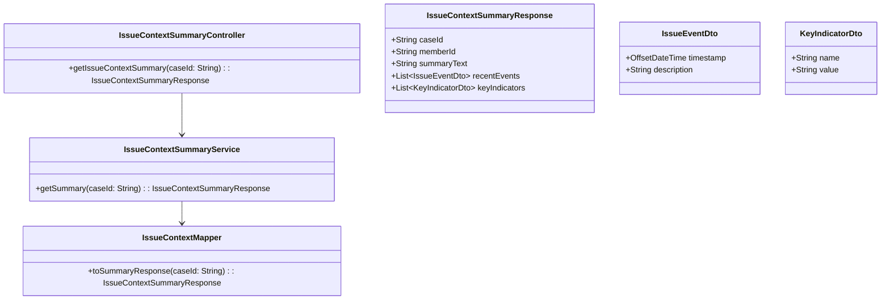
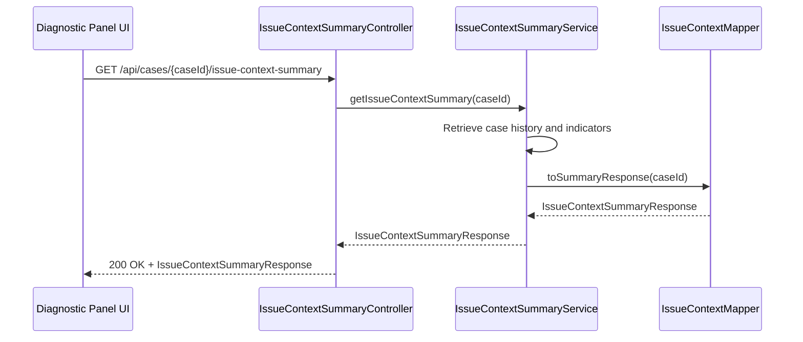
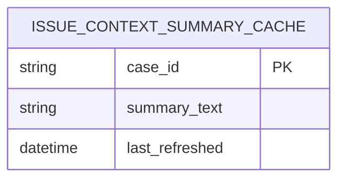

# Repository: APB_Demo
# Branch: intdemotesting3
# Folder: LLD

1. Objective
The objective is to present a summarized view of a member’s issue context so agents can quickly understand the situation before taking action. The summary must include relevant history and key indicators in a single view within the diagnostic panel. The implementation will keep the summary concise while ensuring essential contextual data is visible.

2. Backend Spring Boot API Details
2.1. API Model
2.1.1. Common Components/Services
- IssueContextSummaryController: Exposes endpoints to fetch summarized issue context for a case.
- IssueContextSummaryService: Aggregates data from case history and key indicators to build the summary.
- IssueContextMapper: Maps domain data into a concise summary DTO.

2.1.2. API Details
| Operation                        | REST Method | Type  | URL                                          | Request JSON | Response JSON                                                                                                       |
|----------------------------------|------------|-------|----------------------------------------------|-------------|----------------------------------------------------------------------------------------------------------------------|
| Get issue context summary        | GET        | Query | /api/cases/{caseId}/issue-context-summary    | N/A         | {"caseId":"string","memberId":"string","summaryText":"string","recentEvents":[{"timestamp":"datetime","description":"string"}],"keyIndicators":[{"name":"string","value":"string"}]} |

2.1.3. Exceptions
- IssueContextNotFoundException: Thrown when no issue context can be found for the given caseId.
- IssueContextAggregationException: Thrown when aggregation of history or indicators fails.

2.2. Functional Design
2.2.1. Class Diagram

2.2.2. UML Sequence Diagram

2.2.3. Components
| Component Name                  | Description                                                                  | Existing/New |
|--------------------------------|------------------------------------------------------------------------------|--------------|
| IssueContextSummaryController  | REST controller to fetch issue context summaries for a case.                | New          |
| IssueContextSummaryService     | Service that aggregates history and key indicators into a summary.          | New          |
| IssueContextMapper             | Mapper that builds concise summary DTOs from domain data.                   | New          |

2.3. Service Layer Business Logic
IssueContextSummaryService will coordinate retrieval of case history, member details, and key indicators from existing systems, then delegate to IssueContextMapper to construct IssueContextSummaryResponse. The service ensures only a limited number of recent events and key indicators are included to keep the summary concise. Dependency injection is handled via constructor injection with Spring @Service and @RestController annotations.

Validation rules
| Field Name | Validation                 | Error Message                      | Class Used                   |
|-----------|---------------------------|------------------------------------|------------------------------|
| caseId    | Must be non-null, non-blank| "caseId must not be blank"        | IssueContextSummaryController|

2.4. Service Integrations
| System                     | Integrated For                                  | Integration Type |
|---------------------------|-----------------------------------------------|------------------|
| ExistingCaseManagementAPI | Retrieving case history and member information | REST (synchronous)|
| IndicatorStore            | Retrieving key indicator values                | REST (synchronous)|

3. Front End React Details
3.1. UI Component Architecture
A new IssueContextSummaryPanel component will be added inside the diagnostic panel to display the issue summary. DiagnosticPanel will own the data state and pass the IssueContextSummaryResponse down to IssueContextSummaryPanel via props, while IssueContextSummaryPanel remains presentational. State management will reuse the existing hooks for case context, with an additional hook useIssueContextSummary to fetch summary data.

3.2. UI Specifications
IssueContextSummaryPanel will present a compact summary section at the top with the summaryText, followed by a list of recent events and key indicators. Recent events will be displayed as a vertical timeline or simple list, while key indicators are shown in a two-column layout with name and value. The layout must adapt to narrow widths by stacking sections vertically with appropriate spacing.

3.3. API Integration
The useIssueContextSummary hook will call GET /api/cases/{caseId}/issue-context-summary via the shared HTTP client and store the result in component state. Errors will be displayed as a small inline banner within the panel, and loading states will show a skeleton or spinner until data is available. The hook will re-fetch the summary when the active caseId changes.

4. Database Details
4.1. ER Model

4.2. Database Validations
- case_id must be unique and non-null if summary caching is enabled.
- summary_text length should be bounded (e.g., 2000 characters) to avoid oversized entries.

5. Non-Functional Requirements
5.1. Performance
Summary retrieval should complete within 600ms, including aggregation from existing case and indicator systems. The service should avoid returning excessively large histories by limiting the number of events and indicators included.

5.2. Security (Authentication & Authorization)
Access is restricted to authenticated agents with permission to view the case in question. Existing case management authorization flows will be reused to ensure consistency.

5.3. Logging (Application, Audit, Monitoring)
Application logs will record summary retrieval attempts with caseId and outcome. Any failures in aggregation or upstream calls will be logged with sufficient context for troubleshooting. Monitoring will track error rates and latency for the summary endpoint.

6. Dependencies
- Spring Boot Web starter for REST endpoint creation.
- Spring Security for authentication/authorization.
- React components for IssueContextSummaryPanel and DiagnosticPanel integration.
- Axios (or equivalent HTTP client) for fetching summary data.

7. Assumptions
- Existing systems already expose the necessary case history and indicator data via APIs.
- Only a limited subset of history and indicators is required for the summary; detailed views remain in the main case interface.
- Caching of summaries is optional and can be added later to improve performance if needed.
