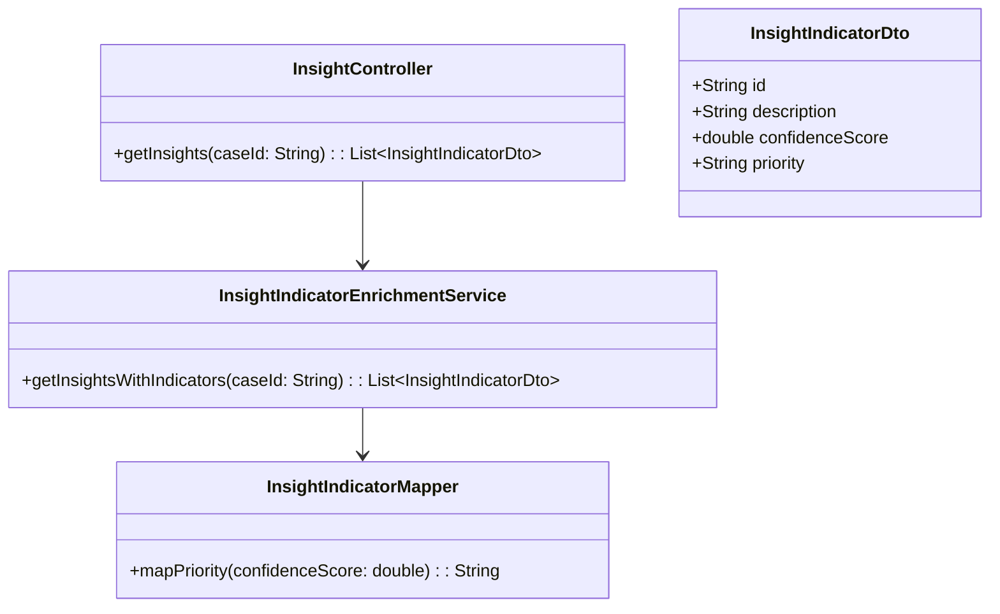
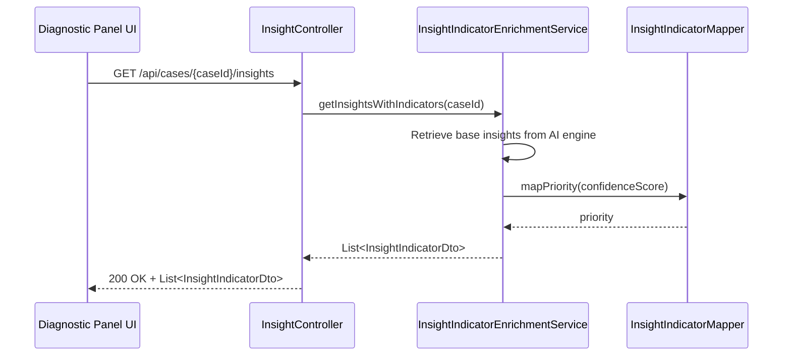
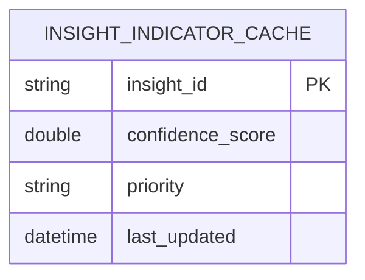

# Repository: APB_Demo
# Branch: intdemotesting3
# Folder: LLD

1. Objective
The objective is to display confidence and priority indicators for AI-generated insights so agents can quickly identify which insights are most reliable and impactful. The indicators must be attached to each insight item in the diagnostic panel. The implementation ensures these indicators are consistently calculated and rendered across backend and frontend.

2. Backend Spring Boot API Details
2.1. API Model
2.1.1. Common Components/Services
- InsightIndicatorEnrichmentService: Adds confidence and priority metadata to AI insights.
- InsightIndicatorMapper: Maps numeric confidence and priority levels to display-friendly values for the frontend.

2.1.2. API Details
| Operation                     | REST Method | Type  | URL                                  | Request JSON | Response JSON                                                                                               |
|-------------------------------|------------|-------|--------------------------------------|-------------|----------------------------------------------------------------------------------------------------------------|
| Get insights with indicators  | GET        | Query | /api/cases/{caseId}/insights         | N/A         | [{"id":"string","description":"string","confidenceScore":0.0,"priority":"HIGH|MEDIUM|LOW"}] |

2.1.3. Exceptions
- InsightNotAvailableException: Thrown when insights cannot be retrieved for the case.
- IndicatorEnrichmentException: Thrown when confidence and priority indicators cannot be derived.

2.2. Functional Design
2.2.1. Class Diagram

2.2.2. UML Sequence Diagram

2.2.3. Components
| Component Name                   | Description                                                           | Existing/New |
|---------------------------------|-----------------------------------------------------------------------|--------------|
| InsightController               | REST controller for retrieving insights with indicators.              | New          |
| InsightIndicatorEnrichmentService | Service enriching insights with confidence and priority metadata.   | New          |
| InsightIndicatorMapper          | Utility to convert confidence scores into priority levels.            | New          |

2.3. Service Layer Business Logic
InsightIndicatorEnrichmentService retrieves AI-generated insights for a given case, calculates or retrieves confidence scores, and uses InsightIndicatorMapper to determine priority levels (e.g., HIGH, MEDIUM, LOW). The enriched insights are returned as InsightIndicatorDto objects to the controller for serialization. Dependency injection is handled via constructor injection with @Service and @RestController annotations.

Validation rules
| Field Name | Validation                 | Error Message                      | Class Used       |
|-----------|---------------------------|------------------------------------|------------------|
| caseId    | Must be non-null, non-blank| "caseId must not be blank"        | InsightController|

2.4. Service Integrations
| System            | Integrated For                                   | Integration Type |
|------------------|--------------------------------------------------|------------------|
| AIInsightEngine   | Retrieving base insights with confidence scores | REST (synchronous)|

3. Front End React Details
3.1. UI Component Architecture
The InsightList component in the diagnostic panel will iterate over insights and render each with confidence and priority indicators. State for insights will be stored at the DiagnosticPanel level, passed down to InsightList and InsightItem via props, ensuring a unidirectional data flow. No additional routing is introduced; the indicators are purely visual enhancements on existing insight items.

3.2. UI Specifications
Each insight card will include a confidence badge (e.g., percentage or descriptive label) and a priority label or icon aligned to the right of the card header. Confidence may be represented as a percentage bar while priority uses color-coded labels such as red for HIGH, amber for MEDIUM, and green for LOW. The layout must be responsive so that indicators stack beneath the main insight text on narrow screens.

3.3. API Integration
The DiagnosticPanel will call GET /api/cases/{caseId}/insights using the shared HTTP client and merge this data into the existing panel state. Error handling will display a non-blocking toast or inline message if indicators cannot be loaded, while still showing basic insight information if available. The client will not perform additional calculations; it will display the confidenceScore and priority fields as provided by the API.

4. Database Details
4.1. ER Model

4.2. Database Validations
- insight_id must be unique and non-null.
- confidence_score must be between 0.0 and 1.0 if persisted.
- priority, when stored, must be one of HIGH, MEDIUM, LOW.

5. Non-Functional Requirements
5.1. Performance
Indicator computation should not add more than 100ms to the baseline insight retrieval time. Any expensive calculations should be performed by the AIInsightEngine or cached when feasible.

5.2. Security (Authentication & Authorization)
Access to insights remains restricted to authenticated agents with appropriate case access permissions. No additional security constraints are introduced beyond existing diagnostic panel security controls.

5.3. Logging (Application, Audit, Monitoring)
Application logs will capture failures in indicator enrichment, including caseId and insight identifiers, at WARN or ERROR level. Monitoring will track the ratio of successful versus failed indicator enrichments to detect degradation in upstream AIInsightEngine.

6. Dependencies
- Spring Boot Web starter for REST API.
- Spring Security for reuse of existing authentication/authorization.
- React components for InsightList and InsightItem rendering.
- Axios (or equivalent HTTP client) for calling insight endpoints from the frontend.

7. Assumptions
- AIInsightEngine already provides a base confidence score per insight or sufficient data to derive one.
- Priority levels HIGH, MEDIUM, and LOW are sufficient for agent decision making in this story.
- Any persistence of indicators is optional and may be introduced later if needed for caching.
