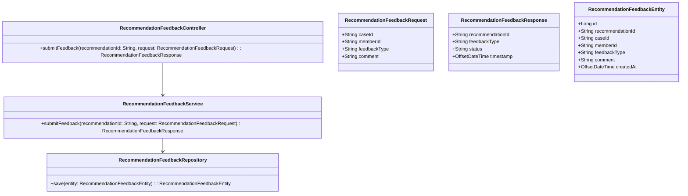
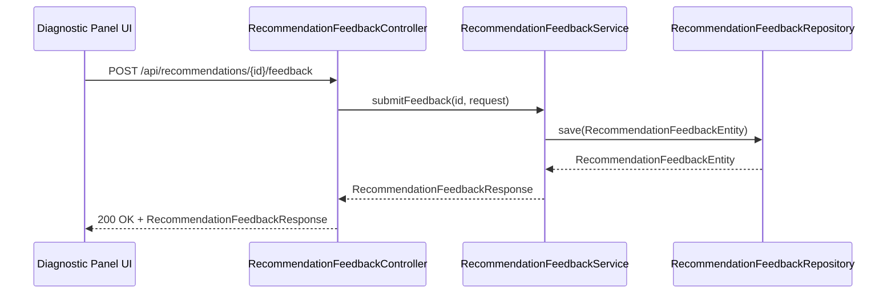
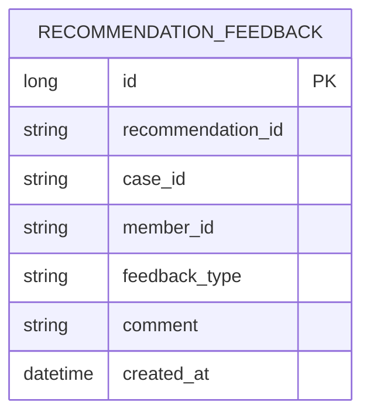

# Repository: APB_Demo
# Branch: intdemotesting3
# Folder: LLD

1. Objective
The objective is to enable contact center agents to submit feedback on AI-generated recommendations displayed in the diagnostic panel. The feedback will capture whether a recommendation was helpful or not helpful and update the visible status of the recommendation. The design must ensure feedback is captured in a structured and auditable way without introducing complex workflows.

2. Backend Spring Boot API Details
2.1. API Model
2.1.1. Common Components/Services
- RecommendationFeedbackController: Handles feedback submission requests from the UI.
- RecommendationFeedbackService: Encapsulates business logic for recording and updating recommendation feedback.
- RecommendationFeedbackRepository: Abstracts persistence of feedback entities.

2.1.2. API Details
| Operation                        | REST Method | Type   | URL                                                | Request JSON                                                                                     | Response JSON                                                                                     |
|----------------------------------|------------|--------|----------------------------------------------------|---------------------------------------------------------------------------------------------------|---------------------------------------------------------------------------------------------------|
| Submit recommendation feedback   | POST       | Body   | /api/recommendations/{recommendationId}/feedback  | {"caseId":"string","memberId":"string","feedbackType":"HELPFUL|NOT_HELPFUL","comment":"string"} | {"recommendationId":"string","feedbackType":"HELPFUL|NOT_HELPFUL","status":"UPDATED","timestamp":"datetime"} |

2.1.3. Exceptions
- RecommendationNotFoundException: Thrown when the recommendationId provided does not correspond to a known recommendation.
- InvalidFeedbackException: Thrown when the feedback payload is invalid (e.g., unsupported feedbackType).
- RecommendationFeedbackPersistenceException: Thrown when feedback cannot be stored due to persistence issues.

2.2. Functional Design
2.2.1. Class Diagram

2.2.2. UML Sequence Diagram

2.2.3. Components
| Component Name                    | Description                                                                | Existing/New |
|----------------------------------|----------------------------------------------------------------------------|--------------|
| RecommendationFeedbackController | REST controller for feedback submission on AI recommendations.            | New          |
| RecommendationFeedbackService    | Service that validates and persists recommendation feedback.              | New          |
| RecommendationFeedbackRepository | Repository interface for storing recommendation feedback records.         | New          |

2.3. Service Layer Business Logic
RecommendationFeedbackService will validate the input request, construct a RecommendationFeedbackEntity, and store it via RecommendationFeedbackRepository. It will then build a RecommendationFeedbackResponse that indicates the submitted feedback type and an "UPDATED" status for the UI to reflect the new state of the recommendation. Dependency injection will use Spring @Service and @Repository annotations with constructor-based injection.

Validation rules
| Field Name       | Validation                                      | Error Message                                      | Class Used                      |
|-----------------|--------------------------------------------------|----------------------------------------------------|---------------------------------|
| recommendationId | Must be non-null, non-blank                     | "recommendationId must not be blank"              | RecommendationFeedbackController|
| caseId           | Must be non-null, non-blank                     | "caseId must not be blank"                        | RecommendationFeedbackController|
| memberId         | Must be non-null, non-blank                     | "memberId must not be blank"                      | RecommendationFeedbackController|
| feedbackType     | Must be HELPFUL or NOT_HELPFUL                  | "feedbackType must be HELPFUL or NOT_HELPFUL"     | RecommendationFeedbackController|
| comment          | Optional, max length 500                        | "comment length must be <= 500"                   | RecommendationFeedbackController|

2.4. Service Integrations
| System                 | Integrated For                                  | Integration Type |
|-----------------------|-------------------------------------------------|------------------|
| RecommendationStore   | Validating that recommendationId exists         | REST (synchronous) |

3. Front End React Details
3.1. UI Component Architecture
The RecommendationItem component within the diagnostic panel will be enhanced to display feedback controls (e.g., helpful/not helpful buttons). State will be managed locally within each RecommendationItem and coordinated via a custom hook useRecommendationFeedback to track feedback submission state and result. Data flow will propagate updated feedback status back up to the parent DiagnosticPanel component through callback props.

3.2. UI Specifications
Each AI recommendation card will display two mutually exclusive actions: "Helpful" and "Not Helpful". When an agent selects one, the selected state is visually highlighted and the other option is disabled, while a small status indicator (e.g., text label) shows that feedback has been recorded. Optional comment input can be displayed in a compact text area that expands on focus, allowing agents to provide additional context without being mandatory.

3.3. API Integration
The useRecommendationFeedback hook will use a shared HTTP client (e.g., Axios instance) to POST feedback to /api/recommendations/{recommendationId}/feedback with the caseId, memberId, and feedbackType. The hook will manage loading and error states, displaying inline errors if the submission fails and preventing duplicate submissions while a request is in progress. Successful responses will update local recommendation state to reflect the feedbackType and status returned by the API.

4. Database Details
4.1. ER Model

4.2. Database Validations
- recommendation_id must be non-null and reference a valid recommendation in the external RecommendationStore (checked at application layer).
- feedback_type must be either HELPFUL or NOT_HELPFUL.
- comment, when provided, must not exceed 500 characters.

5. Non-Functional Requirements
5.1. Performance
Feedback submissions should complete within 300ms under normal load, assuming the underlying database operates within standard SLAs. The service should be lightweight and capable of handling high-frequency feedback submissions without significant performance impact.

5.2. Security (Authentication & Authorization)
Authentication will rely on existing security configuration ensuring only authenticated agents can submit feedback. Authorization will enforce that agents can submit feedback only for recommendations tied to cases they are allowed to access, leveraging existing case access controls.

5.3. Logging (Application, Audit, Monitoring)
Application logs will record feedback submission events including recommendationId and caseId at INFO level, excluding sensitive comment content from logs. Audit logging will capture who submitted feedback and when to support model training governance. Monitoring will track feedback submission volumes and error rates to surface operational issues.

6. Dependencies
- Spring Boot Web starter for REST endpoints.
- Spring Data JPA (or equivalent) for RecommendationFeedbackRepository implementation.
- Spring Security for enforcing authentication and authorization.
- React components and hooks for RecommendationItem and diagnostic panel integration.
- Axios (or equivalent HTTP client) for posting feedback from the frontend.

7. Assumptions
- Recommendation identifiers displayed in the diagnostic panel are stable and can be used as keys for feedback association.
- Recommendation feedback storage uses the existing primary relational database; no additional data store is introduced.
- Feedback is not yet consumed by downstream AI training pipelines in this story; it is only stored and made visible to the application.
