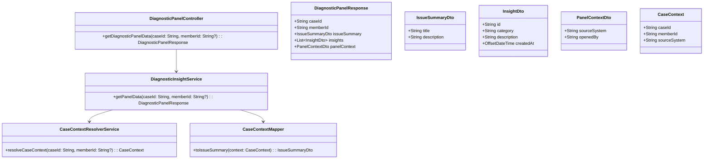
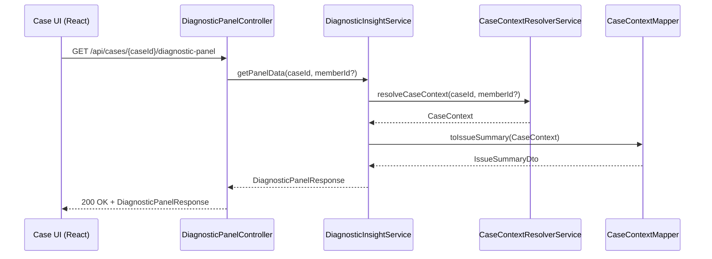
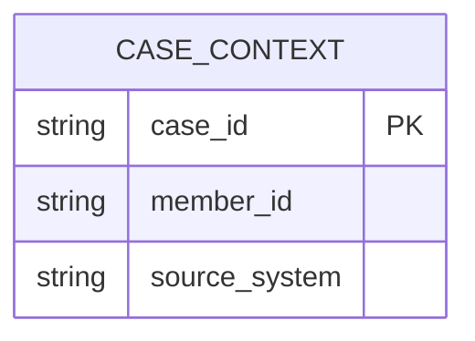

# Repository: APB_Demo
# Branch: intdemotesting3
# Folder: LLD

1. Objective
The objective is to integrate the AI Diagnostic Panel into the existing case workflow so agents can access AI insights without leaving the standard case management interface. The panel must automatically bind to the currently open case and display contextual data. The solution should provide a seamless, secure, and performant embedded experience within the existing UI.

2. Backend Spring Boot API Details
2.1. API Model
2.1.1. Common Components/Services
- CaseContextResolverService: Resolves the active case context (member and case identifiers) from the case management system and request metadata.
- DiagnosticInsightService: Orchestrates retrieval of AI diagnostic insights for a given case.
- CaseContextMapper: Maps case management domain objects into internal DTOs for the diagnostic panel.

2.1.2. API Details
| Operation                              | REST Method | Type   | URL                                      | Request JSON                                                                 | Response JSON                                                                                                  |
|----------------------------------------|------------|--------|------------------------------------------|-------------------------------------------------------------------------------|-----------------------------------------------------------------------------------------------------------------|
| Get diagnostic panel data by case      | GET        | Query  | /api/cases/{caseId}/diagnostic-panel     | N/A (path param caseId, query param memberId optional)                        | {"caseId":"string","memberId":"string","issueSummary":{"title":"string","description":"string"},"insights":[{"id":"string","category":"string","description":"string","createdAt":"datetime"}],"panelContext":{"sourceSystem":"string","openedBy":"string"}} |

2.1.3. Exceptions
- CaseNotFoundException: Thrown when the provided caseId does not map to an existing case in the case management system.
- CaseContextResolutionException: Thrown when the active case context cannot be resolved from the request.
- DiagnosticInsightServiceException: Thrown when retrieval of diagnostic insights fails due to downstream errors.

2.2. Functional Design
2.2.1. Class Diagram

2.2.2. UML Sequence Diagram

2.2.3. Components
| Component Name               | Description                                                                   | Existing/New |
|-----------------------------|-------------------------------------------------------------------------------|--------------|
| DiagnosticPanelController   | REST controller exposing diagnostic panel data for a specific case.          | New          |
| DiagnosticInsightService    | Service that orchestrates case context resolution and insight retrieval.     | New          |
| CaseContextResolverService  | Service to resolve active case context from case management system.          | New          |
| CaseContextMapper           | Mapper to convert case domain data into panel DTOs.                          | New          |

2.3. Service Layer Business Logic
DiagnosticInsightService will receive caseId and optional memberId, invoke CaseContextResolverService to validate and enrich the case context, and orchestrate creation of DiagnosticPanelResponse using CaseContextMapper and downstream AI insight retrieval (stubbed for now). Dependency injection will be handled via Spring @Service and constructor injection, wiring DiagnosticPanelController to DiagnosticInsightService, which in turn depends on CaseContextResolverService and CaseContextMapper. No caching is applied to ensure the panel always reflects the latest case insights. Basic request validation will ensure caseId is non-empty before passing it downstream.

Validation rules
| Field Name | Validation                 | Error Message                           | Class Used                 |
|-----------|---------------------------|-----------------------------------------|----------------------------|
| caseId    | Must be non-null, non-blank| "caseId must not be blank"             | DiagnosticPanelController  |
| memberId  | Optional, max length 64    | "memberId length must be <= 64"        | DiagnosticPanelController  |

2.4. Service Integrations
| System                     | Integrated For                                   | Integration Type |
|---------------------------|--------------------------------------------------|------------------|
| ExistingCaseManagementAPI | Resolving case context and member details        | REST (synchronous) |
| AIInsightEngine           | Fetching AI diagnostic insights for the case     | REST (synchronous) |

3. Front End React Details
3.1. UI Component Architecture
The DiagnosticPanel will be implemented as a React component embedded within the existing case management layout and will receive the active caseId and memberId as props from the host CasePage. State will be managed using React hooks within DiagnosticPanel to store panel data (issue summary and insights) and loading/error states, with a dedicated hook useDiagnosticPanelData handling data fetching. Routing will not introduce new routes; the panel will be rendered as a child component of the existing case route.

3.2. UI Specifications
The DiagnosticPanel will render a header showing the case identifier and member information, a concise issue summary section, and a scrollable list of diagnostic insights. The layout will be responsive with a minimum width suited for a side panel and will collapse into a full-width section on small screens, reusing existing CSS grid or flex utilities. User interactions will include expanding or collapsing the panel and refreshing insights via a simple button within the panel.

3.3. API Integration
The DiagnosticPanel will use a shared HTTP client (e.g., Axios instance) configured with base URL and interceptors for authentication to call GET /api/cases/{caseId}/diagnostic-panel. The useDiagnosticPanelData hook will handle request initiation on mount, manage loading and error states, and retry on user-triggered refresh, translating the JSON response into local state structures. Error responses will be surfaced as non-blocking inline messages within the panel while maintaining previously loaded data if available.

4. Database Details
4.1. ER Model

4.2. Database Validations
- case_id is the primary key and must be unique and non-null.
- member_id is optional but, when provided, must conform to the member identifier format enforced at the application layer.

5. Non-Functional Requirements
5.1. Performance
The diagnostic panel API should respond within 500ms for typical cases, assuming downstream case and AI services respond within their standard SLAs. The API should support concurrent access from multiple agents without degradation, relying on stateless service design and horizontal scaling of the Spring Boot application.

5.2. Security (Authentication & Authorization)
Access to the diagnostic panel endpoint will require authenticated users via the existing authentication mechanism (e.g., JWT or session) propagated by the shared HTTP client. Authorization will ensure that only agents with permission to view the specific case can access its diagnostic data, delegating case-level checks to ExistingCaseManagementAPI.

5.3. Logging (Application, Audit, Monitoring)
Application logs will capture request identifiers, caseId, and high-level outcomes (success/failure) for each panel request at INFO level, with errors logged at ERROR level including exception details. Audit logging will record which user accessed diagnostic insights for which case to support compliance and traceability, using the existing audit logging framework. Operational metrics (request counts, latencies, error rates) will be exposed via existing monitoring endpoints for dashboarding.

6. Dependencies
- Spring Boot Web starter for REST API exposure.
- Spring Boot Validation starter for request validation.
- Spring Security for authentication and authorization integration.
- React and existing UI framework for embedding the DiagnosticPanel component.
- Axios (or equivalent HTTP client) for API interaction on the frontend.

7. Assumptions
- Existing case management interface already provides the active caseId and memberId to the embedded React component.
- ExistingCaseManagementAPI and AIInsightEngine endpoints are already available and secured, and this story only needs to integrate with them, not create them.
- No additional persistence is required for the diagnostic panel; it operates purely on live case and AI data.
