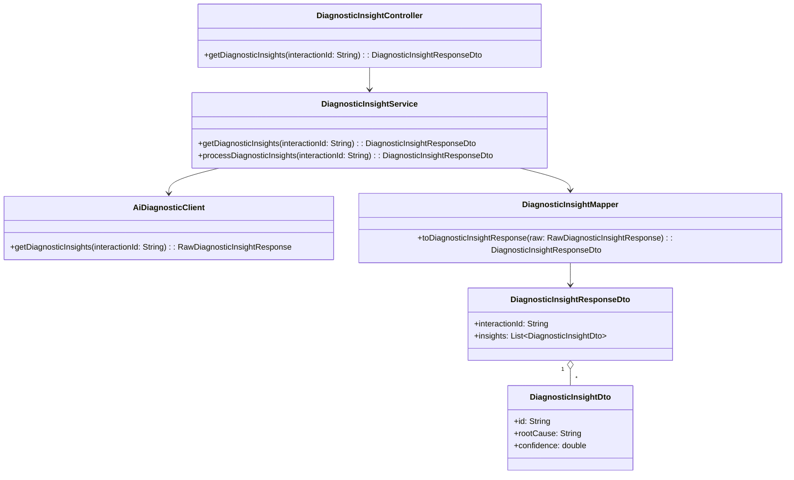
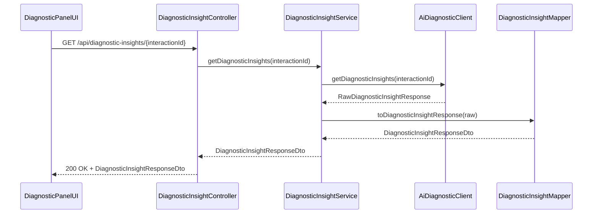
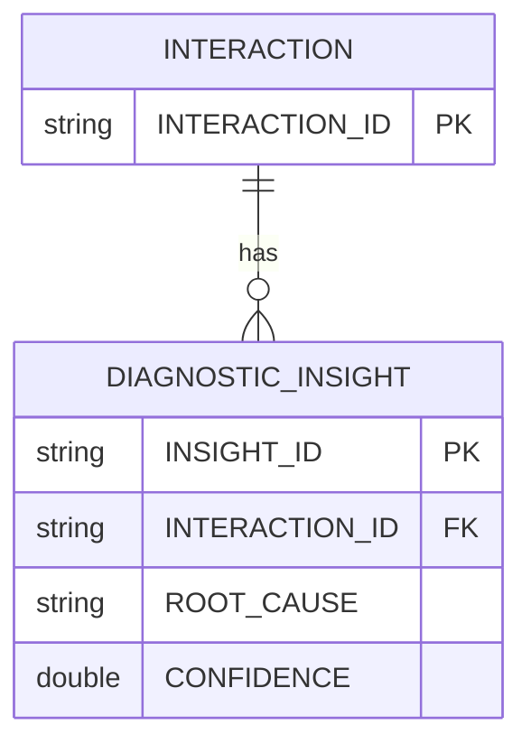

# Repository: APB_Demo
# Branch: APPMRN148
# Folder: LLD

1. Objective
The objective is to display real-time AI-generated diagnostic insights for member issues in the diagnostic panel. The feature enables agents to see likely root causes along with confidence levels as interaction and system data are processed. This helps agents quickly understand and address the underlying problems.

2. Backend Spring Boot API Details
2.1. API Model
2.1.1. Common Components/Services
- DiagnosticInsightController: REST controller providing diagnostic insights.
- DiagnosticInsightService: Service orchestrating retrieval and preparation of diagnostic insights.
- AiDiagnosticClient: Client for calling the AI engine to obtain diagnostic results.
- DiagnosticInsightMapper: Mapper converting AI responses into diagnostic insight DTOs.

2.1.2. API Details
| Operation | REST Method | Type | URL | Request JSON | Response JSON |
|-----------|------------|------|-----|--------------|---------------|
| Get diagnostic insights | GET | Query | /api/diagnostic-insights/{interactionId} | N/A (path param interactionId) | {"interactionId":"string","insights":[{"id":"string","rootCause":"string","confidence":0.9}]} |
| Process diagnostic insights | POST | Command | /internal/diagnostic-insights/process | {"interactionId":"string"} | {"interactionId":"string","insights":[{"id":"string","rootCause":"string","confidence":0.9}]} |

2.1.3. Exceptions
- DiagnosticInsightNotFoundException: Thrown when no diagnostic results exist for the interaction.
- DiagnosticInsightProcessingException: Thrown for failures in processing AI outputs.
- AiDiagnosticClientException: Thrown when AI engine calls fail.

2.2. Functional Design
2.2.1. Class Diagram

2.2.2. UML Sequence Diagram

2.2.3. Components
| Component Name | Description | Existing/New |
|----------------|-------------|--------------|
| DiagnosticInsightController | REST controller exposing diagnostic insight endpoints | New |
| DiagnosticInsightService | Service orchestrating diagnostic insight retrieval | New |
| AiDiagnosticClient | Client calling AI engine for diagnostic results | New |
| DiagnosticInsightMapper | Mapper converting AI responses to DTOs | New |
| DiagnosticInsightResponseDto | DTO containing diagnostic insights | New |
| DiagnosticInsightDto | DTO representing a single diagnostic insight | New |

2.3. Service Layer Business Logic
DiagnosticInsightService is injected with AiDiagnosticClient and DiagnosticInsightMapper. When getDiagnosticInsights is called, the service validates interactionId, calls AiDiagnosticClient, converts raw results into DiagnosticInsightDto list, and returns them along with the interactionId. No caching is used to ensure insights always reflect latest data. Validation includes non-empty interactionId and non-empty insights from AI.

Validation rules
| Field Name | Validation | Error Message | Class Used |
|------------|------------|---------------|------------|
| interactionId | Not null, not blank | "interactionId is required" | DiagnosticInsightService |
| insights | Not null, non-empty | "No diagnostic insights available" | DiagnosticInsightService |
| confidence | Between 0.0 and 1.0 | "Invalid confidence score" | DiagnosticInsightService |

2.4. Service Integrations
| System | Integrated For | Integration Type |
|--------|----------------|------------------|
| AI Engine Service | Providing diagnostic insights and confidence scores | REST client |

3. Front End React Details
3.1. UI Component Architecture
The DiagnosticInsightsPanel component is responsible for showing diagnostic insights for an interaction. It receives interactionId as a prop and uses useDiagnosticInsights hook to call /api/diagnostic-insights/{interactionId}. State for insights, loading, and error is maintained in the hook and passed as props to the panel and its child component DiagnosticInsightList.

3.2. UI Specifications
DiagnosticInsightsPanel displays a list of root causes with associated confidence percentages. Items are ordered as returned by the backend. On narrow screens, insights appear in a vertical list; on wider screens, they may be displayed in two columns. Error messages such as "Diagnostic insights unavailable" appear if the call fails. There is no agent input in this view.

3.3. API Integration
useDiagnosticInsights uses a shared HTTP client to GET /api/diagnostic-insights/{interactionId}. It manages loading and error states, retrying once on transient failures. Data is mapped into DiagnosticInsightDto structures as returned and exposed to the component.

4. Database Details
4.1. ER Model

4.2. Database Validations
- INTERACTION.INTERACTION_ID is primary key and non-null.
- DIAGNOSTIC_INSIGHT.INTERACTION_ID references INTERACTION.INTERACTION_ID.
- DIAGNOSTIC_INSIGHT.CONFIDENCE is between 0.0 and 1.0.
- DIAGNOSTIC_INSIGHT.ROOT_CAUSE is non-null.

5. Non-Functional Requirements
5.1. Performance
Responses must be returned within 300ms for typical interaction sizes under normal load. AI latency must be managed by upstream components; this service only adds minimal overhead.

5.2. Security (Authentication & Authorization)
/api/diagnostic-insights/** endpoints require authenticated agents with appropriate permissions. Internal process endpoint is limited to internal services.

5.3. Logging (Application, Audit, Monitoring)
Log diagnostic insight retrieval at INFO level, including interactionId and insight count. Log AI failures or mapping errors at WARN or ERROR. Monitor latency and error metrics via existing monitoring tools.

6. Dependencies
- Spring Boot Web
- Spring Security
- HTTP client for AI engine
- React 18

7. Assumptions
- AI engine provides diagnostic insights with confidence scores.
- InteractionId is provided by the diagnostic panel context.
- Insights are generated on demand and not cached.
