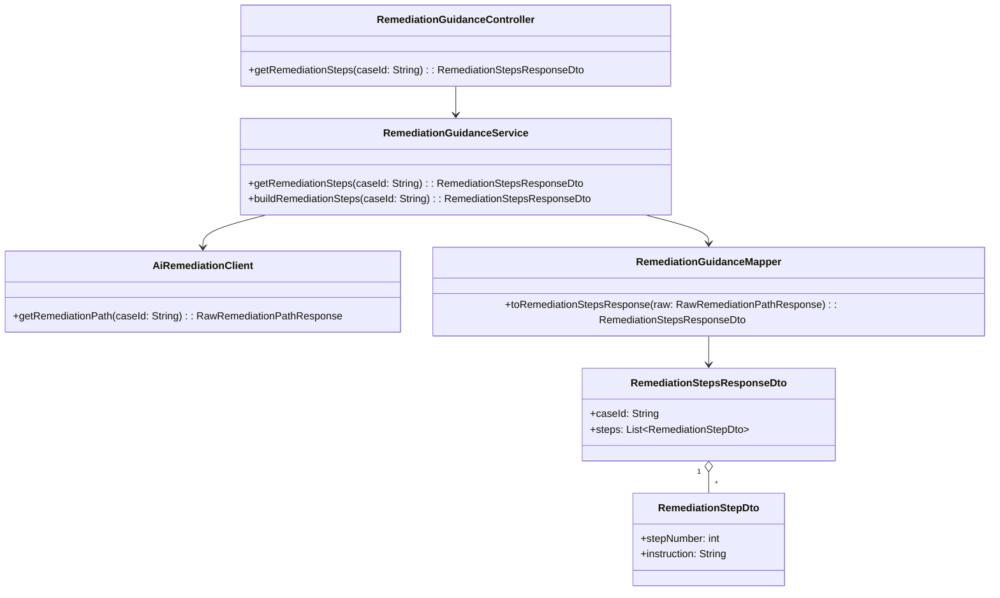
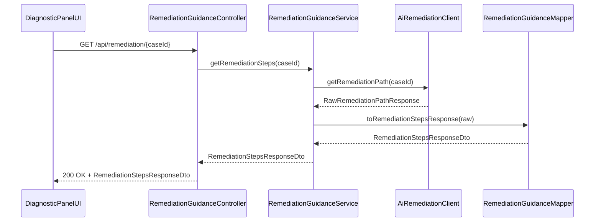
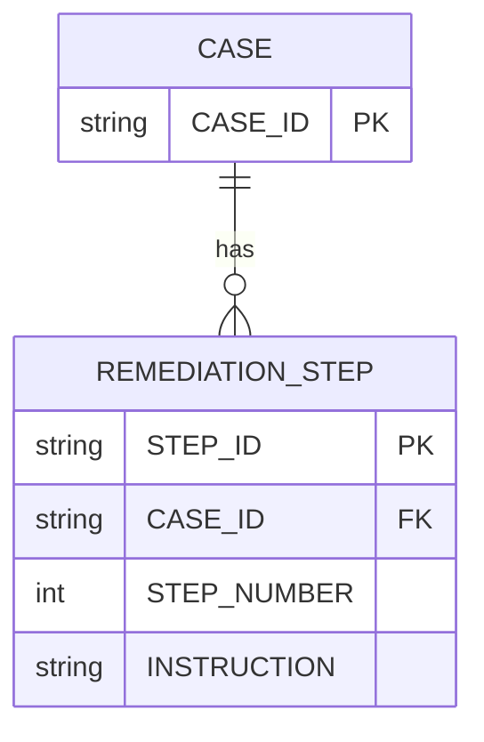

# Repository: APB_Demo
# Branch: APPMRN148
# Folder: LLD

1. Objective
The objective is to provide step-by-step remediation instructions for contact center agents handling member issues. The feature will display a numbered list of clear remediation steps within the diagnostic panel. This supports consistent and efficient resolution of member issues.

2. Backend Spring Boot API Details
2.1. API Model
2.1.1. Common Components/Services
- RemediationGuidanceController: REST controller for retrieving remediation steps.
- RemediationGuidanceService: Service for fetching and preparing remediation paths from AI engine outputs.
- AiRemediationClient: Client for retrieving raw remediation paths for a case or interaction.
- RemediationGuidanceMapper: Mapper converting raw remediation data into ordered step DTOs.

2.1.2. API Details
| Operation | REST Method | Type | URL | Request JSON | Response JSON |
|-----------|------------|------|-----|--------------|---------------|
| Get remediation steps | GET | Query | /api/remediation/{caseId} | N/A (path param caseId) | {"caseId":"string","steps":[{"stepNumber":1,"instruction":"string"}]} |
| Build remediation steps | POST | Command | /internal/remediation/build | {"caseId":"string"} | {"caseId":"string","steps":[{"stepNumber":1,"instruction":"string"}]} |

2.1.3. Exceptions
- RemediationStepsNotFoundException: Thrown when no remediation steps are available.
- RemediationBuildException: Thrown when step generation fails.
- AiRemediationClientException: Thrown on AI remediation retrieval failures.

2.2. Functional Design
2.2.1. Class Diagram

2.2.2. UML Sequence Diagram

2.2.3. Components
| Component Name | Description | Existing/New |
|----------------|-------------|--------------|
| RemediationGuidanceController | REST controller exposing remediation endpoints | New |
| RemediationGuidanceService | Service fetching and building remediation steps | New |
| AiRemediationClient | Client retrieving raw AI remediation paths | New |
| RemediationGuidanceMapper | Mapper converting raw data into ordered steps | New |
| RemediationStepsResponseDto | DTO containing remediation steps | New |
| RemediationStepDto | DTO for a single remediation step | New |

2.3. Service Layer Business Logic
RemediationGuidanceService is injected with AiRemediationClient and RemediationGuidanceMapper. The service retrieves raw remediation paths for a case, validates presence, converts them to RemediationStepDto list, and orders steps by stepNumber. If step numbers are missing, it assigns them in sequence based on original order. No caching is applied to ensure steps reflect current AI recommendations.

Validation rules
| Field Name | Validation | Error Message | Class Used |
|------------|------------|---------------|------------|
| caseId | Not null, not blank | "caseId is required" | RemediationGuidanceService |
| steps | Not null, non-empty | "No remediation steps available" | RemediationGuidanceService |
| stepNumber | Positive integer | "Invalid step number" | RemediationGuidanceService |

2.4. Service Integrations
| System | Integrated For | Integration Type |
|--------|----------------|------------------|
| AI Engine Service | Retrieving remediation paths | REST client |

3. Front End React Details
3.1. UI Component Architecture
The RemediationStepsPanel component presents remediation steps for a case. It receives caseId as a prop and uses a custom hook useRemediationSteps to call /api/remediation/{caseId}. State includes steps, loading, and error, managed via React hooks. The panel passes steps to a child component RemediationStepList for rendering.

3.2. UI Specifications
RemediationStepsPanel displays a numbered list where each item contains a short instruction sentence. The panel header indicates "Steps to resolve". On small screens, the list uses full width with adequate spacing; on larger screens, it aligns within the diagnostic panel. If loading, a simple spinner or skeleton is shown. On error, the text "Remediation steps unavailable" is displayed.

3.3. API Integration
useRemediationSteps uses a shared HTTP client to perform GET requests to /api/remediation/{caseId}. It sets loading before the request and handles success and failure states, updating internal state accordingly. Data is used as returned, with stepNumber used to order the list.

4. Database Details
4.1. ER Model

4.2. Database Validations
- CASE.CASE_ID is non-null and primary key.
- REMEDIATION_STEP.CASE_ID references CASE.CASE_ID.
- REMEDIATION_STEP.STEP_NUMBER must be positive.
- REMEDIATION_STEP.INSTRUCTION must be non-null.

5. Non-Functional Requirements
5.1. Performance
Endpoint should respond within 300ms for typical numbers of remediation steps. In-memory ordering operations are lightweight.

5.2. Security (Authentication & Authorization)
/api/remediation/** endpoints require authenticated agents with proper roles. Internal build endpoint is limited to internal services.

5.3. Logging (Application, Audit, Monitoring)
Log remediation retrieval operations at INFO level including caseId and count of steps. Log AI retrieval failures and mapping errors at WARN or ERROR levels. Monitor latency and failure rates with existing tools.

6. Dependencies
- Spring Boot Web
- Spring Security
- REST client for AI engine
- React 18

7. Assumptions
- AI engine provides remediation paths associated with caseId.
- caseId is available in the diagnostic panel context.
- Remediation steps are presented in English only.
