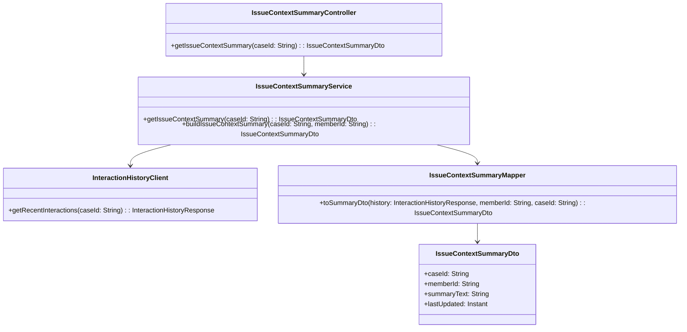
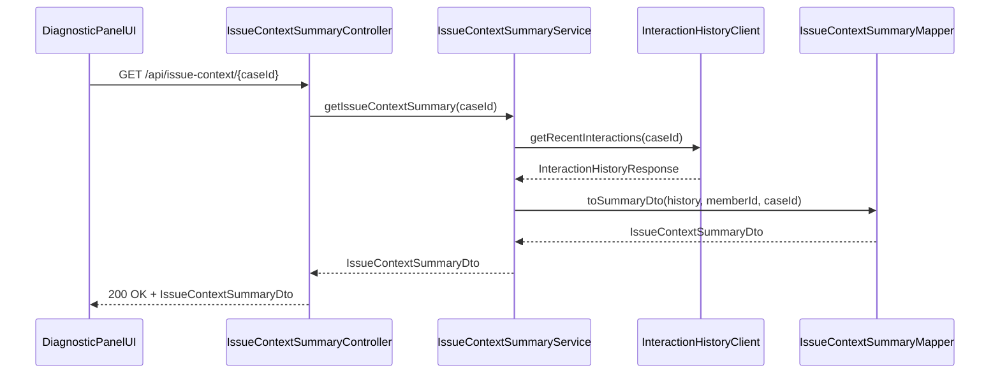
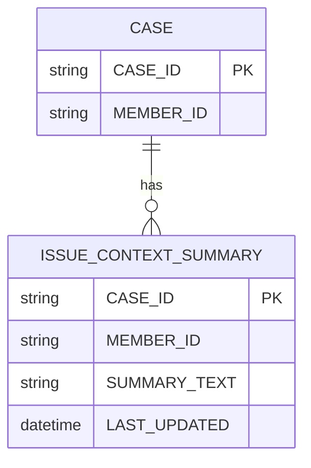

# Repository: APB_Demo
# Branch: APPMRN148
# Folder: LLD

1. Objective
The objective is to provide a concise issue context summary to contact center agents for a member’s active case. The feature aggregates recent interactions and key data points into a short, human-readable summary. This enables agents to quickly understand the member’s situation before taking action.

2. Backend Spring Boot API Details
2.1. API Model
2.1.1. Common Components/Services
- IssueContextSummaryController: REST controller exposing issue context summary endpoints.
- IssueContextSummaryService: Service responsible for aggregating interaction and member data into a summary.
- InteractionHistoryClient: Client to retrieve recent interactions and status data.
- IssueContextSummaryMapper: Component mapping raw data into an issue context summary DTO.

2.1.2. API Details
| Operation | REST Method | Type | URL | Request JSON | Response JSON |
|-----------|------------|------|-----|--------------|---------------|
| Get issue context summary | GET | Query | /api/issue-context/{caseId} | N/A (path param caseId) | {"caseId":"string","memberId":"string","summaryText":"string","lastUpdated":"ISO-8601"} |
| Build issue context summary | POST | Command | /internal/issue-context/build | {"caseId":"string","memberId":"string"} | {"caseId":"string","memberId":"string","summaryText":"string","lastUpdated":"ISO-8601"} |

2.1.3. Exceptions
- IssueContextNotFoundException: Thrown when no relevant context exists for a case.
- IssueContextBuildException: Thrown when summary construction fails.
- InteractionHistoryClientException: Thrown when history retrieval fails.

2.2. Functional Design
2.2.1. Class Diagram

2.2.2. UML Sequence Diagram

2.2.3. Components
| Component Name | Description | Existing/New |
|----------------|-------------|--------------|
| IssueContextSummaryController | REST controller for issue context summary retrieval | New |
| IssueContextSummaryService | Service aggregating data and building summaries | New |
| InteractionHistoryClient | Client for retrieving recent interaction history | New |
| IssueContextSummaryMapper | Mapper composing summary text | New |
| IssueContextSummaryDto | DTO representing issue context summary | New |

2.3. Service Layer Business Logic
IssueContextSummaryService is constructed with InteractionHistoryClient and IssueContextSummaryMapper. When getIssueContextSummary is called, the service validates caseId, retrieves recent interaction data, and uses IssueContextSummaryMapper to generate a concise summaryText highlighting the main issue, recent contact reasons, and any critical flags. lastUpdated is set to the current timestamp. No caching is applied to keep summaries aligned with latest interactions.

Validation rules
| Field Name | Validation | Error Message | Class Used |
|------------|------------|---------------|------------|
| caseId | Not null, not blank | "caseId is required" | IssueContextSummaryService |
| memberId | Not null, not blank (for build endpoint) | "memberId is required" | IssueContextSummaryService |

2.4. Service Integrations
| System | Integrated For | Integration Type |
|--------|----------------|------------------|
| Interaction History Service | Retrieving recent interaction records | REST client |

3. Front End React Details
3.1. UI Component Architecture
The IssueContextPanel component renders the issue context summary for a given caseId. It accepts caseId and memberId as props and uses useIssueContextSummary hook to fetch /api/issue-context/{caseId}. Local state holds loading, error, and IssueContextSummaryDto. The summary text is displayed in a compact panel above other diagnostic content.

3.2. UI Specifications
IssueContextPanel shows memberId, lastUpdated, and summaryText in a single block. On small screens, text wraps naturally with increased line spacing. On larger screens, the panel is aligned to the left with fixed width to maintain readability. If the summary is loading, a skeleton placeholder appears. On error, a brief message "Issue context unavailable" is shown.

3.3. API Integration
useIssueContextSummary uses a shared HTTP client to perform GET /api/issue-context/{caseId}. It sets loading state during the request and handles errors with an error flag. The hook returns summary data as-is; formatting such as date display is handled in the component.

4. Database Details
4.1. ER Model

4.2. Database Validations
- CASE.CASE_ID is primary key and non-null.
- ISSUE_CONTEXT_SUMMARY.CASE_ID references CASE.CASE_ID.
- ISSUE_CONTEXT_SUMMARY.SUMMARY_TEXT must be non-null.
- ISSUE_CONTEXT_SUMMARY.LAST_UPDATED must be non-null.

5. Non-Functional Requirements
5.1. Performance
Summary generation must complete within 300ms for typical interaction history sizes. Aggregation logic is in-memory and avoids heavy NLP processing on the service side.

5.2. Security (Authentication & Authorization)
/api/issue-context/** endpoints require authenticated agents with appropriate permissions. Internal build endpoint is limited to internal services.

5.3. Logging (Application, Audit, Monitoring)
Log summary retrievals at INFO level with caseId. Log failures from Interaction History Service and mapping errors at WARN or ERROR level. Metrics include count of summaries generated and average latency.

6. Dependencies
- Spring Boot Web
- Spring Security
- REST client for Interaction History Service
- React 18

7. Assumptions
- Interaction history is available from an existing service.
- caseId and memberId are provided by the diagnostic panel context.
- Summaries are generated on demand, not precomputed.
