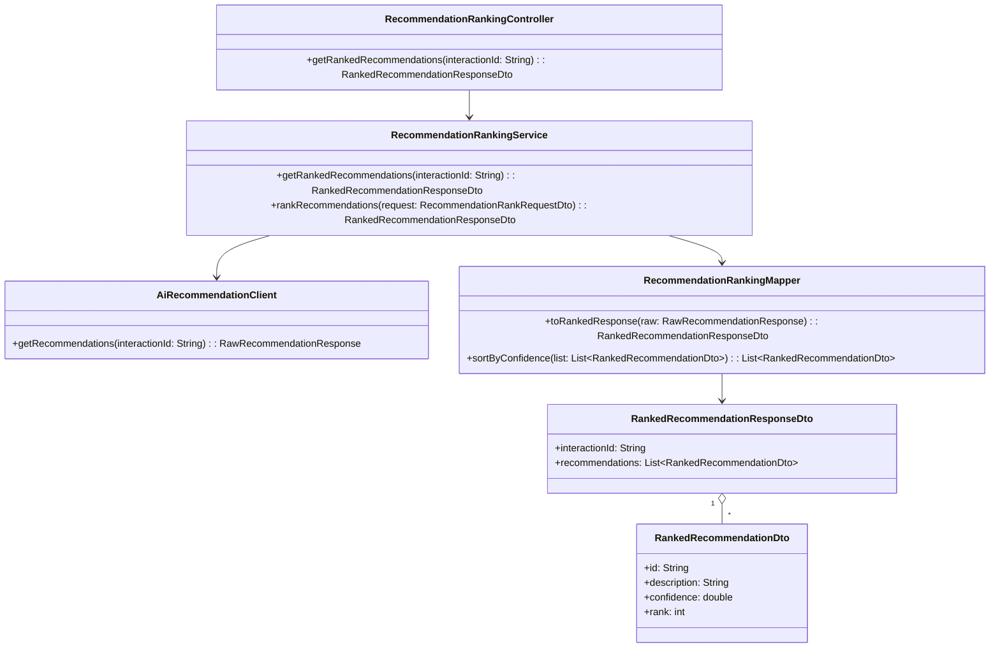
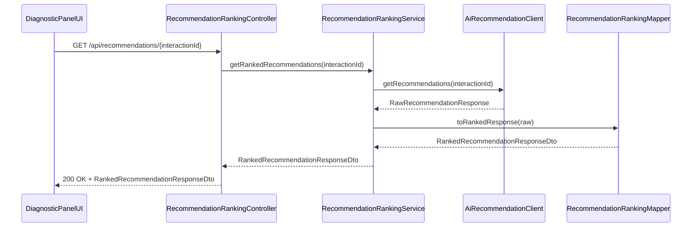
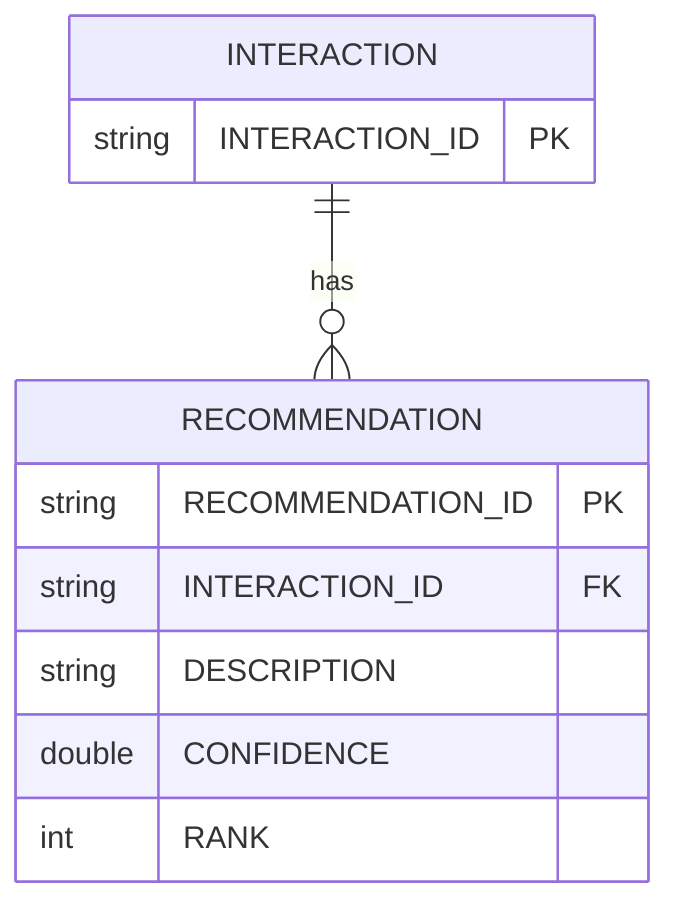

# Repository: APB_Demo
# Branch: APPMRN148
# Folder: LLD

1. Objective
The objective is to present AI-generated remediation recommendations ranked by confidence to contact center agents. The feature will order recommended actions by their confidence scores so agents can prioritize the most effective steps. This improves resolution efficiency by guiding agents toward higher-probability actions first.

2. Backend Spring Boot API Details
2.1. API Model
2.1.1. Common Components/Services
- RecommendationRankingController: REST controller exposing ranked recommendations for an interaction.
- RecommendationRankingService: Service that applies confidence-based sorting and optional thresholds.
- AiRecommendationClient: Client interface for retrieving raw AI remediation pathways with confidence scores.
- RecommendationRankingMapper: Mapper for transforming AI recommendation structures into ranked DTOs.

2.1.2. API Details
| Operation | REST Method | Type | URL | Request JSON | Response JSON |
|-----------|------------|------|-----|--------------|---------------|
| Get ranked recommendations | GET | Query | /api/recommendations/{interactionId} | N/A (path param interactionId) | {"interactionId":"string","recommendations":[{"id":"string","description":"string","confidence":0.95,"rank":1}]} |
| Transform and rank recommendations | POST | Command | /internal/recommendations/rank | {"interactionId":"string","rawRecommendations":[{"code":"string","details":"string","confidence":0.9}]} | {"interactionId":"string","recommendations":[{"id":"string","description":"string","confidence":0.95,"rank":1}]} |

2.1.3. Exceptions
- RecommendationNotFoundException: Thrown when no recommendations exist for the interaction.
- RecommendationRankingException: Thrown when ranking logic fails.
- AiRecommendationClientException: Thrown if AI recommendation retrieval fails.

2.2. Functional Design
2.2.1. Class Diagram

2.2.2. UML Sequence Diagram

2.2.3. Components
| Component Name | Description | Existing/New |
|----------------|-------------|--------------|
| RecommendationRankingController | REST controller exposing ranked recommendations endpoint | New |
| RecommendationRankingService | Service applying confidence-based sorting | New |
| AiRecommendationClient | Client for retrieving AI recommendations | New |
| RecommendationRankingMapper | Mapper converting raw AI recommendations into ranked DTOs | New |
| RankedRecommendationResponseDto | DTO containing ranked recommendations | New |
| RankedRecommendationDto | DTO representing a single ranked recommendation | New |

2.3. Service Layer Business Logic
RecommendationRankingService is injected with AiRecommendationClient and RecommendationRankingMapper. For getRankedRecommendations, the service fetches raw recommendations, validates presence, maps them into RankedRecommendationDto objects, sorts them by confidence descending, and assigns rank values starting from 1. No caching is used to ensure fresh recommendations. Validation includes ensuring interactionId is provided and that each recommendation has a confidence value.

Validation rules
| Field Name | Validation | Error Message | Class Used |
|------------|------------|---------------|------------|
| interactionId | Not null, not blank | "interactionId is required" | RecommendationRankingService |
| rawRecommendations | Not null, non-empty | "No recommendations available" | RecommendationRankingService |
| confidence | Between 0.0 and 1.0 | "Invalid confidence score" | RecommendationRankingService |

2.4. Service Integrations
| System | Integrated For | Integration Type |
|--------|----------------|------------------|
| AI Engine Service | Fetching raw recommendations with confidence scores | REST client |

3. Front End React Details
3.1. UI Component Architecture
The RecommendationPanel component is responsible for displaying ranked recommendations. It receives interactionId as a prop and uses a custom hook useRankedRecommendations to call /api/recommendations/{interactionId}. The hook manages internal state for loading, error, and recommendation data. RecommendationPanel delegates display to child component RankedRecommendationList, passing recommendations as props.

3.2. UI Specifications
RecommendationPanel renders a list where each item shows description, confidence (as percentage), and rank number. Items are ordered by rank, with the highest confidence at the top. On small screens, items span full width; on larger screens, they are shown in a two-column layout. The panel highlights the top recommendation visually (e.g., bold title). There is no user input form. If no recommendations exist, the panel displays "No recommendations available at this time.".

3.3. API Integration
useRankedRecommendations uses a shared HTTP client (e.g., axios instance) to perform GET requests to /api/recommendations/{interactionId}. It sets loading before requests, handles errors by setting an error state, and returns data, loading, and error flags. Data is used as returned from the backend, with confidence formatted as a percentage in the UI.

4. Database Details
4.1. ER Model

4.2. Database Validations
- INTERACTION.INTERACTION_ID is primary key and non-null.
- RECOMMENDATION.INTERACTION_ID references INTERACTION.INTERACTION_ID.
- RECOMMENDATION.CONFIDENCE must be between 0.0 and 1.0.
- RECOMMENDATION.RANK must be positive and unique per interaction.

5. Non-Functional Requirements
5.1. Performance
Sorting is performed in memory and should handle up to a few hundred recommendations per interaction within 100ms. The overall endpoint response time should remain within 300ms under normal load.

5.2. Security (Authentication & Authorization)
/api/recommendations/** endpoints require authenticated agents with appropriate roles. Internal ranking endpoint is restricted to internal services via service-to-service authentication.

5.3. Logging (Application, Audit, Monitoring)
Log retrieval and ranking operations at INFO level with interactionId and count of recommendations. Log invalid AI responses or missing confidence scores at WARN level. Track latency metrics and error rates for monitoring.

6. Dependencies
- Spring Boot Web
- Spring Security
- HTTP client (WebClient or RestTemplate)
- React 18

7. Assumptions
- AI Engine Service returns confidence scores for all recommendations.
- Confidence scores are normalized between 0 and 1.
- InteractionId context is already available in the diagnostic panel.
