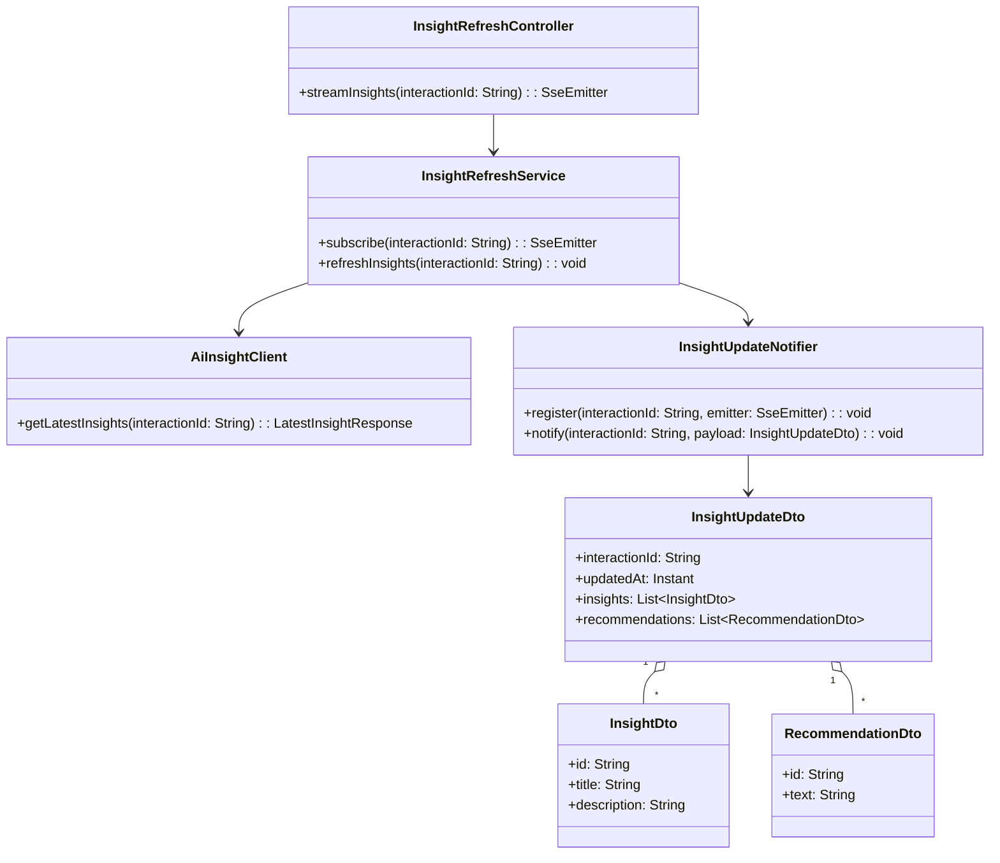
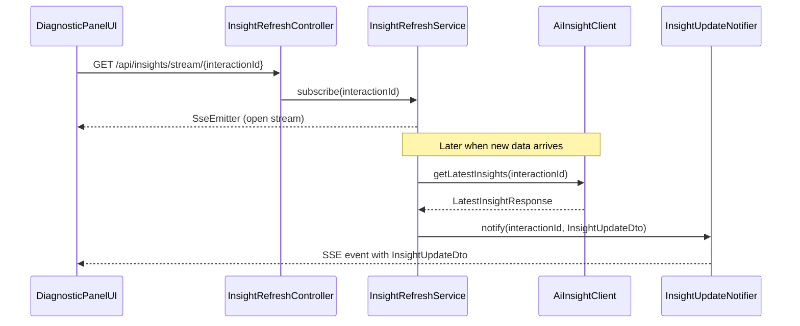
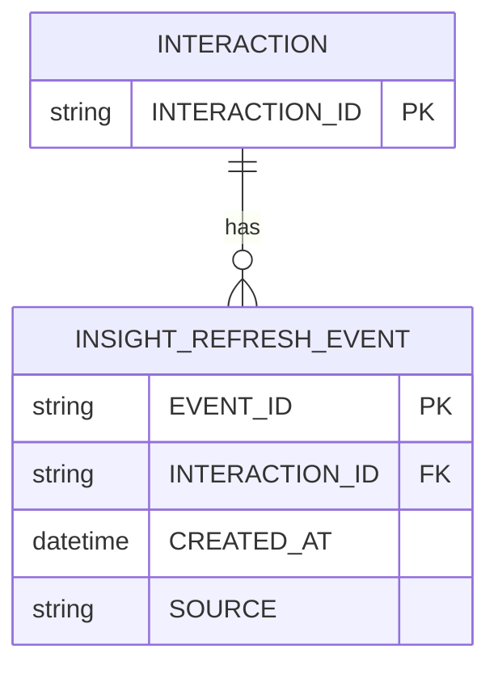

# Repository: APB_Demo
# Branch: APPMRN148
# Folder: LLD

1. Objective
The objective is to enable real-time refresh of AI insights within the diagnostic panel for active interactions. The feature will automatically update the panel when new interaction data or status changes are received. This ensures agents always see the latest insights and recommendations without manual refresh.

2. Backend Spring Boot API Details
2.1. API Model
2.1.1. Common Components/Services
- InsightRefreshController: REST controller managing real-time insight refresh endpoints.
- InsightRefreshService: Service responsible for orchestrating refresh logic and broadcasting updates.
- AiInsightClient: Client interface responsible for fetching latest AI insights for an interaction.
- InsightUpdateNotifier: Component for pushing update notifications to subscribed front-end clients (e.g., via Server-Sent Events).

2.1.2. API Details
| Operation | REST Method | Type | URL | Request JSON | Response JSON |
|-----------|------------|------|-----|--------------|---------------|
| Subscribe to insight updates | GET | Query | /api/insights/stream/{interactionId} | N/A (path param interactionId) | Server-Sent Events stream of {"interactionId":"string","updatedAt":"ISO-8601","insights":[{"id":"string","title":"string","description":"string"}],"recommendations":[{"id":"string","text":"string"}]} |
| Trigger insight refresh | POST | Command | /internal/insights/refresh | {"interactionId":"string"} | {"interactionId":"string","refreshedAt":"ISO-8601"} |

2.1.3. Exceptions
- InsightSubscriptionException: Thrown when subscription to updates fails.
- InsightRefreshException: Thrown when refresh logic encounters errors.
- AiInsightClientException: Thrown when calls to AI engine for latest insights fail.

2.2. Functional Design
2.2.1. Class Diagram

2.2.2. UML Sequence Diagram

2.2.3. Components
| Component Name | Description | Existing/New |
|----------------|-------------|--------------|
| InsightRefreshController | REST controller exposing SSE stream endpoint | New |
| InsightRefreshService | Service managing subscriptions and refresh orchestration | New |
| AiInsightClient | Client fetching latest AI insights | New |
| InsightUpdateNotifier | Notifier maintaining SseEmitter registry and broadcasting updates | New |
| InsightUpdateDto | DTO carrying updated insights and recommendations | New |
| InsightDto | DTO representing a single insight | New |
| RecommendationDto | DTO representing a single recommendation | New |

2.3. Service Layer Business Logic
InsightRefreshService is injected with AiInsightClient and InsightUpdateNotifier. When a client subscribes, it registers an SseEmitter for the interactionId and returns it. Upon receiving a refresh trigger (via internal event or REST call), the service retrieves the latest AI insights, converts them to InsightUpdateDto, and asks InsightUpdateNotifier to broadcast to all registered emitters for that interaction. There is no caching to ensure real-time behavior; AI calls are made whenever refresh is required. Validation ensures interactionId is present and that AI responses contain non-empty insights.

Validation rules
| Field Name | Validation | Error Message | Class Used |
|------------|------------|---------------|------------|
| interactionId | Not null, not blank | "interactionId is required" | InsightRefreshService |
| insights | Not null, non-empty | "No insights available for interaction" | InsightRefreshService |

2.4. Service Integrations
| System | Integrated For | Integration Type |
|--------|----------------|------------------|
| AI Engine Service | Fetching latest AI insights and recommendations | REST client |

3. Front End React Details
3.1. UI Component Architecture
The DiagnosticPanelRealtimeView component manages the real-time subscription to insight updates. It receives interactionId as a prop and uses a custom hook useInsightStream to open an EventSource connection to /api/insights/stream/{interactionId}. State (insights and recommendations) is stored via useState and updated upon receiving SSE messages. Child components InsightList and RecommendationList receive updated props and re-render.

3.2. UI Specifications
DiagnosticPanelRealtimeView shows current insights and recommendations, with a small badge indicating "Updated" when new data is received. The layout is responsive: at widths below 768px, lists stack; at larger widths, they are arranged side-by-side. Agents do not manually refresh; instead, updates appear automatically with a subtle highlight of new content that fades after a short duration. Error messages such as "Real-time updates unavailable" appear if the stream disconnects.

3.3. API Integration
The useInsightStream hook configures an EventSource pointing to /api/insights/stream/{interactionId}. It listens to message events, parses JSON payloads into InsightUpdateDto, and updates local state. On error or close, it sets an error flag and optionally attempts one reconnection with backoff. No additional transformation is applied beyond mapping to component-friendly structures.

4. Database Details
4.1. ER Model

4.2. Database Validations
- INTERACTION.INTERACTION_ID is unique and non-null.
- INSIGHT_REFRESH_EVENT.INTERACTION_ID must reference INTERACTION.INTERACTION_ID.
- INSIGHT_REFRESH_EVENT.CREATED_AT must be non-null.

5. Non-Functional Requirements
5.1. Performance
SSE connections should support up to the typical number of concurrent agents without saturating the server. Each refresh event should propagate within 1 second from AI data availability under normal conditions.

5.2. Security (Authentication & Authorization)
SSE endpoint /api/insights/stream/** requires authenticated agents with appropriate roles. Internal refresh endpoint is restricted to service accounts with machine credentials.

5.3. Logging (Application, Audit, Monitoring)
Log subscription start and end for each interactionId at INFO level. Log refresh events and any SSE errors at WARN or ERROR levels. Expose metrics for active SSE connections and refresh latency.

6. Dependencies
- Spring Boot Web starter
- Spring Security
- Spring MVC support for Server-Sent Events
- React 18 and EventSource API support in the browser

7. Assumptions
- Real-time behavior is implemented using Server-Sent Events, not WebSockets.
- AI Engine Service can provide updated insights on demand.
- The number of concurrent SSE connections is within infrastructure limits.
