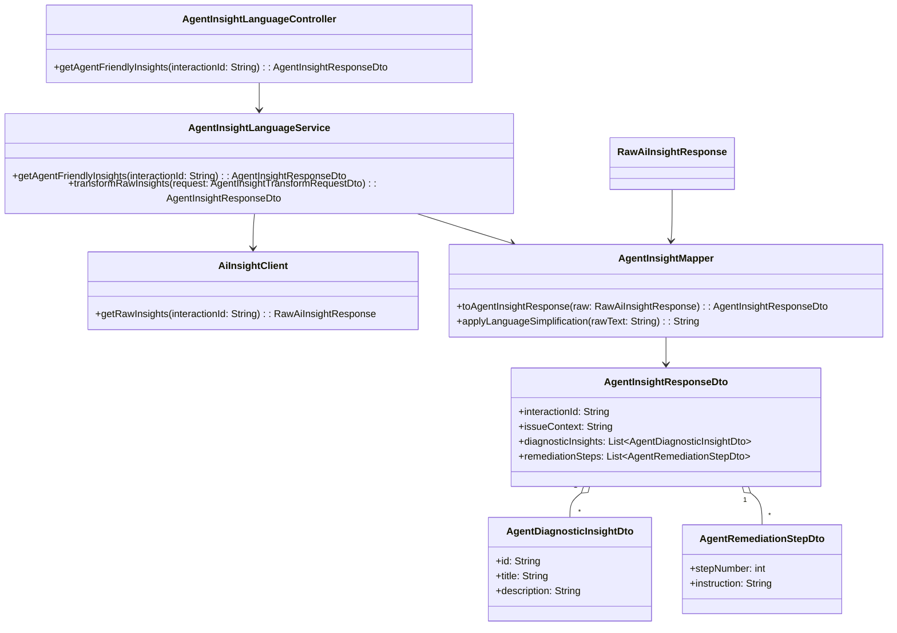
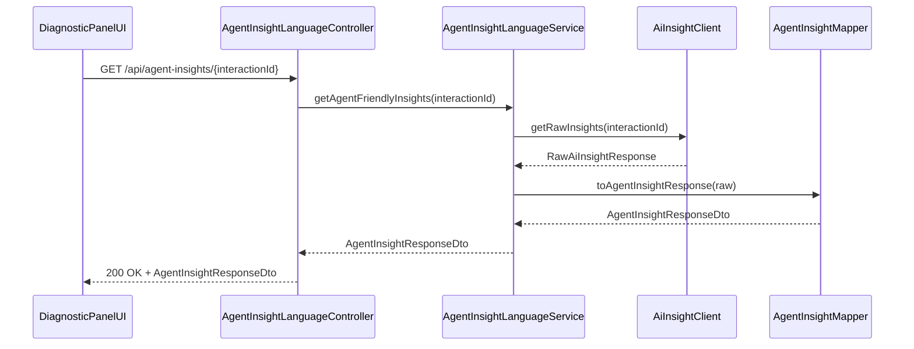
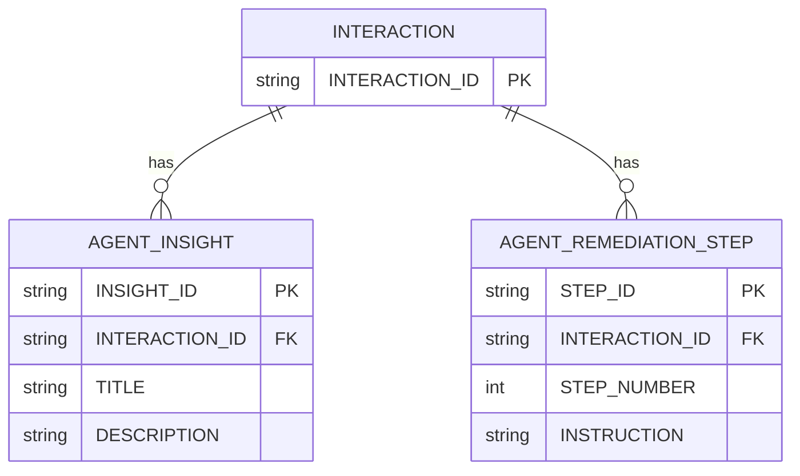

# Repository: APB_Demo
# Branch: APPMRN148
# Folder: LLD

1. Objective
The objective is to ensure AI-generated diagnostic insights and remediation instructions are presented in clear, non-technical language suited for contact center agents. The feature will transform technical outputs from the AI engine into concise, human-readable messages. This improves agent comprehension and reduces reliance on technical interpretation during member interactions.

2. Backend Spring Boot API Details
2.1. API Model
2.1.1. Common Components/Services
- AgentInsightLanguageService: Service that converts AI diagnostic insights and remediation steps into agent-friendly language using rules and templates.
- AgentInsightLanguageController: REST controller exposing endpoints to retrieve and transform AI insights into agent-friendly text.
- AiInsightClient: Internal client interface for fetching raw AI engine insights and remediation outputs.
- AgentInsightMapper: Utility component to map raw AI engine structures to DTOs used for agent-facing views.

2.1.2. API Details
| Operation | REST Method | Type | URL | Request JSON | Response JSON |
|-----------|------------|------|-----|--------------|---------------|
| Get agent-friendly insights | GET | Query | /api/agent-insights/{interactionId} | N/A (path param interactionId) | {"interactionId":"string","issueContext":"string","diagnosticInsights":[{"id":"string","title":"string","description":"string"}],"remediationSteps":[{"stepNumber":1,"instruction":"string"}]} |
| Transform raw AI insights | POST | Command | /internal/agent-insights/transform | {"interactionId":"string","rawInsights":[{"code":"string","message":"string","confidence":0.95}],"rawRemediations":[{"code":"string","details":"string","sequence":1}]} | {"interactionId":"string","diagnosticInsights":[{"id":"string","title":"string","description":"string"}],"remediationSteps":[{"stepNumber":1,"instruction":"string"}]} |

2.1.3. Exceptions
- AgentInsightNotFoundException: Thrown when no AI insights are available for the given interactionId.
- AgentInsightTransformationException: Thrown when transformation from raw AI insight to agent-friendly language fails.
- AiInsightClientException: Thrown when calls to the AI engine fail.

2.2. Functional Design
2.2.1. Class Diagram

2.2.2. UML Sequence Diagram

2.2.3. Components
| Component Name | Description | Existing/New |
|----------------|-------------|--------------|
| AgentInsightLanguageController | REST controller exposing agent-friendly insight retrieval endpoints | New |
| AgentInsightLanguageService | Business logic for transforming raw AI outputs into agent-facing insights | New |
| AiInsightClient | Client for retrieving raw diagnostic insights and remediation paths from AI engine | New |
| AgentInsightMapper | Mapper and text simplification utilities | New |
| AgentInsightResponseDto | DTO representing agent-facing insights and remediation steps | New |
| AgentDiagnosticInsightDto | DTO for a single diagnostic insight | New |
| AgentRemediationStepDto | DTO for a single remediation step | New |

2.3. Service Layer Business Logic
AgentInsightLanguageService uses dependency injection to receive AiInsightClient and AgentInsightMapper via constructor. The service retrieves raw AI outputs for an interactionId, invokes mapping and simplification functions to remove jargon, and returns AgentInsightResponseDto. The workflow: validate interactionId, fetch raw data, map to structured DTOs, run language simplification (e.g., replacing technical terms with friendly equivalents, shortening sentences), and return results. No caching is applied to ensure the latest AI outputs are always shown. Basic validation ensures interactionId is non-empty and that diagnosticInsights and remediationSteps are present.

Validation rules
| Field Name | Validation | Error Message | Class Used |
|------------|------------|---------------|------------|
| interactionId | Not null, not blank | "interactionId is required" | AgentInsightLanguageService |
| rawInsights | Not null, non-empty | "AI insights not available" | AgentInsightLanguageService |
| rawRemediations | Not null | "AI remediation data not available" | AgentInsightLanguageService |

2.4. Service Integrations
| System | Integrated For | Integration Type |
|--------|----------------|------------------|
| AI Engine Service | Fetching raw diagnostic insights and remediation paths | REST client |

3. Front End React Details
3.1. UI Component Architecture
The main UI component will be DiagnosticPanelAgentView, which consumes agent-friendly insights. DiagnosticPanelAgentView receives interactionId as a prop and uses a custom hook useAgentInsights to fetch data from /api/agent-insights/{interactionId}. State is managed using React hooks (useState, useEffect); loading and error states are stored locally within the component. Data flows from the hook to child components AgentInsightSummaryList and AgentRemediationStepsList, which are passed props for display.

3.2. UI Specifications
DiagnosticPanelAgentView displays a header with the member identifier and an issue context snippet, followed by a list of diagnostic insights and a numbered list of remediation steps. The layout is responsive with breakpoints at 768px and 1024px; below 768px, lists stack vertically, and above they are side-by-side. Text is concise, with bullet points and numbered steps. There is no direct form input; instead, agents read instructions. Tooltips or inline help are avoided to keep language simple. Errors are displayed as a single line message "Unable to load agent guidance. Please retry." at the top of the panel.

3.3. API Integration
The UI uses a shared HTTP client configuration built on fetch or axios within useAgentInsights. The hook performs a GET to /api/agent-insights/{interactionId}, sets loading = true before sending, and handles success, error, and completion states. On success, it stores AgentInsightResponseDto in state; on error, it logs the error and exposes an error flag so the component can render a fallback message. Data is used as-is, with minimal transformation (e.g., sorting by stepNumber for remediationSteps).

4. Database Details
4.1. ER Model

4.2. Database Validations
- INTERACTION.INTERACTION_ID is the primary key and must be unique and non-null.
- AGENT_INSIGHT.INTERACTION_ID must reference an existing INTERACTION.INTERACTION_ID.
- AGENT_REMEDIATION_STEP.INTERACTION_ID must reference an existing INTERACTION.INTERACTION_ID.
- AGENT_REMEDIATION_STEP.STEP_NUMBER must be positive.

5. Non-Functional Requirements
5.1. Performance
The service should respond within 300ms for typical payload sizes under normal load. Transformations are in-memory and avoid heavy computations. The system should handle concurrent requests proportional to existing diagnostic panel traffic without additional throttling.

5.2. Security (Authentication & Authorization)
Endpoints under /api/agent-insights/** require authenticated users with the AGENT role. Internal endpoint /internal/agent-insights/transform is restricted to internal services using service-to-service authentication (e.g., OAuth2 client credentials). No sensitive member data is logged.

5.3. Logging (Application, Audit, Monitoring)
Log at INFO level when agent insights are retrieved, including interactionId and response size. Log at WARN level when AI Engine Service returns incomplete or empty data. Log at ERROR level when transformations fail or downstream calls fail. Expose basic metrics (request count, latency, error rate) via existing monitoring framework.

6. Dependencies
- Spring Boot Web starter
- Spring Security for securing endpoints
- HTTP client library (e.g., Spring WebClient or RestTemplate) for AI Engine Service integration
- React 18 with React Router for UI routing

7. Assumptions
- Raw AI insights are provided by a separate AI Engine Service via REST.
- No multilingual support is required; language simplification targets English only.
- Interaction IDs are already available in the diagnostic panel context.
