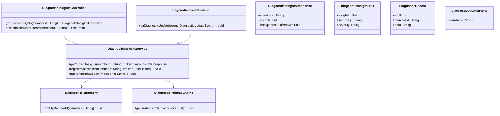
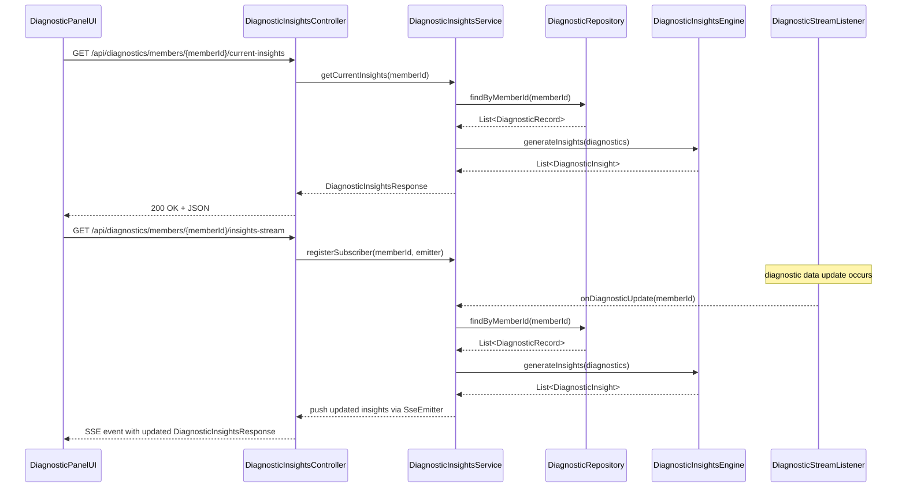
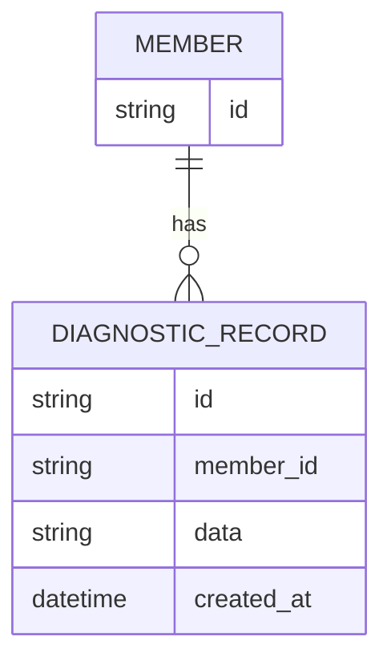

# Repository: APB_Demo
# Branch: APPMRN149
# Folder: LLD

1. Objective
The objective is to provide real-time diagnostic insights for member cases in the AI-assisted diagnostic panel. The system will update insights when new diagnostic data arrives. This enables support agents to quickly understand and respond to the current issue state.

2. Backend Spring Boot API Details
2.1. API Model
2.1.1. Common Components/Services
- DiagnosticInsightsController: REST controller and streaming endpoint provider for diagnostic insights.
- DiagnosticInsightsService: Service responsible for aggregating and refreshing insights from underlying diagnostics.
- DiagnosticInsightsEngine: Component encapsulating insight generation logic from raw diagnostic data.
- DiagnosticStreamListener: Component listening to diagnostic data updates (e.g., messaging or event stream).
- DiagnosticRepository: Data access component for diagnostic records.

2.1.2. API Details
| Operation                             | REST Method | Type           | URL                                                     | Request JSON | Response JSON                                                                                                       |
|---------------------------------------|------------|----------------|---------------------------------------------------------|-------------|---------------------------------------------------------------------------------------------------------------------|
| Get current diagnostic insights       | GET        | Query API      | /api/diagnostics/members/{memberId}/current-insights    | N/A         | { "memberId": "string", "insights": [ { "insightId": "string", "summary": "string", "severity": "string" } ], "lastUpdated": "datetime" } |
| Subscribe to diagnostic insight updates | GET      | Stream (SSE)   | /api/diagnostics/members/{memberId}/insights-stream     | N/A         | Server-Sent Events emitting JSON payloads same as current-insights response                                         |

2.1.3. Exceptions
- MemberNotFoundException: Thrown when member diagnostics cannot be located.
- DiagnosticInsightsGenerationException: Thrown when insight generation fails.

2.2. Functional Design
2.2.1. Class Diagram

2.2.2. UML Sequence Diagram

2.2.3. Components
| Component Name               | Description                                                             | Existing/New |
|-----------------------------|-------------------------------------------------------------------------|-------------|
| DiagnosticInsightsController| REST and streaming controller for diagnostic insights.                  | New         |
| DiagnosticInsightsService   | Service orchestration for insight generation and subscriber management. | New         |
| DiagnosticInsightsEngine    | Component encapsulating insight generation logic.                       | New         |
| DiagnosticStreamListener    | Listener for upstream diagnostic update events.                         | New         |
| DiagnosticRepository        | Repository for diagnostic records.                                      | New         |
| DiagnosticInsightsResponse  | DTO for current insights response.                                      | New         |
| DiagnosticInsightDTO        | DTO for individual insight representation.                              | New         |
| DiagnosticRecord            | Entity/DTO for raw diagnostic data.                                     | New         |
| DiagnosticUpdateEvent       | Event representation for diagnostic updates.                            | New         |

2.3. Service Layer Business Logic
- Service architecture & dependency injection: DiagnosticInsightsController injects DiagnosticInsightsService. DiagnosticInsightsService injects DiagnosticRepository and DiagnosticInsightsEngine. DiagnosticStreamListener injects DiagnosticInsightsService.
- Workflow: For current insights, the service fetches diagnostics, generates insights, and returns response with lastUpdated. For streaming, subscribers are registered per memberId, and when DiagnosticStreamListener receives an update, it regenerates insights and notifies subscribers.
- Caching strategy: Short-lived cache of generated insights per memberId to serve GET requests quickly while still refreshing on updates.
- Validation rules: Validate memberId is non-empty; ensure diagnostics exist before generating insights; handle cases with no diagnostics by returning an empty list.

Validation rules
| Field Name | Validation                         | Error Message                                      | Class Used                    |
|-----------|-------------------------------------|----------------------------------------------------|-------------------------------|
| memberId  | Not null, not blank                 | "memberId is required"                            | DiagnosticInsightsService     |

2.4. Service Integrations
| System              | Integrated For                                 | Integration Type |
|---------------------|------------------------------------------------|------------------|
| DiagnosticDataStore | Reading and streaming diagnostic data          | Synchronous API / Event Stream |

3. Front End React Details
3.1. UI Component Architecture
- Components:
  - DiagnosticInsightsPanel: Container component that displays real-time diagnostic insights.
  - DiagnosticInsightList: Presentational component rendering insight items.
- Data flow: DiagnosticInsightsPanel fetches current insights and subscribes to SSE for updates, passing insights as props to DiagnosticInsightList.
- State management: useState/useEffect to manage insights, loading, error, and subscription lifecycle.
- Props interfaces:
  - DiagnosticInsightList props: { insights: DiagnosticInsightViewModel[] }
- Routing: DiagnosticInsightsPanel is embedded within the member diagnostic case view.

3.2. UI Specifications
- Wireframes/pages: Insights appear as a list or cards summarizing current issues, each with severity labels.
- Responsive breakpoints: Insights stack vertically on small screens and use a grid on larger screens if needed.
- Form structures with validation: None; read-only insights.
- User interaction patterns: Panel auto-refreshes via SSE; agent can see timestamps for lastUpdated.

3.3. API Integration
- HTTP client configuration: Use fetch/axios for GET current-insights and EventSource for SSE subscription.
- Call patterns and error handling: On mount, DiagnosticInsightsPanel calls the current-insights endpoint and opens SSE stream; on SSE error, it retries or falls back to polling. Errors show a non-blocking banner.
- Loading states: Show spinner until initial load; subtle indicator when updating.
- Data transformation: Map DiagnosticInsightsResponse to DiagnosticInsightViewModel including formatted timestamps and severity labels.

4. Database Details
4.1. ER Model

4.2. Database Validations
- DIAGNOSTIC_RECORD.member_id references MEMBER.id.

5. Non-Functional Requirements
5.1. Performance
- Insight retrieval should complete within 500 ms.
- SSE streaming should handle multiple concurrent subscribers efficiently.

5.2. Security (Authentication & Authorization)
- All endpoints secured for authenticated support agents.
- SSE stream must validate authorization per connection.

5.3. Logging (Application, Audit, Monitoring)
- Log insight generation events and errors.
- Track SSE connection lifecycle (open, close, error) for monitoring.

6. Dependencies
- Spring Boot Web and possibly Spring WebFlux (for SSE support).
- React with hooks, axios/fetch, and EventSource for SSE.

7. Assumptions
- Upstream diagnostic system publishes updates to a stream consumed by DiagnosticStreamListener.
- SSE is acceptable for real-time updates in the web client.
