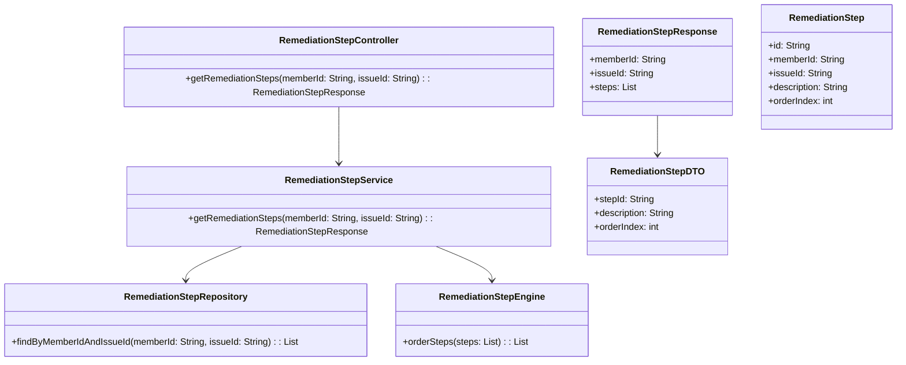
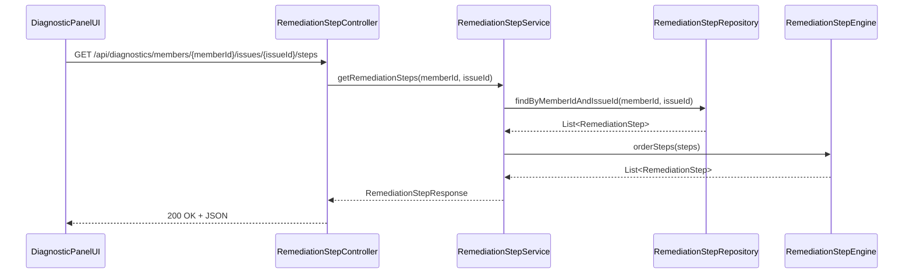
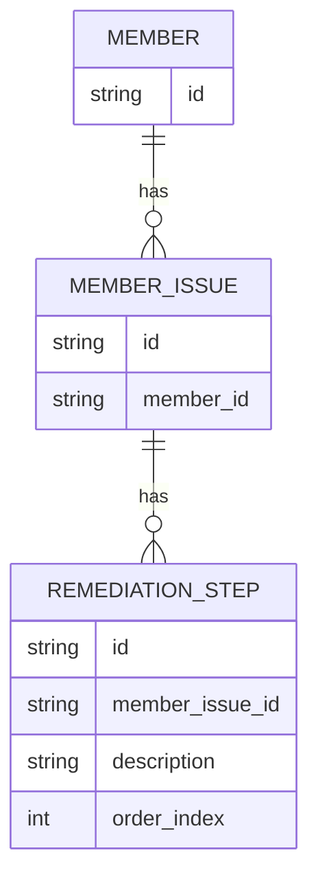

# Repository: APB_Demo
# Branch: APPMRN149
# Folder: LLD

1. Objective
The objective is to provide AI-guided remediation steps for member issues. The system will display a numbered list of recommended remediation steps in logical order within the AI-assisted diagnostic panel. This guides support agents through a clear sequence of actions to resolve member issues.

2. Backend Spring Boot API Details
2.1. API Model
2.1.1. Common Components/Services
- RemediationStepController: REST controller exposing AI-guided remediation steps.
- RemediationStepService: Service retrieving and ordering remediation steps for a member issue.
- RemediationStepEngine: Component encapsulating step ordering and transformation logic.
- RemediationStepRepository: Data access component for remediation steps.

2.1.2. API Details
| Operation                        | REST Method | Type      | URL                                                         | Request JSON | Response JSON                                                                                                             |
|----------------------------------|------------|-----------|-------------------------------------------------------------|-------------|---------------------------------------------------------------------------------------------------------------------------|
| Get AI-guided remediation steps  | GET        | Query API | /api/diagnostics/members/{memberId}/issues/{issueId}/steps  | N/A         | { "memberId": "string", "issueId": "string", "steps": [ { "stepId": "string", "description": "string", "orderIndex": number } ] } |

2.1.3. Exceptions
- MemberNotFoundException: Thrown when member does not exist.
- IssueNotFoundException: Thrown when issueId does not correspond to any known issue.
- RemediationStepsNotFoundException: Thrown when no remediation steps exist for the issue.

2.2. Functional Design
2.2.1. Class Diagram

2.2.2. UML Sequence Diagram

2.2.3. Components
| Component Name            | Description                                                        | Existing/New |
|--------------------------|--------------------------------------------------------------------|-------------|
| RemediationStepController| REST controller for AI-guided remediation steps.                   | New         |
| RemediationStepService   | Service for retrieving and ordering remediation steps.             | New         |
| RemediationStepEngine    | Component encapsulating step ordering logic.                       | New         |
| RemediationStepRepository| Repository for remediation step entities.                          | New         |
| RemediationStepResponse  | DTO for response payload of remediation steps.                     | New         |
| RemediationStepDTO       | DTO for individual remediation step.                               | New         |
| RemediationStep          | Entity representing remediation step data.                         | New         |

2.3. Service Layer Business Logic
- Service architecture & dependency injection: RemediationStepController injects RemediationStepService; RemediationStepService injects RemediationStepRepository and RemediationStepEngine via constructor-based injection.
- Workflow: For a given memberId and issueId, RemediationStepService retrieves raw steps from RemediationStepRepository, passes them to RemediationStepEngine for ordering, transforms them to RemediationStepDTO, and returns RemediationStepResponse.
- Caching strategy: Optional caching of ordered steps per memberId/issueId with invalidation based on issue updates.
- Validation rules: Validate that memberId and issueId are provided; ensure steps are not empty; ensure orderIndex values are consistent and non-negative.

Validation rules
| Field Name | Validation                         | Error Message                                      | Class Used              |
|-----------|-------------------------------------|----------------------------------------------------|-------------------------|
| memberId  | Not null, not blank                 | "memberId is required"                            | RemediationStepService  |
| issueId   | Not null, not blank                 | "issueId is required"                             | RemediationStepService  |
| orderIndex| Non-negative integer                | "orderIndex must be non-negative"                 | RemediationStepEngine   |

2.4. Service Integrations
| System              | Integrated For                                | Integration Type |
|---------------------|-----------------------------------------------|------------------|
| DiagnosticDataStore | Storing and retrieving AI remediation steps   | Synchronous API / Repository |

3. Front End React Details
3.1. UI Component Architecture
- Components:
  - RemediationStepListPanel: Container component that fetches and displays AI-guided remediation steps.
  - RemediationStepListView: Presentational component rendering numbered steps.
- Data flow: RemediationStepListPanel invokes the backend endpoint and passes steps as props to RemediationStepListView.
- State management: useState/useEffect manage loading, error, and steps state.
- Props interfaces:
  - RemediationStepListView props: { steps: RemediationStepViewModel[] }
- Routing: RemediationStepListPanel is embedded in the AI-assisted diagnostic panel linked to memberId and issueId.

3.2. UI Specifications
- Wireframes/pages: A section titled "AI-Guided Steps" lists steps numbered 1..N with descriptive text.
- Responsive breakpoints: Steps are shown as full-width rows; minimal responsive adaptation needed beyond standard typography scaling.
- Form structures with validation: None; read-only list.
- User interaction patterns: Steps may be expandable for additional details if needed; no inputs required.

3.3. API Integration
- HTTP client configuration: Use shared DiagnosticApiClient.
- Call patterns and error handling: RemediationStepListPanel calls GET /api/diagnostics/members/{memberId}/issues/{issueId}/steps when issue context is active. Errors display an inline message and optionally hide the steps section.
- Loading states: Spinner or skeleton for steps while loading.
- Data transformation: Map RemediationStepDTO to RemediationStepViewModel; ensure steps are ordered by orderIndex.

4. Database Details
4.1. ER Model

4.2. Database Validations
- REMEDIATION_STEP.member_issue_id references MEMBER_ISSUE.id.
- order_index must be non-negative and unique per issue.

5. Non-Functional Requirements
5.1. Performance
- Retrieval of remediation steps should complete within 300 ms under typical load.

5.2. Security (Authentication & Authorization)
- Only authenticated and authorized support agents can access remediation steps.

5.3. Logging (Application, Audit, Monitoring)
- Log step retrieval calls including memberId and issueId.

6. Dependencies
- Spring Boot Web, Spring Data JPA.
- React with hooks and shared HTTP client.

7. Assumptions
- AI engine generating remediation steps is external and has populated DiagnosticDataStore.
- Steps are immutable for the lifecycle of a given issue instance.
