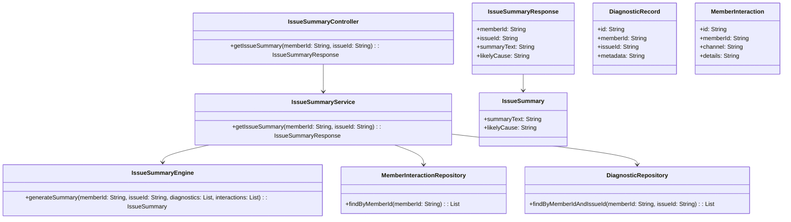
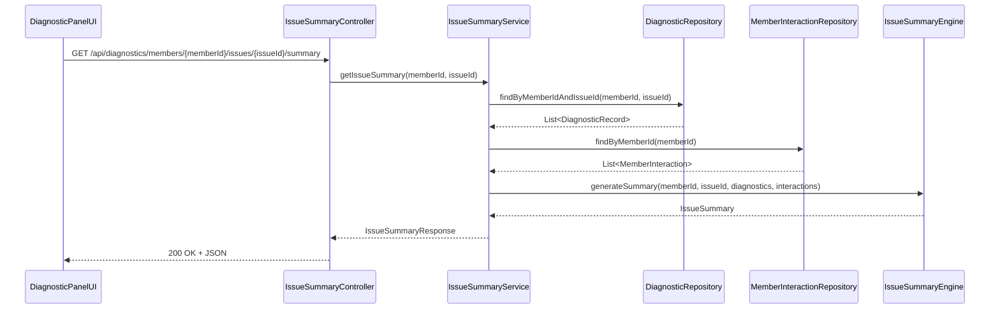
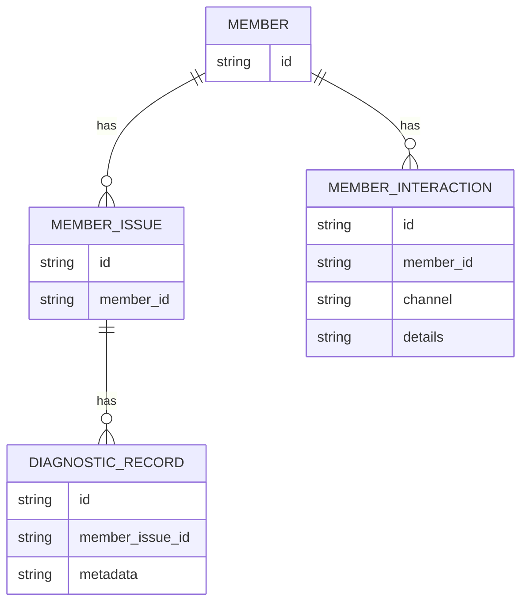

# Repository: APB_Demo
# Branch: APPMRN149
# Folder: LLD

1. Objective
The objective is to provide contextual issue summarization for support agents. The system will generate concise summaries of member issues combining diagnostics and historical interactions. This allows agents to quickly understand key problems and likely causes without reading all underlying details.

2. Backend Spring Boot API Details
2.1. API Model
2.1.1. Common Components/Services
- IssueSummaryController: REST controller for providing AI-generated issue summaries.
- IssueSummaryService: Service responsible for aggregating data and orchestrating summary generation.
- IssueSummaryEngine: Component that encapsulates summarization logic using diagnostics and historical interactions.
- MemberInteractionRepository: Data access component for member interaction history.
- DiagnosticRepository: Data access component for diagnostic records.

2.1.2. API Details
| Operation                     | REST Method | Type      | URL                                                       | Request JSON                                                                 | Response JSON                                                                                                                     |
|-------------------------------|------------|-----------|-----------------------------------------------------------|------------------------------------------------------------------------------|-----------------------------------------------------------------------------------------------------------------------------------|
| Get contextual issue summary  | GET        | Query API | /api/diagnostics/members/{memberId}/issues/{issueId}/summary | N/A                                                                          | { "memberId": "string", "issueId": "string", "summaryText": "string", "likelyCause": "string" }                                      |

2.1.3. Exceptions
- MemberNotFoundException: Thrown when the member does not exist.
- IssueNotFoundException: Thrown when the issueId does not correspond to any known issue for the member.
- IssueSummaryGenerationException: Thrown when summarization fails due to missing or inconsistent data.

2.2. Functional Design
2.2.1. Class Diagram

2.2.2. UML Sequence Diagram

2.2.3. Components
| Component Name              | Description                                                              | Existing/New |
|----------------------------|--------------------------------------------------------------------------|-------------|
| IssueSummaryController     | REST controller exposing contextual issue summary endpoint.              | New         |
| IssueSummaryService        | Service orchestrating data retrieval and summary generation.             | New         |
| IssueSummaryEngine         | Component encapsulating summarization logic.                             | New         |
| MemberInteractionRepository| Repository for member interaction history.                               | New         |
| DiagnosticRepository       | Repository for diagnostic records.                                       | New         |
| IssueSummaryResponse       | DTO representing summary response payload.                               | New         |
| IssueSummary               | Internal model for summary content.                                      | New         |
| DiagnosticRecord           | Entity/DTO representing diagnostic data.                                 | New         |
| MemberInteraction          | Entity/DTO representing historical member interactions.                  | New         |

2.3. Service Layer Business Logic
- Service architecture & dependency injection: IssueSummaryController injects IssueSummaryService. IssueSummaryService injects DiagnosticRepository, MemberInteractionRepository, and IssueSummaryEngine using constructor injection.
- Workflow: For a request, IssueSummaryService fetches diagnostics and member interactions, passes them to IssueSummaryEngine, builds IssueSummaryResponse from the generated IssueSummary, and returns it.
- Caching strategy: Optional caching of IssueSummaryResponse per memberId/issueId for the duration of the case session.
- Validation rules: Validate that memberId and issueId are not blank; ensure diagnostics exist; handle empty interactions by summarizing based on diagnostics alone.

Validation rules
| Field Name | Validation                         | Error Message                                      | Class Used             |
|-----------|-------------------------------------|----------------------------------------------------|------------------------|
| memberId  | Not null, not blank                 | "memberId is required"                            | IssueSummaryService    |
| issueId   | Not null, not blank                 | "issueId is required"                             | IssueSummaryService    |

2.4. Service Integrations
| System              | Integrated For                           | Integration Type |
|---------------------|------------------------------------------|------------------|
| DiagnosticDataStore | Retrieving diagnostics and interactions  | Synchronous API / Repository |

3. Front End React Details
3.1. UI Component Architecture
- Components:
  - IssueSummaryPanel: Container component that fetches and displays the summary for a specific issue.
  - IssueSummaryText: Presentational component rendering summaryText and likelyCause.
- Data flow: IssueSummaryPanel calls the backend summary endpoint and supplies the resulting data as props to IssueSummaryText.
- State management: useState/useEffect for managing summary loading and errors.
- Props interfaces:
  - IssueSummaryText props: { summaryText: string, likelyCause: string }
- Routing: IssueSummaryPanel is displayed within the AI-assisted diagnostic panel, bound to the active issue.

3.2. UI Specifications
- Wireframes/pages: A summary card at the top of the diagnostic panel shows "Issue Summary" and "Likely Cause" sections.
- Responsive breakpoints: Summary text reflows across device widths, with padding adjustments.
- Form structures with validation: No user-input forms; output-only.
- User interaction patterns: When the user switches issue context, IssueSummaryPanel reloads and updates content.

3.3. API Integration
- HTTP client configuration: Use shared DiagnosticApiClient configured for JSON.
- Call patterns and error handling: IssueSummaryPanel calls GET /api/diagnostics/members/{memberId}/issues/{issueId}/summary when issue context changes. Errors display a fallback message (e.g., "Summary unavailable") and log details.
- Loading states: Spinner or skeleton summary view until data loads.
- Data transformation: Minimal mapping from IssueSummaryResponse to view model fields.

4. Database Details
4.1. ER Model

4.2. Database Validations
- MEMBER_ISSUE.member_id references MEMBER.id.
- DIAGNOSTIC_RECORD.member_issue_id references MEMBER_ISSUE.id.
- MEMBER_INTERACTION.member_id references MEMBER.id.

5. Non-Functional Requirements
5.1. Performance
- Summary generation should complete within 700 ms for typical diagnostics and interaction histories.

5.2. Security (Authentication & Authorization)
- Only authorized support agents can access member issue summaries.

5.3. Logging (Application, Audit, Monitoring)
- Log summary generation requests and outcomes, including memberId/issueId.
- Log summarization failures with enough context to reproduce issues.

6. Dependencies
- Spring Boot Web and Spring Data JPA.
- React with hooks and shared HTTP client.

7. Assumptions
- Diagnostics and historical interactions are already ingested into DiagnosticDataStore.
- Summary generation uses deterministic summarization rules or a pre-existing AI service.
