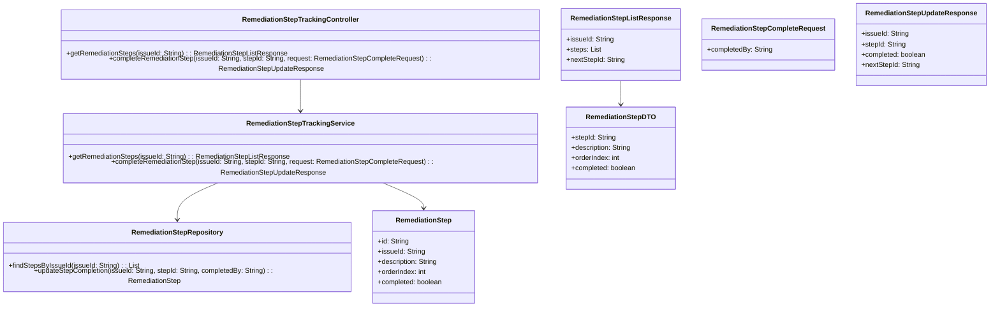
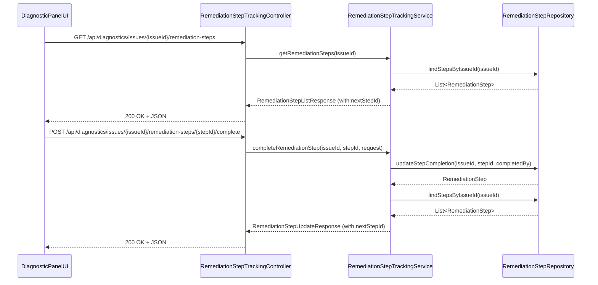
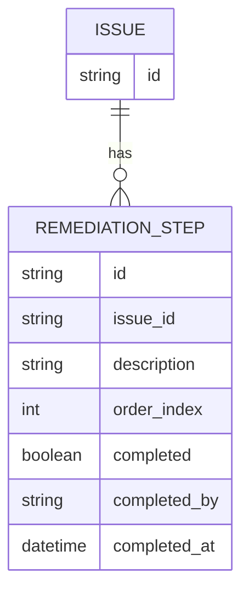

# Repository: APB_Demo
# Branch: APPMRN149
# Folder: LLD

1. Objective
The objective is to enable step-by-step tracking of AI-guided remediation steps for support agents. The system will allow marking remediation steps as completed and automatically highlighting the next step. This supports reliable progression toward issue resolution within the AI-assisted diagnostic panel.

2. Backend Spring Boot API Details
2.1. API Model
2.1.1. Common Components/Services
- RemediationStepTrackingController: REST controller for remediation step tracking operations.
- RemediationStepTrackingService: Service managing retrieval and update of remediation step completion status.
- RemediationStepRepository: Data access component for remediation steps and their statuses.

2.1.2. API Details
| Operation                          | REST Method | Type   | URL                                                                 | Request JSON                                                                                         | Response JSON                                                                                                                               |
|------------------------------------|------------|--------|---------------------------------------------------------------------|------------------------------------------------------------------------------------------------------|---------------------------------------------------------------------------------------------------------------------------------------------|
| Get remediation steps              | GET        | Query  | /api/diagnostics/issues/{issueId}/remediation-steps                 | N/A                                                                                                  | { "issueId": "string", "steps": [ { "stepId": "string", "description": "string", "orderIndex": number, "completed": boolean } ], "nextStepId": "string" } |
| Mark remediation step as completed | POST       | Command| /api/diagnostics/issues/{issueId}/remediation-steps/{stepId}/complete | { "completedBy": "string" }                                                                         | { "issueId": "string", "stepId": "string", "completed": boolean, "nextStepId": "string" }                                           |

2.1.3. Exceptions
- IssueNotFoundException: Thrown when the issueId is not associated with any known issue.
- RemediationStepNotFoundException: Thrown when the specified stepId does not exist for the issue.
- RemediationStepUpdateException: Thrown when a step completion update cannot be persisted.

2.2. Functional Design
2.2.1. Class Diagram

2.2.2. UML Sequence Diagram

2.2.3. Components
| Component Name                     | Description                                                                | Existing/New |
|-----------------------------------|----------------------------------------------------------------------------|-------------|
| RemediationStepTrackingController | REST controller for remediation step retrieval and completion.            | New         |
| RemediationStepTrackingService    | Service layer for step tracking logic.                                     | New         |
| RemediationStepRepository         | Repository for remediation step entities.                                  | New         |
| RemediationStep                   | Entity representing a remediation step.                                    | New         |
| RemediationStepListResponse       | DTO for listing remediation steps and nextStepId.                          | New         |
| RemediationStepDTO                | DTO for an individual remediation step.                                    | New         |
| RemediationStepCompleteRequest    | DTO for marking a step as complete.                                        | New         |
| RemediationStepUpdateResponse     | DTO for response after a step completion update.                           | New         |

2.3. Service Layer Business Logic
- Service architecture & dependency injection: RemediationStepTrackingController injects RemediationStepTrackingService; RemediationStepTrackingService injects RemediationStepRepository using constructor injection.
- Workflow: For listing steps, the service fetches all steps by issueId, orders by orderIndex ascending, calculates nextStepId as the first not-completed step, and returns RemediationStepListResponse. For completion, the service updates the step as completed, reloads steps to compute the new nextStepId, and returns RemediationStepUpdateResponse.
- Caching strategy: Optional short-lived caching of step lists by issueId, invalidated on completion updates.
- Validation rules: Ensure issueId and stepId are present and valid; ensure the step belongs to the given issue; prevent re-marking already completed steps if required.

Validation rules
| Field Name | Validation                         | Error Message                                      | Class Used                      |
|-----------|-------------------------------------|----------------------------------------------------|---------------------------------|
| issueId   | Not null, not blank                 | "issueId is required"                              | RemediationStepTrackingService |
| stepId    | Not null, not blank                 | "stepId is required"                               | RemediationStepTrackingService |
| orderIndex| Non-negative integer                | "orderIndex must be non-negative"                  | RemediationStep                |

2.4. Service Integrations
| System              | Integrated For                                | Integration Type |
|---------------------|-----------------------------------------------|------------------|
| DiagnosticDataStore | Persisting and retrieving remediation steps   | Synchronous API / Repository |

3. Front End React Details
3.1. UI Component Architecture
- Components:
  - RemediationStepTracker: Container component managing remediation step list and completion actions.
  - RemediationStepList: Presentational component rendering steps with completion indicators.
- Data flow: RemediationStepTracker fetches steps from the backend, keeps them in local state, and passes them to RemediationStepList along with completion handlers.
- State management: useState/useEffect to manage steps, loading, and error states; useCallback for completion handlers.
- Props interfaces:
  - RemediationStepList props: { steps: RemediationStepViewModel[], onCompleteStep: (stepId: string) => void, nextStepId: string | null }
- Routing: RemediationStepTracker is embedded in the diagnostic panel for a specific issue context.

3.2. UI Specifications
- Wireframes/pages: Steps are displayed as a vertical list with checkboxes or completion icons. Completed steps are visually indicated (e.g., strike-through or dimmed), and the next step is highlighted.
- Responsive breakpoints: List layout adjusts to small screens by full-width rows; no complex layout changes needed.
- Form structures with validation: When marking a step as completed, a simple action button is used without additional form fields.
- User interaction patterns: Clicking a step completion control triggers the POST complete endpoint; UI updates instantly to reflect completion and move highlight to next step.

3.3. API Integration
- HTTP client configuration: Use shared DiagnosticApiClient or fetch wrapper.
- Call patterns and error handling: RemediationStepTracker calls GET /api/diagnostics/issues/{issueId}/remediation-steps on mount; on completion, it calls POST /api/diagnostics/issues/{issueId}/remediation-steps/{stepId}/complete and updates local state with the response. Errors show inline error messages.
- Loading states: Spinner or skeleton displayed while steps are loading and optionally during completion updates.
- Data transformation: Map RemediationStepDTO to RemediationStepViewModel adding derived flags (isNextStep, displayLabel).

4. Database Details
4.1. ER Model

4.2. Database Validations
- REMEDIATION_STEP.issue_id is a foreign key referencing ISSUE.id.
- order_index must be non-negative and unique per issue.

5. Non-Functional Requirements
5.1. Performance
- GET remediation-steps should return within 300 ms under normal load.
- Use indexes on REMEDIATION_STEP.issue_id and order_index.

5.2. Security (Authentication & Authorization)
- Only authenticated support agents may update remediation steps.
- Authorization checks ensure agents can only modify steps for issues they have access to.

5.3. Logging (Application, Audit, Monitoring)
- Log each completion event with issueId, stepId, and completedBy.
- Capture failures to update remediation steps for troubleshooting.

6. Dependencies
- Spring Boot Web and Spring Data JPA.
- React with hooks and axios/fetch.

7. Assumptions
- AI-generated remediation steps already exist in the system and are associated with issues.
- Issue context and identifiers are provided from the existing diagnostic panel.
