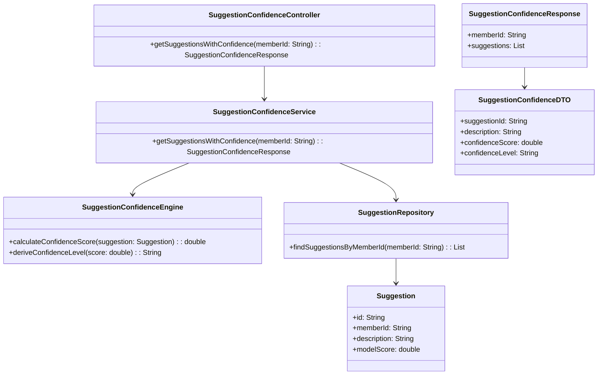
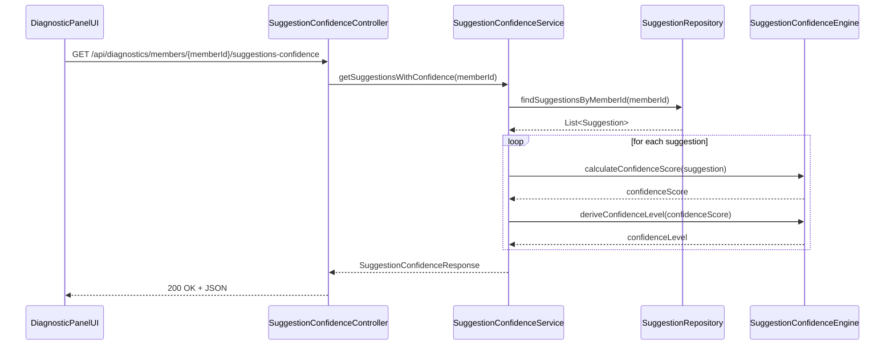
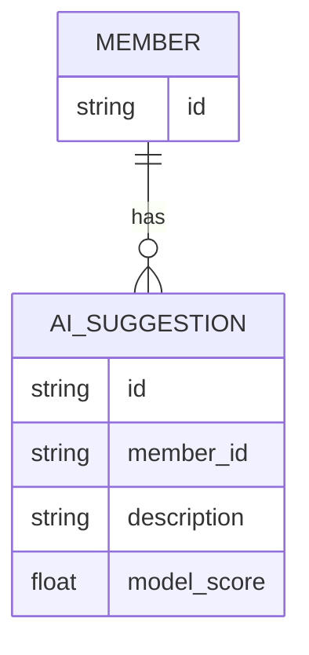

# Repository: APB_Demo
# Branch: APPMRN149
# Folder: LLD

1. Objective
The objective is to add confidence indicators to AI-generated remediation suggestions for support agents. The system will expose APIs and UI components to surface confidence levels per suggestion in the AI-assisted diagnostic panel. This allows agents to understand how strongly the system supports each recommendation.

2. Backend Spring Boot API Details
2.1. API Model
2.1.1. Common Components/Services
- SuggestionConfidenceController: REST controller for retrieving AI suggestions with confidence indicators.
- SuggestionConfidenceService: Service that aggregates suggestions and calculates or retrieves confidence scores.
- SuggestionConfidenceEngine: Component encapsulating the confidence scoring logic for suggestions.
- SuggestionRepository: Data access component for AI suggestion entities.

2.1.2. API Details
| Operation                            | REST Method | Type      | URL                                                        | Request JSON                                                                 | Response JSON                                                                                                                      |
|--------------------------------------|------------|-----------|------------------------------------------------------------|------------------------------------------------------------------------------|------------------------------------------------------------------------------------------------------------------------------------|
| Get suggestions with confidence      | GET        | Query API | /api/diagnostics/members/{memberId}/suggestions-confidence | N/A                                                                          | { "memberId": "string", "suggestions": [ { "suggestionId": "string", "description": "string", "confidenceScore": number, "confidenceLevel": "HIGH/MEDIUM/LOW" } ] } |

2.1.3. Exceptions
- MemberNotFoundException: Thrown when member or associated suggestions are not found.
- SuggestionNotFoundException: Thrown when no AI suggestions are available for the member.
- SuggestionConfidenceException: Thrown when confidence scores cannot be derived due to missing or invalid data.

2.2. Functional Design
2.2.1. Class Diagram

2.2.2. UML Sequence Diagram

2.2.3. Components
| Component Name                 | Description                                                     | Existing/New |
|--------------------------------|-----------------------------------------------------------------|-------------|
| SuggestionConfidenceController | REST controller for suggestions with confidence indicators.     | New         |
| SuggestionConfidenceService    | Service computing or retrieving suggestion confidence.          | New         |
| SuggestionConfidenceEngine     | Component encapsulating confidence scoring rules.               | New         |
| SuggestionRepository           | Repository for AI suggestions.                                  | New         |
| SuggestionConfidenceResponse   | DTO containing suggestions with confidence data.                | New         |
| SuggestionConfidenceDTO        | DTO representing an individual suggestion and confidence.       | New         |
| Suggestion                     | Entity representing stored AI suggestion information.           | New         |

2.3. Service Layer Business Logic
- Service architecture & dependency injection: SuggestionConfidenceController injects SuggestionConfidenceService. SuggestionConfidenceService injects SuggestionRepository and SuggestionConfidenceEngine using constructor-based injection.
- Workflow: For a given memberId, SuggestionConfidenceService loads suggestions, passes each to SuggestionConfidenceEngine to compute confidenceScore and confidenceLevel, builds SuggestionConfidenceDTOs, and returns SuggestionConfidenceResponse.
- Caching strategy: Optional Spring Cache on getSuggestionsWithConfidence keyed by memberId with a short TTL to avoid recomputing confidence scores frequently for the same session.
- Validation rules: Ensure memberId is valid; ensure modelScore or derived confidenceScore is within [0,1] or configured range; handle empty suggestion lists gracefully.

Validation rules
| Field Name       | Validation                        | Error Message                                     | Class Used                    |
|-----------------|------------------------------------|--------------------------------------------------|-------------------------------|
| memberId        | Not null, not blank                | "memberId is required"                           | SuggestionConfidenceService   |
| memberId        | Matches pattern [A-Za-z0-9\-]+     | "memberId format is invalid"                     | SuggestionConfidenceService   |
| modelScore      | Between 0 and 1 inclusive          | "modelScore must be between 0 and 1"             | SuggestionConfidenceEngine    |
| confidenceScore | Non-negative                       | "confidenceScore must be non-negative"           | SuggestionConfidenceEngine    |

2.4. Service Integrations
| System              | Integrated For                                    | Integration Type |
|---------------------|---------------------------------------------------|------------------|
| DiagnosticDataStore | Loading AI suggestions and base model scores      | Synchronous API / Repository |

3. Front End React Details
3.1. UI Component Architecture
- Components:
  - SuggestionConfidencePanel: Container component that fetches and renders suggestions with confidence indicators.
  - SuggestionConfidenceList: Presentational component rendering a list of suggestions with confidence badges.
- Data flow: SuggestionConfidencePanel retrieves SuggestionConfidenceResponse from the backend and passes suggestions as props to SuggestionConfidenceList.
- State management: useState/useEffect in SuggestionConfidencePanel to manage loading, error, and suggestion data.
- Props interfaces:
  - SuggestionConfidenceList props: { suggestions: SuggestionConfidenceViewModel[] }
- Routing: SuggestionConfidencePanel is embedded in the existing AI-assisted diagnostic panel route.

3.2. UI Specifications
- Wireframes/pages: Within the diagnostic panel, each suggestion row shows description text and a confidence indicator (badge or bar) labeled e.g., "High Confidence".
- Responsive breakpoints: Suggestion list is displayed as a single column list on small screens and multi-column cards on larger screens.
- Form structures with validation: No input form; memberId context is derived from the case being viewed.
- User interaction patterns: Hover tooltips can display numeric confidenceScore; color coding is used (e.g., green for high, amber for medium, gray for low).

3.3. API Integration
- HTTP client configuration: Use a shared HTTP client (e.g., DiagnosticApiClient) with base URL and JSON interceptors.
- Call patterns and error handling: SuggestionConfidencePanel calls GET /api/diagnostics/members/{memberId}/suggestions-confidence when the diagnostic panel loads or when member context changes. Errors trigger a user-friendly message and log entry.
- Loading states: Show a spinner or placeholder until suggestions are loaded; fallback message when no suggestions exist.
- Data transformation: Map SuggestionConfidenceDTOs into SuggestionConfidenceViewModel with additional presentation fields such as labelText and color for confidenceLevel.

4. Database Details
4.1. ER Model

4.2. Database Validations
- AI_SUGGESTION.member_id is a foreign key referencing MEMBER.id.
- model_score must be between 0 and 1.

5. Non-Functional Requirements
5.1. Performance
- Endpoint should serve typical requests within 500 ms under normal load.
- Suggestions are limited to a reasonable count (e.g., top 20) per member to avoid overloading the UI.

5.2. Security (Authentication & Authorization)
- Access requires authenticated support agents.
- Enforce authorization so agents only see suggestions for members they are allowed to support.

5.3. Logging (Application, Audit, Monitoring)
- Log each suggestions-confidence request along with memberId and latency.
- Log confidence computation errors with sufficient detail for debugging.
- Optionally emit metrics for average confidenceScore per member or case.

6. Dependencies
- Spring Boot Web starter and Spring Data JPA.
- React with hooks and axios/fetch for HTTP requests.

7. Assumptions
- Base modelScore is provided by the AI engine and stored or retrievable via DiagnosticDataStore.
- ConfidenceLevel thresholds (e.g., HIGH >= 0.8, MEDIUM >= 0.5) are configured in application properties.
- Existing authentication and routing frameworks are already in place.
