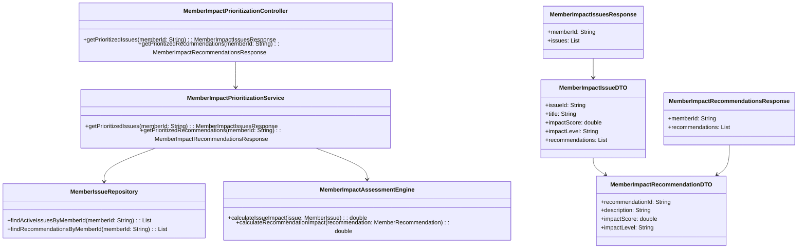
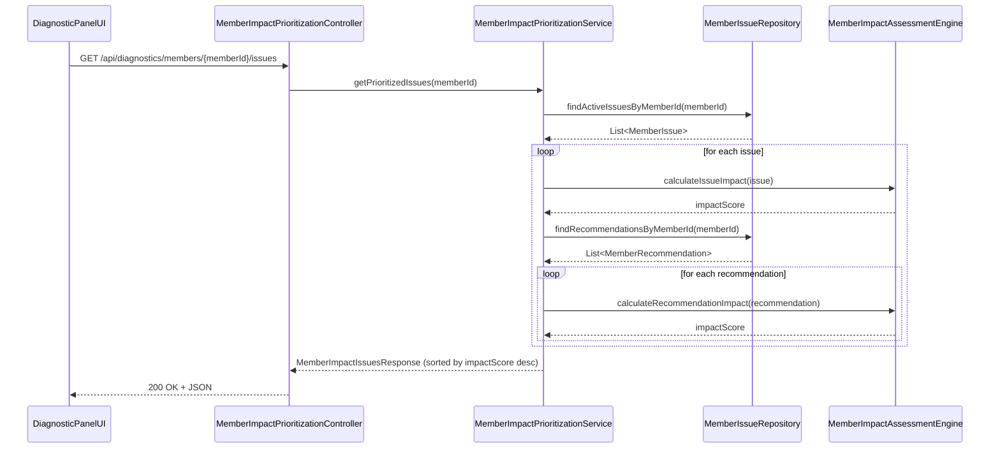
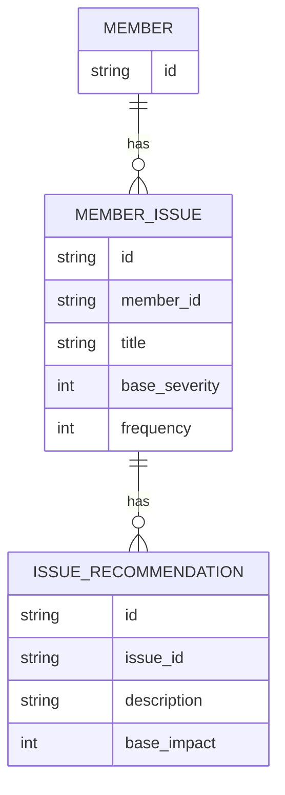

# Repository: APB_Demo
# Branch: APPMRN149
# Folder: LLD

1. Objective
The objective is to provide prioritized ordering of member issues based on assessed member impact for support agents. The system will expose APIs and UI components to retrieve and display issues and recommendations sorted by impact. This enables agents to address the most critical problems first within the AI-assisted diagnostic panel.

2. Backend Spring Boot API Details
2.1. API Model
2.1.1. Common Components/Services
- MemberImpactPrioritizationController: REST controller to expose endpoints related to member impact prioritization.
- MemberImpactPrioritizationService: Service responsible for computing and retrieving impact-prioritized issues and recommendations.
- MemberImpactAssessmentEngine: Component that encapsulates impact scoring logic based on available diagnostics and metadata.
- MemberIssueRepository: Data access component for retrieving member issues and related recommendations.

2.1.2. API Details
| Operation                          | REST Method | Type      | URL                                               | Request JSON                                                                 | Response JSON                                                                                                       |
|------------------------------------|------------|-----------|---------------------------------------------------|------------------------------------------------------------------------------|---------------------------------------------------------------------------------------------------------------------|
| Get prioritized member issues      | GET        | Query API | /api/diagnostics/members/{memberId}/issues        | N/A                                                                          | { "memberId": "string", "issues": [ { "issueId": "string", "title": "string", "impactScore": number, "impactLevel": "HIGH/MEDIUM/LOW", "recommendations": [ { "recommendationId": "string", "description": "string", "impactScore": number, "impactLevel": "HIGH/MEDIUM/LOW" } ] } ] } |
| Get prioritized recommendations    | GET        | Query API | /api/diagnostics/members/{memberId}/recommendations | N/A                                                                          | { "memberId": "string", "recommendations": [ { "recommendationId": "string", "description": "string", "impactScore": number, "impactLevel": "HIGH/MEDIUM/LOW" } ] } |

2.1.3. Exceptions
- MemberNotFoundException: Thrown when no member record or active issues are found for the given memberId.
- ImpactAssessmentException: Thrown when impact scores cannot be calculated due to missing or inconsistent data.
- RecommendationNotFoundException: Thrown when no recommendations are available for the member.

2.2. Functional Design
2.2.1. Class Diagram

2.2.2. UML Sequence Diagram

2.2.3. Components
| Component Name                         | Description                                                        | Existing/New |
|---------------------------------------|--------------------------------------------------------------------|-------------|
| MemberImpactPrioritizationController  | REST controller for impact-prioritized issues and recommendations. | New         |
| MemberImpactPrioritizationService     | Service handling impact scoring and sorting logic.                 | New         |
| MemberImpactAssessmentEngine          | Engine encapsulating impact calculation rules.                     | New         |
| MemberIssueRepository                 | Repository for member issues and recommendations.                  | New         |
| MemberImpactIssuesResponse            | DTO for prioritized issues response.                               | New         |
| MemberImpactIssueDTO                  | DTO representing a single prioritized issue.                       | New         |
| MemberImpactRecommendationsResponse   | DTO for prioritized recommendations response.                      | New         |
| MemberImpactRecommendationDTO         | DTO representing a prioritized recommendation.                     | New         |

2.3. Service Layer Business Logic
- Service architecture & dependency injection: MemberImpactPrioritizationController injects MemberImpactPrioritizationService via constructor-based injection. MemberImpactPrioritizationService injects MemberIssueRepository and MemberImpactAssessmentEngine. Beans are defined using Spring stereotypes (@RestController, @Service, @Repository, @Component).
- Workflow: For a given memberId, MemberImpactPrioritizationService retrieves active issues and associated recommendations, computes impact scores using MemberImpactAssessmentEngine, assigns impact levels (HIGH/MEDIUM/LOW) based on score thresholds, sorts issues and recommendations by impactScore descending, and builds response DTOs.
- Caching strategy: A simple in-memory cache (e.g., Spring Cache) can be used on MemberImpactPrioritizationService methods with a short TTL keyed by memberId to avoid repeated impact calculations during an active support session.
- Validation rules: Validate memberId for non-null and format, ensure at least one issue is returned before sorting, and handle empty results by returning an empty list.

Validation rules
| Field Name | Validation                         | Error Message                                    | Class Used                         |
|-----------|-------------------------------------|--------------------------------------------------|------------------------------------|
| memberId  | Not null, not blank                 | "memberId is required"                          | MemberImpactPrioritizationService  |
| memberId  | Matches pattern [A-Za-z0-9\-]+      | "memberId format is invalid"                    | MemberImpactPrioritizationService  |
| issues    | Must not be null when processing    | "No issues found for member"                    | MemberImpactPrioritizationService  |
| score     | Non-negative impactScore            | "Impact score must be non-negative"             | MemberImpactAssessmentEngine       |

2.4. Service Integrations
| System              | Integrated For                          | Integration Type |
|---------------------|-----------------------------------------|------------------|
| DiagnosticDataStore | Fetching member issues and recommendations | Synchronous API / Repository |

3. Front End React Details
3.1. UI Component Architecture
- Components:
  - DiagnosticPanelImpactList: Container component responsible for fetching and rendering impact-prioritized issues and recommendations.
  - MemberImpactIssueList: Presentational component that displays ordered issues with impact indicators.
  - MemberImpactRecommendationList: Presentational component showing ordered recommendations under each issue.
- Data flow: DiagnosticPanelImpactList calls the backend APIs and passes normalized data as props to MemberImpactIssueList and MemberImpactRecommendationList. State is maintained in DiagnosticPanelImpactList using React hooks.
- State management: useState and useEffect for local state management; no global state store assumed.
- Props interfaces:
  - MemberImpactIssueList props: { issues: MemberImpactIssueViewModel[] }
  - MemberImpactRecommendationList props: { recommendations: MemberImpactRecommendationViewModel[] }
- Routing: DiagnosticPanelImpactList is rendered within the existing diagnostic panel route (assumed as /diagnostics/:memberId).

3.2. UI Specifications
- Wireframes/pages: Within the AI-assisted diagnostic panel, a section titled "Impact Prioritized Issues" lists issues in descending impact order with labels like "High Impact".
- Responsive breakpoints: Layout adapts to standard widths (mobile <768px, tablet 768-1024px, desktop >1024px) by stacking issue cards vertically on smaller screens.
- Form structures with validation: No explicit forms; memberId is derived from route/context. Basic fallback message is shown when no issues exist.
- User interaction patterns: Issues are displayed as clickable rows/cards; selecting an issue can expand to show its recommendations. Visual indicators (badges, colored labels) show impactLevel.

3.3. API Integration
- HTTP client configuration: Use a shared fetch wrapper or axios instance (e.g., DiagnosticApiClient) configured with base URL and interceptors for error handling.
- Call patterns and error handling: DiagnosticPanelImpactList triggers GET /api/diagnostics/members/{memberId}/issues on mount or when memberId changes. Errors are displayed as inline error messages and logged.
- Loading states: A loading spinner or skeleton is shown while fetching; empty state message when no issues.
- Data transformation: Raw API responses are mapped into MemberImpactIssueViewModel and MemberImpactRecommendationViewModel with computed display labels for impactLevel.

4. Database Details
4.1. ER Model

4.2. Database Validations
- MEMBER_ISSUE.member_id is a foreign key referencing MEMBER.id.
- ISSUE_RECOMMENDATION.issue_id is a foreign key referencing MEMBER_ISSUE.id.
- base_severity and base_impact must be non-negative integers.

5. Non-Functional Requirements
5.1. Performance
- API response time for prioritized issues should be under 500 ms for typical loads.
- Use index on MEMBER_ISSUE.member_id for faster lookups.

5.2. Security (Authentication & Authorization)
- APIs require authenticated users via existing security filters (e.g., JWT or session-based).
- Only authorized support agents can access member diagnostic data based on role checks.

5.3. Logging (Application, Audit, Monitoring)
- Log each prioritized issues request with memberId and execution time.
- Capture errors from MemberImpactAssessmentEngine with stack traces.
- Include audit logs for access to member diagnostic information as per compliance.

6. Dependencies
- Spring Boot Web starter.
- Spring Data JPA or equivalent for repository implementation.
- Spring Cache abstraction for optional caching.
- React with hooks, axios or fetch for HTTP calls.

7. Assumptions
- Member issues and recommendations are precomputed and stored in DiagnosticDataStore.
- Impact scoring uses a simple linear combination of severity and frequency with thresholds for impactLevel.
- Authentication and diagnostic panel routing already exist in the host application.
