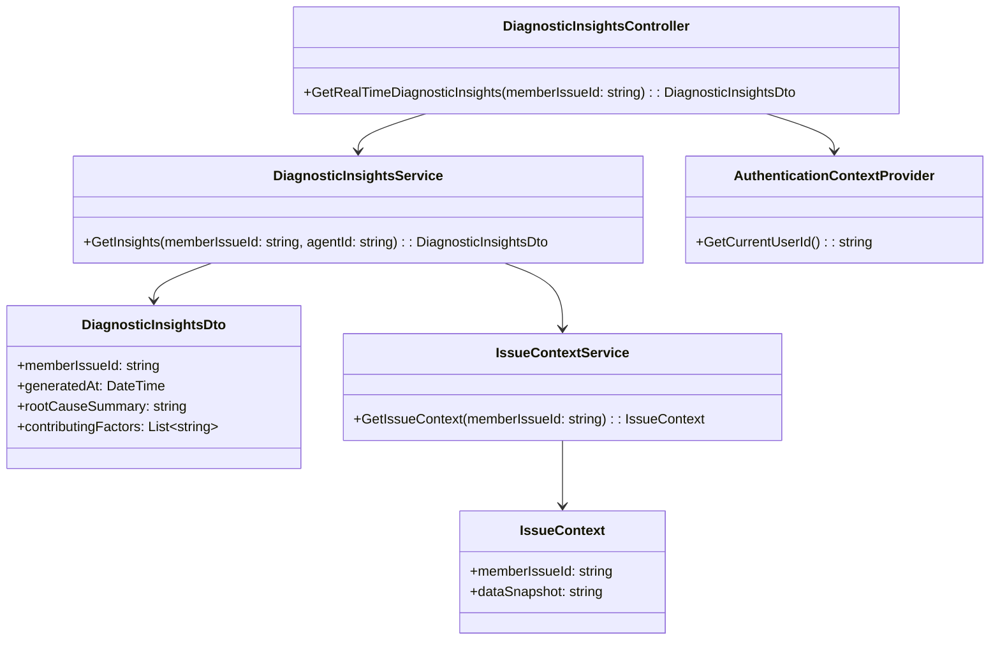
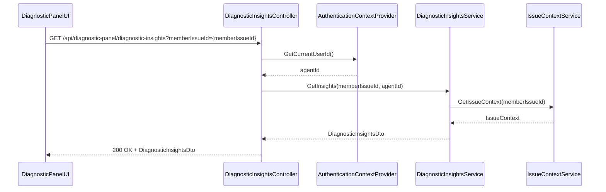
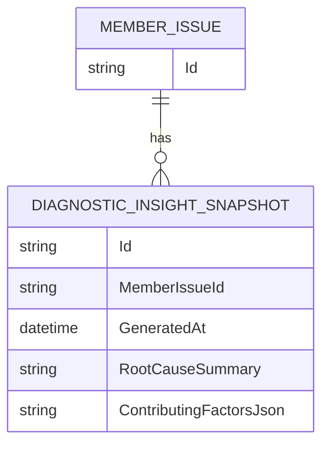

# Repository: APB_Demo
# Branch: KGTEST1
# Folder: LLD
1. Objective
The objective is to provide real-time AI-generated diagnostic insights for member issues within the Diagnostic Panel. The insights will summarize likely root causes and contributing factors to help support agents understand issues quickly and accurately. The solution will continuously analyze member data and issue context and update the insights view.

2. Backend C# API Details
2.1. API Model
2.1.1. Common Components/Services
- IDiagnosticInsightsService: Generates real-time diagnostic insights for a member issue.
- IIssueContextService: Provides current issue context and member data needed for diagnostics.

2.1.2. API Details
| Operation | REST Method | Type | URL | Request JSON | Response JSON |
|-----------|-------------|------|-----|--------------|---------------|
| GetRealTimeDiagnosticInsights | GET | Query | /api/diagnostic-panel/diagnostic-insights | { "memberIssueId": "string" } | { "memberIssueId": "string", "generatedAt": "string", "rootCauseSummary": "string", "contributingFactors": [ "string" ] } |

2.1.3. Exceptions
- DiagnosticInsightsNotAvailableException: Thrown when insights cannot be generated for the issue.
- MemberIssueNotFoundException: Thrown when the issue context cannot be found.
- UnauthorizedAccessException: Thrown when the agent is not authorized to view diagnostic insights.

2.2. Functional Design
2.2.1. Class Diagram

2.2.2. UML Sequence Diagram

2.2.3. Components
| Component Name | Description | Existing/New |
|----------------|-------------|--------------|
| DiagnosticInsightsController | API controller exposing real-time diagnostic insights. | New |
| DiagnosticInsightsService | Service generating diagnostic insights via AI. | New |
| IssueContextService | Service providing issue context and member data snapshot. | New |
| AuthenticationContextProvider | Provides current agent identity. | Existing |
| DiagnosticInsightsDto | DTO representing diagnostic insights payload. | New |
| IssueContext | Internal model representing the issue context used for diagnostics. | New |

2.3. Service Layer Business Logic
Service architecture & dependency injection:
- DiagnosticInsightsController uses IDiagnosticInsightsService and IAuthenticationContextProvider via constructor injection.
- DiagnosticInsightsService depends on IIssueContextService.

Workflow:
1. DiagnosticPanelUI calls GetRealTimeDiagnosticInsights with the active memberIssueId.
2. DiagnosticInsightsController gets agentId from AuthenticationContextProvider.
3. DiagnosticInsightsService validates memberIssueId and agentId.
4. IssueContextService retrieves current IssueContext for the case.
5. DiagnosticInsightsService invokes AI diagnostic engine with IssueContext to generate rootCauseSummary and contributingFactors.
6. DiagnosticInsightsService constructs DiagnosticInsightsDto with generatedAt timestamp.
7. Controller returns DiagnosticInsightsDto to the UI.

Caching strategy:
- Use short-lived caching (e.g., 30 seconds) for insights per memberIssueId to avoid excessive AI calls.
- Provide a mechanism to force refresh via query parameter or dedicated endpoint if required later.

Validation rules
| Field Name | Validation | Error Message | Class Used |
|------------|-----------|---------------|------------|
| memberIssueId | Required; must refer to an existing issue | "Member issue identifier is required." / "Member issue not found." | DiagnosticInsightsService |
| agentId | Required; must be authenticated | "Authenticated agent is required." | DiagnosticInsightsService |

2.4. Service Integrations
| System | Integrated For | Integration Type |
|--------|---------------|------------------|
| IssueManagementSystem | Retrieve issue and member data snapshot | Internal service via IssueContextService |
| AI Diagnostic Engine | Generate diagnostic insights | Internal service or SDK within DiagnosticInsightsService |

3. Front End React Details
3.1. UI Component Architecture
Component hierarchy and data flow:
- DiagnosticPanelContainer (existing)
  - DiagnosticInsightsSection (new)
    - ContributingFactorList (new)
      - ContributingFactorItem (new)

DiagnosticInsightsSection receives memberIssueId and uses hook useDiagnosticInsights to fetch data. It manages local state for insights, loading, and error. ContributingFactorList receives contributingFactors as props and renders them via ContributingFactorItem components.

State management:
- useState for insights object, loading, and error flags.
- useEffect triggers API calls when memberIssueId changes or periodically for refresh.

Props interfaces:
- DiagnosticInsightsSectionProps: { memberIssueId: string }
- ContributingFactorListProps: { contributingFactors: string[] }
- ContributingFactorItemProps: { factor: string }

Routing:
- No new route; insights section is part of the Diagnostic Panel.

3.2. UI Specifications
Wireframes/pages:
- Diagnostic Panel shows a "Diagnostic Insights" section with rootCauseSummary and a list of contributingFactors.

Responsive breakpoints:
- Desktop: Summary and factor list presented side by side or stacked depending on panel width.
- Tablet/Mobile: Summary and factors stacked vertically.

Form structures with validation:
- No forms; display-only data.

User interaction patterns:
- Agents view the summary; contributing factors listed as bullets or chips.
- If insights are unavailable, display "Diagnostic insights are not available for this issue.".

3.3. API Integration
HTTP client configuration:
- Use shared HTTP client with authorization headers.

Call patterns and error handling:
- useDiagnosticInsights calls GET /api/diagnostic-panel/diagnostic-insights with memberIssueId query parameter.
- Handle DiagnosticInsightsNotAvailableException with an empty state message.
- Handle 404 and 403 errors with inline messaging and optional retry.

Loading states:
- Show skeleton or spinner in section while data is loading.

Data transformation:
- Map DiagnosticInsightsDto directly to view model with fields: { rootCauseSummary, contributingFactors, generatedAt }.

4. Database Details
4.1. ER Model

4.2. Database Validations
- Ensure DIAGNOSTIC_INSIGHT_SNAPSHOT.MemberIssueId references a valid MEMBER_ISSUE.Id.
- ContributingFactorsJson must be valid JSON representing a list of strings.

5. Non-Functional Requirements
5.1. Performance
- Real-time insights generation should typically complete within 1 second under expected load.

5.2. Security (Authentication & Authorization)
- Only authenticated support agents may access diagnostic insights.
- Insights must exclude sensitive personal data.

5.3. Logging (Application, Audit, Monitoring)
- Log each diagnostic insight request with memberIssueId and agentId.
- Capture AI engine errors and latency metrics.

6. Dependencies
- ASP.NET Core Web API.
- Issue management system.
- AI diagnostic engine.
- React Diagnostic Panel UI.

7. Assumptions
- IssueContextService can retrieve necessary data without performance degradation.
- AI diagnostic engine is available and integrated.
- Real-time updates can be achieved with periodic polling; push-based updates may be considered later.