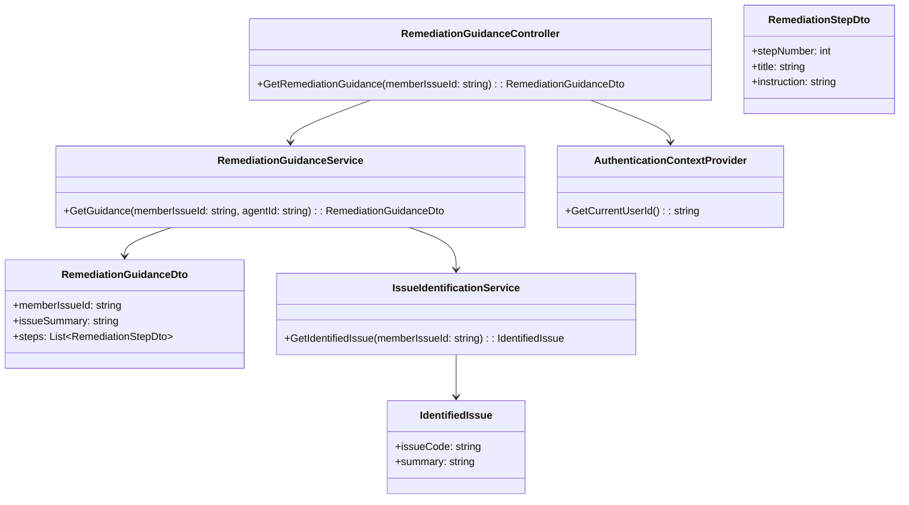
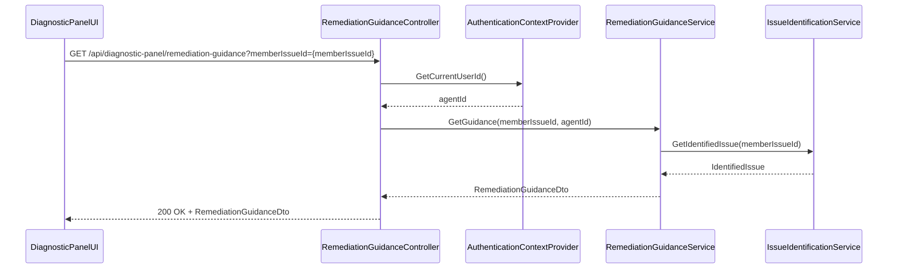
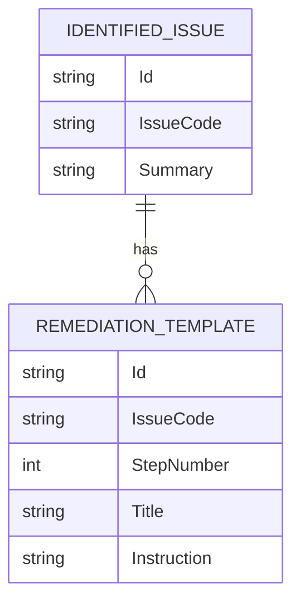

# Repository: APB_Demo
# Branch: KGTEST1
# Folder: LLD
1. Objective
The objective is to present step-by-step remediation guidance for identified member issues within the Diagnostic Panel. The guidance will provide a clear, ordered list of steps that support agents can follow to resolve issues consistently and efficiently. The solution must integrate with the existing Diagnostic Panel and leverage AI-identified issues.

2. Backend C# API Details
2.1. API Model
2.1.1. Common Components/Services
- IRemediationGuidanceService: Provides ordered remediation steps for identified issues.
- IIssueIdentificationService: Confirms identified issue details for the member case.

2.1.2. API Details
| Operation | REST Method | Type | URL | Request JSON | Response JSON |
|-----------|-------------|------|-----|--------------|---------------|
| GetRemediationGuidance | GET | Query | /api/diagnostic-panel/remediation-guidance | { "memberIssueId": "string" } | { "memberIssueId": "string", "issueSummary": "string", "steps": [ { "stepNumber": 1, "title": "string", "instruction": "string" } ] } |

2.1.3. Exceptions
- RemediationGuidanceNotAvailableException: Thrown when no guidance is available for the identified issue.
- MemberIssueNotFoundException: Thrown when the member issue is missing or invalid.
- UnauthorizedAccessException: Thrown when the agent cannot access remediation guidance for the case.

2.2. Functional Design
2.2.1. Class Diagram

2.2.2. UML Sequence Diagram

2.2.3. Components
| Component Name | Description | Existing/New |
|----------------|-------------|--------------|
| RemediationGuidanceController | API controller exposing remediation guidance steps. | New |
| RemediationGuidanceService | Service generating ordered remediation steps. | New |
| IssueIdentificationService | Service providing identified issue details. | Existing or New (depending on existing AI issue identification) |
| AuthenticationContextProvider | Provides current agent identity. | Existing |
| RemediationGuidanceDto | DTO representing remediation guidance payload. | New |
| RemediationStepDto | DTO describing a single remediation step. | New |
| IdentifiedIssue | Internal model representing the identified issue. | New |

2.3. Service Layer Business Logic
Service architecture & dependency injection:
- RemediationGuidanceController uses IRemediationGuidanceService and IAuthenticationContextProvider via constructor injection.
- RemediationGuidanceService depends on IIssueIdentificationService.

Workflow:
1. DiagnosticPanelUI requests remediation guidance when an issue is identified.
2. RemediationGuidanceController retrieves agentId from AuthenticationContextProvider.
3. RemediationGuidanceService validates memberIssueId and agentId.
4. IssueIdentificationService retrieves IdentifiedIssue details for the case.
5. RemediationGuidanceService looks up remediation steps for the issueCode and constructs an ordered steps list.
6. Controller returns RemediationGuidanceDto to the UI.

Caching strategy:
- Cache remediation step templates by issueCode to reduce repeated lookups.
- Do not cache per-member issue guidance if steps depend on dynamic context.

Validation rules
| Field Name | Validation | Error Message | Class Used |
|------------|-----------|---------------|------------|
| memberIssueId | Required; must correspond to an existing identified issue | "Member issue identifier is required." / "Member issue not found." | RemediationGuidanceService |
| agentId | Required; must be an authenticated agent | "Authenticated agent is required." | RemediationGuidanceService |

2.4. Service Integrations
| System | Integrated For | Integration Type |
|--------|---------------|------------------|
| AI Issue Identification Engine | Identify issueCode and summary | Internal integration via IssueIdentificationService |
| KnowledgeBaseSystem | Retrieve remediation step templates by issueCode | Internal service or repository within RemediationGuidanceService |

3. Front End React Details
3.1. UI Component Architecture
Component hierarchy and data flow:
- DiagnosticPanelContainer (existing)
  - RemediationGuidanceSection (new)
    - RemediationStepList (new)
      - RemediationStepItem (new)

RemediationGuidanceSection receives memberIssueId, uses a hook useRemediationGuidance to fetch guidance, and manages loading/error states. RemediationStepList receives steps via props and renders ordered items. Each RemediationStepItem displays stepNumber, title, and instruction.

State management:
- useState for guidance data, loading, and error.
- useEffect to call API when memberIssueId changes or when agent opens the remediation instructions section.

Props interfaces:
- RemediationGuidanceSectionProps: { memberIssueId: string }
- RemediationStepListProps: { steps: RemediationStepViewModel[] }
- RemediationStepItemProps: { stepNumber: number, title: string, instruction: string }

Routing:
- No new route; section is part of the Diagnostic Panel.

3.2. UI Specifications
Wireframes/pages:
- Within Diagnostic Panel, a dedicated "Remediation Instructions" section appears when an issue is identified.

Responsive breakpoints:
- Desktop: Steps displayed as a numbered list with full instructions.
- Tablet/Mobile: Steps displayed in collapsible cards to minimize scrolling.

Form structures with validation:
- No forms; only display data.

User interaction patterns:
- Agents expand the Remediation Instructions section to view steps.
- Steps are shown in a numbered sequence; agents follow them sequentially.
- If guidance is unavailable, show "Remediation guidance is not available for this issue.".

3.3. API Integration
HTTP client configuration:
- Use shared HTTP client with existing authorization configuration.

Call patterns and error handling:
- useRemediationGuidance performs GET /api/diagnostic-panel/remediation-guidance with memberIssueId as query parameter.
- Handle RemediationGuidanceNotAvailableException with an empty state message.
- Handle 404 or 403 with respective messages and possible retry.

Loading states:
- Show skeleton list or spinner while guidance is loading.

Data transformation:
- Map RemediationGuidanceDto.steps to RemediationStepViewModel for rendering.

4. Database Details
4.1. ER Model

4.2. Database Validations
- Ensure each REMEDIATION_TEMPLATE.IssueCode matches a valid IDENTIFIED_ISSUE.IssueCode.
- StepNumber values for a given IssueCode must be sequential and unique.

5. Non-Functional Requirements
5.1. Performance
- Guidance retrieval should complete within 500ms for typical cases.

5.2. Security (Authentication & Authorization)
- Only authenticated agents can fetch remediation guidance.
- Guidance content should not include sensitive personal data.

5.3. Logging (Application, Audit, Monitoring)
- Log each guidance retrieval with memberIssueId, agentId, and issueCode.
- Track latency and failures in telemetry.

6. Dependencies
- ASP.NET Core Web API.
- AI issue identification engine.
- Knowledge base or remediation template store.
- React Diagnostic Panel UI.

7. Assumptions
- An issue identification engine already exists and can provide issueCode for memberIssueId.
- Remediation steps are maintained in a knowledge base accessible by the service.
- Steps are text-only instructions without embedded media for this iteration.