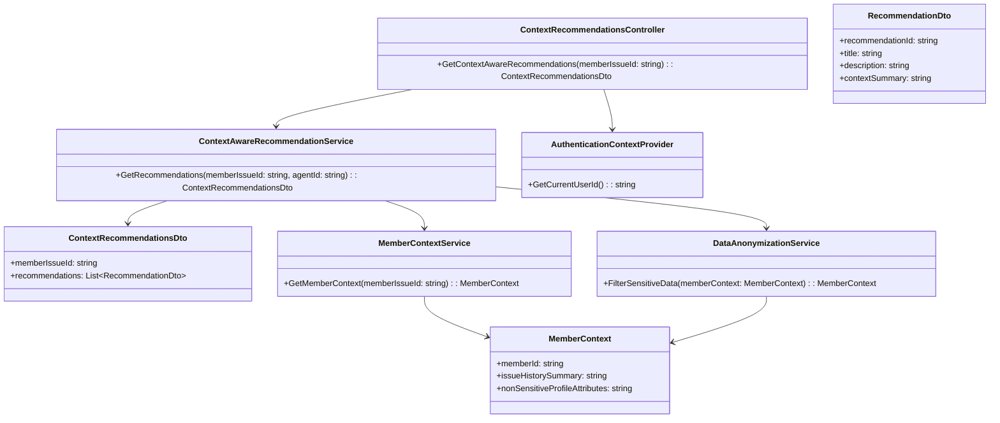
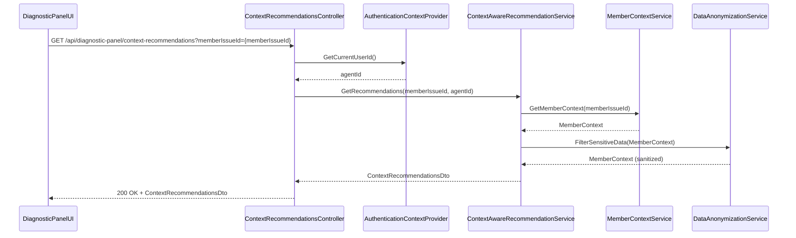
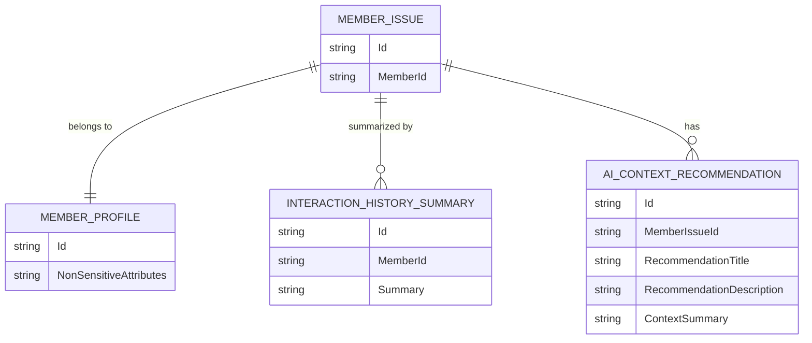

# Repository: APB_Demo
# Branch: KGTEST1
# Folder: LLD
1. Objective
The objective is to deliver context-aware AI recommendations within the Diagnostic Panel that reflect the member's profile and interaction history. The recommendations must be relevant to the current issue while avoiding exposure of sensitive personal data. The solution provides suggestions that reference history and current issue details in a privacy-safe manner.

2. Backend C# API Details
2.1. API Model
2.1.1. Common Components/Services
- IContextAwareRecommendationService: Generates recommendations using member profile and interaction history.
- IMemberContextService: Provides non-sensitive profile attributes and interaction summaries.
- IDataAnonymizationService: Ensures sensitive fields are excluded or masked from context passed to recommendation logic.

2.1.2. API Details
| Operation | REST Method | Type | URL | Request JSON | Response JSON |
|-----------|-------------|------|-----|--------------|---------------|
| GetContextAwareRecommendations | GET | Query | /api/diagnostic-panel/context-recommendations | { "memberIssueId": "string" } | { "memberIssueId": "string", "recommendations": [ { "recommendationId": "string", "title": "string", "description": "string", "contextSummary": "string" } ] } |

2.1.3. Exceptions
- MemberIssueNotFoundException: Thrown when the member issue cannot be resolved.
- RecommendationsNotAvailableException: Thrown when no suitable recommendations are found.
- UnauthorizedAccessException: Thrown when the agent is not authorized to view recommendations for the member.

2.2. Functional Design
2.2.1. Class Diagram

2.2.2. UML Sequence Diagram

2.2.3. Components
| Component Name | Description | Existing/New |
|----------------|-------------|--------------|
| ContextRecommendationsController | API controller exposing context-aware recommendations. | New |
| ContextAwareRecommendationService | Service generating recommendations using member context. | New |
| MemberContextService | Service retrieving profile and interaction history summaries. | New |
| DataAnonymizationService | Service filtering or masking sensitive fields from context. | New |
| AuthenticationContextProvider | Provides current agent identity. | Existing |
| ContextRecommendationsDto | DTO returning recommendations collection. | New |
| RecommendationDto | DTO representing a single recommendation. | New |
| MemberContext | Internal model representing non-sensitive member context. | New |

2.3. Service Layer Business Logic
Service architecture & dependency injection:
- ContextRecommendationsController receives IContextAwareRecommendationService and IAuthenticationContextProvider via constructor injection.
- ContextAwareRecommendationService receives IMemberContextService and IDataAnonymizationService via constructor injection.

Workflow:
1. DiagnosticPanelUI requests context-aware recommendations for the active memberIssueId.
2. ContextRecommendationsController retrieves agentId from AuthenticationContextProvider.
3. ContextAwareRecommendationService validates the memberIssueId and agentId.
4. MemberContextService retrieves MemberContext based on the issue and member.
5. DataAnonymizationService filters or masks sensitive fields, returning sanitized MemberContext.
6. ContextAwareRecommendationService calls internal AI logic with sanitized context to produce recommendations.
7. Controller returns ContextRecommendationsDto to the UI.

Caching strategy:
- Cache sanitized MemberContext for a short duration (e.g., 5 minutes) keyed by memberIssueId to reduce repeated data access.
- Do not cache recommendation lists if they depend on frequently changing interaction history.

Validation rules
| Field Name | Validation | Error Message | Class Used |
|------------|-----------|---------------|------------|
| memberIssueId | Required; must refer to an existing issue | "Member issue identifier is required." / "Member issue not found." | ContextAwareRecommendationService |
| agentId | Required; must represent an authenticated support agent | "Authenticated agent is required." | ContextAwareRecommendationService |

2.4. Service Integrations
| System | Integrated For | Integration Type |
|--------|---------------|------------------|
| MemberProfileSystem | Retrieve member profile attributes | Internal service via MemberContextService |
| InteractionHistorySystem | Retrieve interaction history summary | Internal service via MemberContextService |
| AIRecommendationEngine | Generate recommendations based on sanitized context | Internal service or SDK inside ContextAwareRecommendationService |

3. Front End React Details
3.1. UI Component Architecture
Component hierarchy and data flow:
- DiagnosticPanelContainer (existing)
  - ContextRecommendationsList (new)
    - ContextRecommendationItem (new)

ContextRecommendationsList receives memberIssueId as a prop and uses a custom hook useContextAwareRecommendations to fetch data. It manages loading and error states and passes each recommendation as props to ContextRecommendationItem.

State management:
- useState for loading, error, and recommendations array.
- useEffect to trigger fetch when memberIssueId changes.

Props interfaces:
- ContextRecommendationsListProps: { memberIssueId: string }
- ContextRecommendationItemProps: { recommendationId: string, title: string, description: string, contextSummary: string }

Routing:
- No new routes; recommendations are part of the existing Diagnostic Panel view.

3.2. UI Specifications
Wireframes/pages:
- Within the Diagnostic Panel, a recommendations section lists items with title, short description, and a brief contextSummary text.

Responsive breakpoints:
- Desktop: Recommendations displayed in a vertical list with full descriptions.
- Tablet/Mobile: Items may collapse descriptions into expandable sections to conserve space.

Form structures with validation:
- No forms; validation limited to ensuring a valid memberIssueId is available.

User interaction patterns:
- Agents can scan recommendation titles and expand items to read descriptions and context summaries.
- If no recommendations are available, show "No context-aware recommendations at this time.".

3.3. API Integration
HTTP client configuration:
- Use shared HTTP client utility with the current session's authorization headers.

Call patterns and error handling:
- useContextAwareRecommendations triggers GET /api/diagnostic-panel/context-recommendations with memberIssueId as query parameter.
- Handle RecommendationsNotAvailableException by rendering an empty state message.
- Handle 404 and 403 errors with appropriate inline messages and optional retry logic.

Loading states:
- Show skeleton cards or spinner in the recommendations section while fetching.

Data transformation:
- Map RecommendationDto to a view model used by ContextRecommendationItem.

4. Database Details
4.1. ER Model

4.2. Database Validations
- Enforce foreign keys between MEMBER_ISSUE.MemberId and MEMBER_PROFILE.Id.
- Ensure AI_CONTEXT_RECOMMENDATION.MemberIssueId references a valid MEMBER_ISSUE.Id.
- Sensitive profile attributes are stored in separate tables not accessed by this feature (assumed external).

5. Non-Functional Requirements
5.1. Performance
- Recommendation retrieval should complete within 800ms under normal load, including context fetching.

5.2. Security (Authentication & Authorization)
- Only authenticated support agents may access context-aware recommendations.
- DataAnonymizationService must guarantee that no sensitive personal data is included in recommendations.

5.3. Logging (Application, Audit, Monitoring)
- Log each recommendations request with memberIssueId and agentId.
- Monitor latency and error rates for context-aware recommendation generation.

6. Dependencies
- ASP.NET Core Web API.
- Member profile and interaction history systems.
- AI recommendation engine.
- React Diagnostic Panel UI.

7. Assumptions
- Member profile and history data sources can provide non-sensitive summaries suitable for AI consumption.
- There is an existing anonymization policy that defines which fields are considered sensitive.
- AI engine supports receiving sanitized context and returning recommendation identifiers.