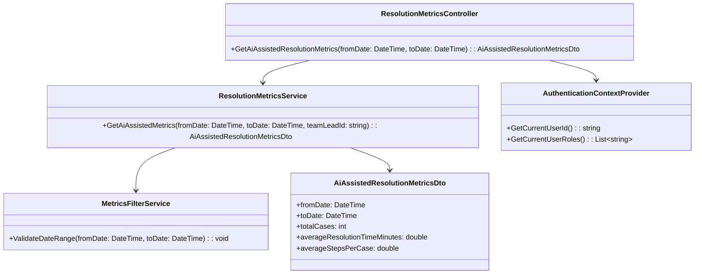
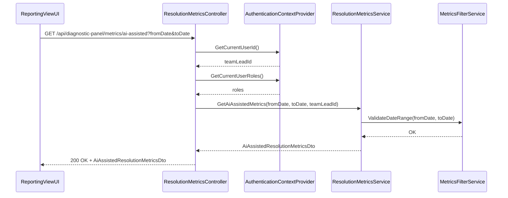
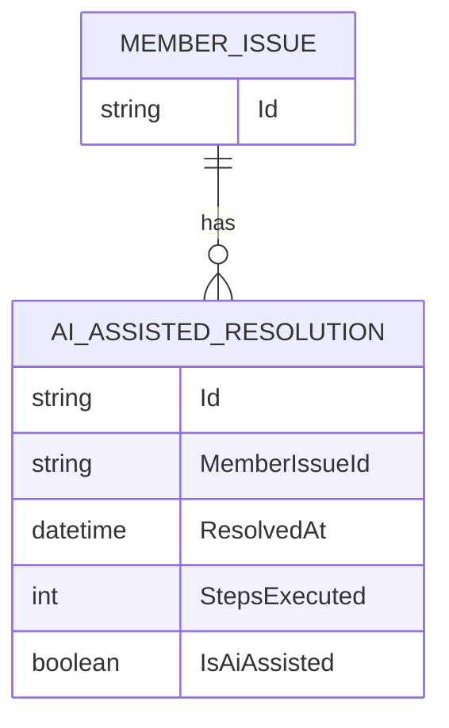

# Repository: APB_Demo
# Branch: KGTEST1
# Folder: LLD
1. Objective
The objective is to surface issue resolution efficiency metrics for AI-assisted cases within the Diagnostic Panel reporting view. The metrics will help team leads monitor performance of AI-assisted resolutions without exposing sensitive case data. The solution will provide non-sensitive aggregate metrics such as average resolution time and number of steps executed per case.

2. Backend C# API Details
2.1. API Model
2.1.1. Common Components/Services
- IResolutionMetricsService: Computes and retrieves efficiency metrics for AI-assisted member issues.
- IMetricsFilterService: Handles filtering criteria (date ranges, AI-assisted flag) for metrics queries.

2.1.2. API Details
| Operation | REST Method | Type | URL | Request JSON | Response JSON |
|-----------|-------------|------|-----|--------------|---------------|
| GetAiAssistedResolutionMetrics | GET | Query | /api/diagnostic-panel/metrics/ai-assisted | { "fromDate": "string", "toDate": "string" } | { "fromDate": "string", "toDate": "string", "totalCases": 0, "averageResolutionTimeMinutes": 0.0, "averageStepsPerCase": 0.0 } |

2.1.3. Exceptions
- InvalidDateRangeException: Thrown when fromDate is after toDate or dates are invalid.
- MetricsNotAvailableException: Thrown when no AI-assisted data exists in the given range.
- UnauthorizedAccessException: Thrown when the requesting user lacks permission to view metrics.

2.2. Functional Design
2.2.1. Class Diagram

2.2.2. UML Sequence Diagram

2.2.3. Components
| Component Name | Description | Existing/New |
|----------------|-------------|--------------|
| ResolutionMetricsController | API controller exposing AI-assisted resolution metrics. | New |
| ResolutionMetricsService | Service computing metrics for AI-assisted cases. | New |
| MetricsFilterService | Service validating and preparing filters for metrics queries. | New |
| AuthenticationContextProvider | Service providing current user identity and roles. | Existing |
| AiAssistedResolutionMetricsDto | DTO containing efficiency metrics for AI-assisted cases. | New |

2.3. Service Layer Business Logic
Service architecture & dependency injection:
- ResolutionMetricsController receives IResolutionMetricsService and IAuthenticationContextProvider via constructor injection.
- ResolutionMetricsService receives IMetricsFilterService via constructor injection.

Workflow:
1. ReportingViewUI calls GetAiAssistedResolutionMetrics with a date range.
2. ResolutionMetricsController obtains teamLeadId and roles via AuthenticationContextProvider.
3. ResolutionMetricsController verifies that the user has a team lead role before proceeding.
4. ResolutionMetricsService validates the date range using MetricsFilterService.
5. ResolutionMetricsService queries AI-assisted resolution records and computes totalCases, averageResolutionTimeMinutes, and averageStepsPerCase.
6. Controller returns AiAssistedResolutionMetricsDto.

Caching strategy:
- Cache aggregated metrics for commonly requested date ranges (e.g., last 7 days, last 30 days) per team lead.
- Invalidate cache when new AI-assisted resolution records are written.

Validation rules
| Field Name | Validation | Error Message | Class Used |
|------------|-----------|---------------|------------|
| fromDate | Required; must be a valid date | "From date is required and must be valid." | MetricsFilterService |
| toDate | Required; must be a valid date | "To date is required and must be valid." | MetricsFilterService |
| dateRange | fromDate <= toDate | "From date cannot be after to date." | MetricsFilterService |

2.4. Service Integrations
| System | Integrated For | Integration Type |
|--------|---------------|------------------|
| CaseManagementSystem | Source of resolution times and steps per case | Direct database access or repository pattern |
| AuthenticationService | Validation of team lead permissions | Internal call via AuthenticationContextProvider |

3. Front End React Details
3.1. UI Component Architecture
Component hierarchy and data flow:
- DiagnosticPanelReportingView (new)
  - MetricsFilterBar (new)
  - AiAssistedMetricsSummaryCard (new)

DiagnosticPanelReportingView manages filter state (fromDate, toDate) and calls a custom hook useAiAssistedResolutionMetrics. MetricsFilterBar allows date range selection and passes updates to the parent via callbacks. AiAssistedMetricsSummaryCard receives metrics via props and displays aggregated values.

State management:
- useState in DiagnosticPanelReportingView for filter values and response data.
- useEffect to trigger API calls when filters change.

Props interfaces:
- MetricsFilterBarProps: { fromDate: string, toDate: string, onChange: (fromDate: string, toDate: string) => void }
- AiAssistedMetricsSummaryCardProps: { totalCases: number, averageResolutionTimeMinutes: number, averageStepsPerCase: number }

Routing:
- Reporting view is accessible via an existing or new sub-route within the Diagnostic Panel (e.g., /diagnostic-panel/reporting).

3.2. UI Specifications
Wireframes/pages:
- Reporting view page includes a filter bar at the top and a metrics summary card below.

Responsive breakpoints:
- Desktop: Filter bar and metrics card displayed side by side if space permits.
- Tablet/Mobile: Filter bar stacked above metrics card.

Form structures with validation:
- Date range filter form includes two date pickers with client-side validation ensuring fromDate <= toDate.

User interaction patterns:
- Team lead selects a date range; metrics auto-refresh.
- If no data, show "No AI-assisted cases found for the selected period.".

3.3. API Integration
HTTP client configuration:
- Use shared HTTP client with authorization headers from the team lead’s session.

Call patterns and error handling:
- useAiAssistedResolutionMetrics triggers GET /api/diagnostic-panel/metrics/ai-assisted with fromDate and toDate as query parameters.
- Handle InvalidDateRangeException by showing validation error near the filter bar.
- Handle MetricsNotAvailableException by showing a no-data message.
- Handle 403 Unauthorized by hiding metrics and showing an authorization warning.

Loading states:
- Display loading spinner or skeleton in AiAssistedMetricsSummaryCard during API calls.

Data transformation:
- Map AiAssistedResolutionMetricsDto directly to props for AiAssistedMetricsSummaryCard.

4. Database Details
4.1. ER Model

4.2. Database Validations
- Enforce foreign key relationship between AI_ASSISTED_RESOLUTION.MemberIssueId and MEMBER_ISSUE.Id.
- Ensure IsAiAssisted is true for records included in AI-assisted metrics queries.

5. Non-Functional Requirements
5.1. Performance
- Metrics queries should complete within 1 second for typical date ranges.

5.2. Security (Authentication & Authorization)
- Only users with team lead roles can access AI-assisted metrics endpoints.
- No sensitive member or agent identifiers should be exposed in the metrics response.

5.3. Logging (Application, Audit, Monitoring)
- Log each metrics retrieval request with date range and requesting user ID.
- Record metrics computation failures and latency in monitoring dashboards.

6. Dependencies
- ASP.NET Core Web API.
- Case management data source for resolution records.
- React-based Diagnostic Panel reporting UI.

7. Assumptions
- AI-assisted resolutions are marked in the data source with IsAiAssisted flag.
- Team lead role is clearly defined and available from AuthenticationContextProvider.
- Only aggregate metrics are required; no per-case details are surfaced.