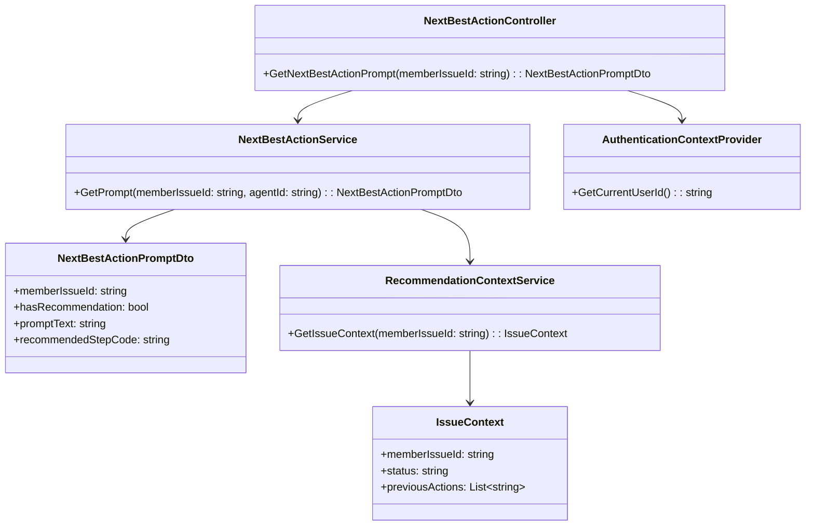
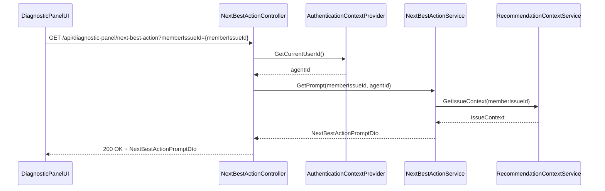
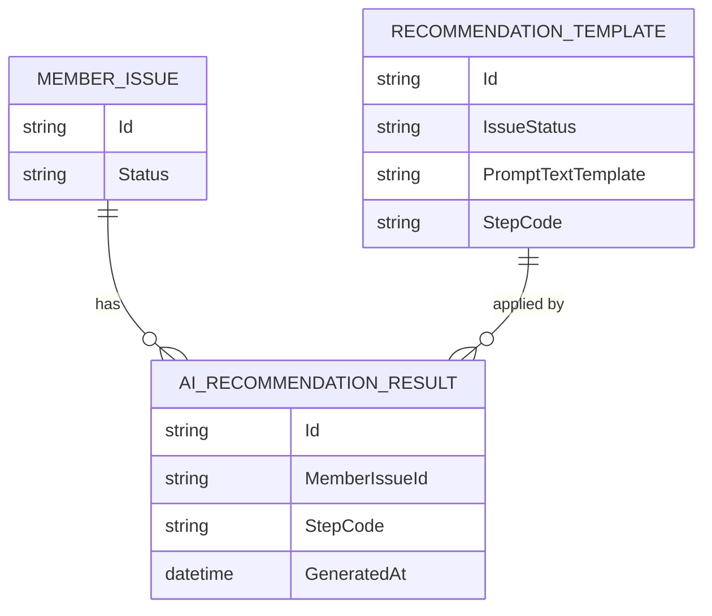

# Repository: APB_Demo
# Branch: KGTEST1
# Folder: LLD
1. Objective
The objective is to provide clear, actionable prompts for support agents indicating the next best action within the Diagnostic Panel. The prompts will be generated based on AI recommendations and displayed in a way that reduces confusion during issue resolution. The solution ensures prompts are contextually relevant and easily understood by agents.

2. Backend C# API Details
2.1. API Model
2.1.1. Common Components/Services
- INextBestActionService: Provides next best action recommendations for a member issue based on AI insights.
- IRecommendationContextService: Supplies contextual data (issue status, previous actions) required to generate actionable prompts.

2.1.2. API Details
| Operation | REST Method | Type | URL | Request JSON | Response JSON |
|-----------|-------------|------|-----|--------------|---------------|
| GetNextBestActionPrompt | GET | Query | /api/diagnostic-panel/next-best-action | { "memberIssueId": "string" } | { "memberIssueId": "string", "hasRecommendation": true, "promptText": "string", "recommendedStepCode": "string" } |

2.1.3. Exceptions
- RecommendationNotAvailableException: Thrown when no next best action can be determined for the given issue.
- MemberIssueNotFoundException: Thrown when the issue referenced by memberIssueId does not exist.
- UnauthorizedAccessException: Thrown when the agent is not authorized to view recommendations for the issue.

2.2. Functional Design
2.2.1. Class Diagram

2.2.2. UML Sequence Diagram

2.2.3. Components
| Component Name | Description | Existing/New |
|----------------|-------------|--------------|
| NextBestActionController | API controller exposing next best action prompt for a member issue. | New |
| NextBestActionService | Service generating actionable prompts based on recommendations and issue context. | New |
| RecommendationContextService | Service retrieving relevant issue context data. | New |
| AuthenticationContextProvider | Provides current agent identity. | Existing |
| NextBestActionPromptDto | DTO representing next best action prompt details. | New |
| IssueContext | Internal model holding contextual information about the member issue. | New |

2.3. Service Layer Business Logic
Service architecture & dependency injection:
- NextBestActionController receives INextBestActionService and IAuthenticationContextProvider via constructor injection.
- NextBestActionService receives IRecommendationContextService via constructor injection.

Workflow:
1. DiagnosticPanelUI calls GetNextBestActionPrompt with the active memberIssueId.
2. NextBestActionController retrieves agentId from AuthenticationContextProvider.
3. NextBestActionService validates memberIssueId and agentId.
4. NextBestActionService obtains IssueContext from RecommendationContextService.
5. NextBestActionService uses AI recommendation outputs (retrieved from internal logic or another service) and IssueContext to construct a clear promptText and recommendedStepCode.
6. Controller returns NextBestActionPromptDto to the UI.

Caching strategy:
- Cache generic recommendation templates per issue type and status.
- Do not cache member-specific next best action results to avoid stale prompts.

Validation rules
| Field Name | Validation | Error Message | Class Used |
|------------|-----------|---------------|------------|
| memberIssueId | Required; must map to an existing issue | "Member issue identifier is required." / "Member issue not found." | NextBestActionService |
| agentId | Required; must be a valid authenticated agent | "Authenticated agent is required." | NextBestActionService |

2.4. Service Integrations
| System | Integrated For | Integration Type |
|--------|---------------|------------------|
| IssueManagementSystem | Retrieve issue context (status, actions) | Internal service via RecommendationContextService |
| AIRecommendationEngine | Generate next best action based on context | Internal service or SDK integration inside NextBestActionService |

3. Front End React Details
3.1. UI Component Architecture
Component hierarchy and data flow:
- DiagnosticPanelContainer (existing from related stories)
  - NextBestActionPromptBanner (new)

NextBestActionPromptBanner receives memberIssueId as a prop from DiagnosticPanelContainer and uses a custom hook useNextBestActionPrompt to fetch prompt data. Local state in the banner component holds loading, error, and prompt data.

State management:
- useState for loading and error flags.
- useEffect to trigger API fetch when memberIssueId changes.

Props interfaces:
- NextBestActionPromptBannerProps: { memberIssueId: string }

Routing:
- No new routes; the banner is embedded in the existing Diagnostic Panel UI.

3.2. UI Specifications
Wireframes/pages:
- Within the Diagnostic Panel, a highlighted but unobtrusive banner or card displays the next best action prompt.

Responsive breakpoints:
- Desktop: Banner aligned at the top of the panel with full-width text.
- Tablet/Mobile: Banner stacked with other panel elements, text wrapping to multiple lines.

Form structures with validation:
- No forms; ensure memberIssueId is present before fetching.

User interaction patterns:
- When a recommendation is available, the banner shows promptText and optionally an icon.
- If hasRecommendation is false, the banner is hidden or displays a subtle "No recommended next action at this time." message.
- Errors are shown inline with a retry button when appropriate.

3.3. API Integration
HTTP client configuration:
- Use shared HTTP client configured with authorization headers from the existing session.

Call patterns and error handling:
- useNextBestActionPrompt triggers GET /api/diagnostic-panel/next-best-action with memberIssueId as query parameter.
- Handle 200 by rendering promptText.
- Handle 404 (MemberIssueNotFoundException) by showing "Issue not found" message in the panel.
- Handle 403 (UnauthorizedAccessException) by suppressing the banner and optionally logging client-side.
- Handle RecommendationNotAvailableException via a hasRecommendation=false response.

Loading states:
- Display skeleton text or spinner within the banner area while loading.

Data transformation:
- Map NextBestActionPromptDto to a view model { text: promptText, code: recommendedStepCode }.

4. Database Details
4.1. ER Model

4.2. Database Validations
- Enforce foreign key between AI_RECOMMENDATION_RESULT.MemberIssueId and MEMBER_ISSUE.Id.
- Ensure AI_RECOMMENDATION_RESULT.StepCode matches a valid StepCode in RECOMMENDATION_TEMPLATE.

5. Non-Functional Requirements
5.1. Performance
- Next best action prompt retrieval must typically complete within 500ms, including AI recommendation lookup.

5.2. Security (Authentication & Authorization)
- Only authenticated support agents may request next best action prompts.
- Ensure prompts do not reveal sensitive personal data or internal system credentials.

5.3. Logging (Application, Audit, Monitoring)
- Log each recommendation retrieval with memberIssueId, agentId, and whether a recommendation was found.
- Capture error details for failed recommendation generation for monitoring.

6. Dependencies
- ASP.NET Core Web API.
- AI recommendation engine or service.
- React Diagnostic Panel UI.

7. Assumptions
- An AI engine capable of generating next best action recommendations is available.
- IssueManagementSystem exposes necessary context for recommendation generation.
- Prompt wording can be configured via templates without code changes.