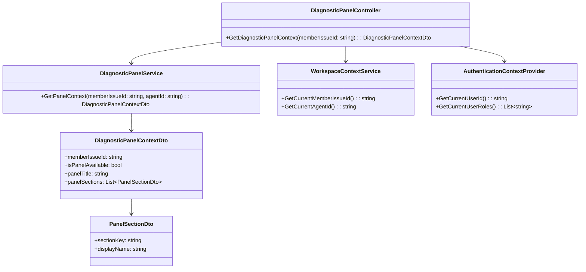
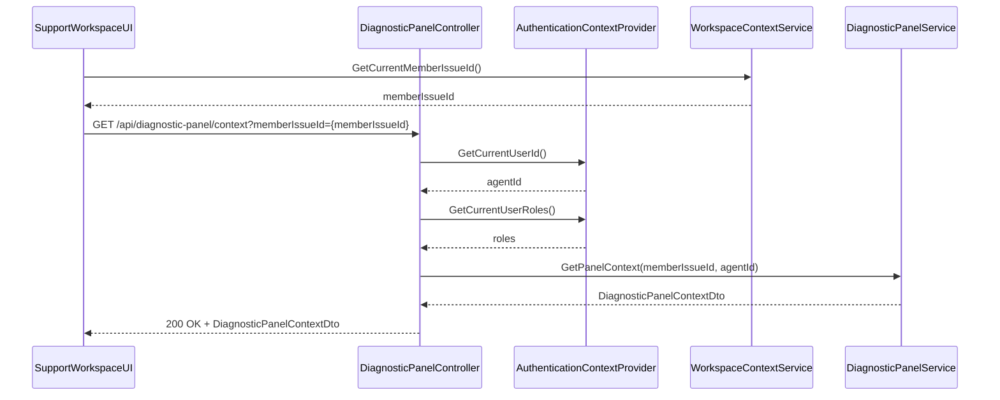
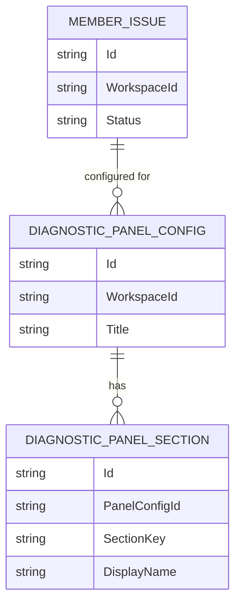

# Repository: APB_Demo
# Branch: KGTEST1
# Folder: LLD
1. Objective
The objective is to integrate the Diagnostic Panel into the existing Support Workspace UI so agents can access AI insights inline. The integration must be non-intrusive and use the agent's active authenticated session without additional credential prompts. The Diagnostic Panel will render within the member issue view while preserving security and isolation from sensitive credentials.

2. Backend C# API Details
2.1. API Model
2.1.1. Common Components/Services
- IWorkspaceContextService: Provides current agent workspace context and active member issue identifiers.
- IDiagnosticPanelService: Orchestrates retrieval of AI insight availability and panel configuration for a given member issue.
- IAuthenticationContextProvider: Provides current authenticated user identity and roles for authorization checks.

2.1.2. API Details
| Operation | REST Method | Type | URL | Request JSON | Response JSON |
|-----------|-------------|------|-----|--------------|---------------|
| GetDiagnosticPanelContext | GET | Query | /api/diagnostic-panel/context | { "memberIssueId": "string" } | { "memberIssueId": "string", "isPanelAvailable": true, "panelTitle": "string", "panelSections": [ { "sectionKey": "string", "displayName": "string" } ] } |

2.1.3. Exceptions
- MemberIssueNotFoundException: Thrown when the requested member issue does not exist or is not accessible to the agent.
- PanelUnavailableException: Thrown when the Diagnostic Panel cannot be rendered for the requested issue due to configuration or system constraints.
- UnauthorizedAccessException: Thrown when the current agent lacks permission to access the Diagnostic Panel for the member issue.

2.2. Functional Design
2.2.1. Class Diagram

2.2.2. UML Sequence Diagram

2.2.3. Components
| Component Name | Description | Existing/New |
|----------------|-------------|--------------|
| DiagnosticPanelController | API controller exposing Diagnostic Panel context for the workspace UI. | New |
| DiagnosticPanelService | Service providing panel availability and configuration for a member issue. | New |
| WorkspaceContextService | Service resolving current workspace context and member issue identifiers. | New |
| AuthenticationContextProvider | Service providing authenticated user identity and roles. | Existing |
| DiagnosticPanelContextDto | DTO representing panel context for rendering within the workspace. | New |
| PanelSectionDto | DTO describing individual sections available in the Diagnostic Panel. | New |

2.3. Service Layer Business Logic
The service layer will be implemented using dependency injection through the ASP.NET Core built-in DI container. DiagnosticPanelController receives IDiagnosticPanelService, IWorkspaceContextService, and IAuthenticationContextProvider via constructor injection. DiagnosticPanelService will encapsulate business rules determining panel availability based on member issue type, agent role, and system configuration flags.

Workflow:
1. UI obtains current memberIssueId from the existing workspace context.
2. UI calls GetDiagnosticPanelContext with the memberIssueId.
3. DiagnosticPanelController validates the request and retrieves agentId and roles from AuthenticationContextProvider.
4. DiagnosticPanelService verifies that the member issue exists and the agent is authorized.
5. DiagnosticPanelService computes isPanelAvailable and panel sections based on configuration.
6. Controller returns DiagnosticPanelContextDto to the UI.

Caching strategy:
- Use in-memory caching for panel configuration (section definitions, titles) keyed by workspace type to avoid repeated configuration lookups.
- Do not cache per-member issue authorization or availability decisions to ensure up-to-date access control.

Validation rules
| Field Name | Validation | Error Message | Class Used |
|------------|-----------|---------------|------------|
| memberIssueId | Required, non-empty; must correspond to an existing issue | "Member issue identifier is required." / "Member issue not found." | DiagnosticPanelService |
| agentId | Required; must represent an authenticated support agent | "Authenticated agent is required." | DiagnosticPanelService |

2.4. Service Integrations
| System | Integrated For | Integration Type |
|--------|---------------|------------------|
| SupportWorkspaceSystem | Retrieve current member issue context | Internal service call via IWorkspaceContextService |
| AuthorizationService | Validate agent permissions for Diagnostic Panel access | Internal service call via IAuthenticationContextProvider |

3. Front End React Details
3.1. UI Component Architecture
The Diagnostic Panel will be implemented as a React component embedded within the existing MemberIssueView layout.

Component hierarchy and data flow:
- MemberIssueView (existing)
  - DiagnosticPanelContainer (new)
    - DiagnosticPanelHeader (new)
    - DiagnosticPanelSections (new)

DiagnosticPanelContainer will receive the current memberIssueId as a prop from MemberIssueView. It will manage local state for panel loading, error, and context data. DiagnosticPanelSections will receive panelSections via props and render section content. State management will use React hooks (useState, useEffect) and a custom hook useDiagnosticPanelContext for data fetching.

Routing:
- No new top-level routes; DiagnosticPanelContainer is rendered within the existing route for member issue details.

Props interfaces:
- DiagnosticPanelContainerProps: { memberIssueId: string }
- DiagnosticPanelHeaderProps: { panelTitle: string }
- DiagnosticPanelSectionsProps: { sections: PanelSectionViewModel[] }

3.2. UI Specifications
Wireframes/pages:
- MemberIssueView page includes a right-side or bottom integrated Diagnostic Panel region showing the panel header and sections when available.

Responsive breakpoints:
- Desktop (>= 1024px): Panel rendered as a side panel next to issue details.
- Tablet (768px - 1023px): Panel rendered below issue details with collapsible sections.
- Mobile (< 768px): Panel rendered as a collapsible accordion below issue details.

Form structures with validation:
- No explicit forms introduced; validation is limited to ensuring a valid memberIssueId is present before invoking the API.

User interaction patterns:
- When MemberIssueView loads a new issue, DiagnosticPanelContainer automatically requests context.
- If isPanelAvailable is false, the panel area shows a subtle message "Diagnostic insights are not available for this issue." without disrupting the main workflow.
- No separate login prompts; errors related to authentication show a non-blocking inline message "Unable to load diagnostic panel. Please refresh or contact support.".

3.3. API Integration
HTTP client configuration:
- Use a shared HTTP client utility (e.g., fetch wrapper or Axios instance) configured with the existing workspace base URL and authorization headers derived from the active session token.

Call patterns and error handling:
- useDiagnosticPanelContext: On mount or when memberIssueId changes, perform GET /api/diagnostic-panel/context with memberIssueId as query parameter.
- Handle HTTP 200 by updating context state.
- Handle 404 (MemberIssueNotFoundException) by showing "Issue not found" message and hiding panel content.
- Handle 403 (UnauthorizedAccessException) by showing a non-intrusive "Access to diagnostic panel is restricted." message.
- Handle other errors with generic inline error messaging and optional retry button.

Loading states:
- While fetching context, display a skeleton or spinner within the panel area without blocking the main issue view.

Data transformation:
- Map DiagnosticPanelContextDto to PanelSectionViewModel with fields: { key, displayName } for rendering.

4. Database Details
4.1. ER Model

4.2. Database Validations
- Ensure referential integrity between DIAGNOSTIC_PANEL_CONFIG and DIAGNOSTIC_PANEL_SECTION (PanelConfigId must exist in DIAGNOSTIC_PANEL_CONFIG).
- WorkspaceId in DIAGNOSTIC_PANEL_CONFIG must correspond to a valid workspace in the existing workspace table (assumed external).

5. Non-Functional Requirements
5.1. Performance
- The GetDiagnosticPanelContext API must respond within 300ms under normal load when panel configuration is cached.
- Database queries for panel configuration must be optimized using indexes on WorkspaceId.

5.2. Security (Authentication & Authorization)
- Enforce authentication via existing middleware; only authenticated support agents can access /api/diagnostic-panel/context.
- Validate that the agent has access to the requested memberIssueId based on workspace-level authorization rules.
- Do not expose any credentials or sensitive configuration values in the API response.

5.3. Logging (Application, Audit, Monitoring)
- Log each call to GetDiagnosticPanelContext with memberIssueId and agentId (excluding sensitive data).
- Log unauthorized access attempts as warnings with correlation identifiers.
- Expose metrics for API latency and error rates via the existing monitoring framework.

6. Dependencies
- ASP.NET Core Web API framework.
- Existing Support Workspace system providing member issue context.
- Existing authentication and authorization infrastructure.
- React application hosting MemberIssueView.

7. Assumptions
- The Support Workspace already has a stable route and layout for MemberIssueView from which memberIssueId is available.
- There is an existing shared HTTP client utility in the React codebase.
- Workspace-level configuration for panel sections is stored in the application database or configuration service.
- No PII or credentials are required or returned as part of Diagnostic Panel context.