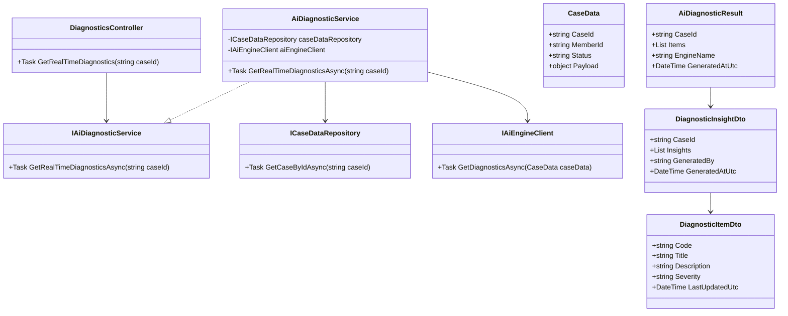
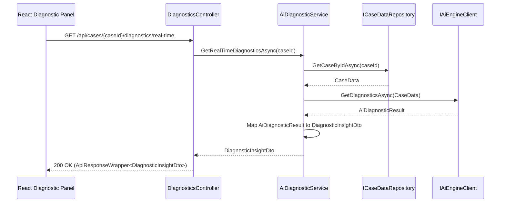
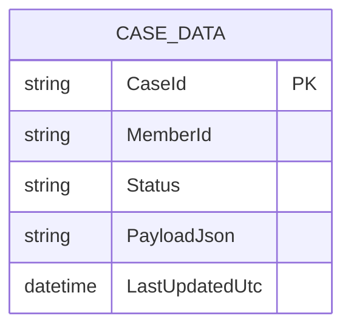

# Repository: APB_Demo
# Branch: DAVTEST1
# Folder: LLD
1. Objective
The objective is to expose real-time AI-generated diagnostic insights for active member cases through a backend API and React UI.
This enables support agents to quickly understand current member issues based on live case data processed by the AI engine.
The solution provides a diagnostic panel that surfaces up-to-date insights that automatically reflect AI analysis results.

2. Backend C# API Details
2.1. API Model
2.1.1. Common Components/Services
- IAiDiagnosticService: Domain service interface responsible for orchestrating AI diagnostic insight retrieval for member cases.
- AiDiagnosticService: Implementation of IAiDiagnosticService that calls the AI engine, transforms results, and applies minimal business rules.
- ICaseDataRepository: Abstraction over the case data source (e.g., database or API) used to retrieve current member case data.
- DiagnosticInsightDto: Data transfer object representing AI diagnostic insights returned to the client.
- ApiResponseWrapper<T>: Generic wrapper to standardize API responses (status, data, error message).

2.1.2. API Details
| Operation | REST Method | Type | URL | Request JSON | Response JSON |
|----------|-------------|------|-----|--------------|---------------|
| GetRealTimeDiagnostics | GET | Query | /api/cases/{caseId}/diagnostics/real-time | N/A (caseId in route) | { "caseId": "string", "insights": [ { "code": "string", "title": "string", "description": "string", "severity": "string", "lastUpdatedUtc": "string" } ], "generatedBy": "string", "generatedAtUtc": "string" } |

2.1.3. Exceptions
- CaseNotFoundException: Thrown when the specified caseId does not exist in the case data source.
- AiEngineUnavailableException: Thrown when the AI engine cannot be reached or returns an error.
- DiagnosticsNotAvailableException: Thrown when AI diagnostics cannot be generated for the current case context.

2.2. Functional Design
2.2.1. Class Diagram

2.2.2. UML Sequence Diagram

2.2.3. Components
| Component Name | Description | Existing/New |
|------------------------|-------------|-------------|
| DiagnosticsController | ASP.NET Core API controller exposing real-time diagnostics endpoint. | New |
| AiDiagnosticService | Service that orchestrates case data retrieval and AI diagnostics generation. | New |
| CaseDataRepository | Repository implementation of ICaseDataRepository used for case lookup. | Minimal New |
| AiEngineClient | HTTP client used to call external/internal AI engine and retrieve diagnostics. | New |
| DiagnosticInsightDto | DTO used to serialize diagnostics to the UI. | New |
| DiagnosticItemDto | DTO representing individual diagnostic items. | New |

2.3. Service Layer Business Logic
Service architecture & dependency injection:
- DiagnosticsController depends on IAiDiagnosticService, injected via constructor using ASP.NET Core DI container.
- AiDiagnosticService depends on ICaseDataRepository and IAiEngineClient, both registered as scoped services.
- ICaseDataRepository is implemented by CaseDataRepository, which uses DbContext or an HTTP client based on configuration.
- IAiEngineClient is implemented by AiEngineClient, configured with HttpClientFactory and AI endpoint settings.

Workflow:
- Receive caseId from route in DiagnosticsController.
- Call IAiDiagnosticService.GetRealTimeDiagnosticsAsync(caseId).
- Validate case existence via ICaseDataRepository.GetCaseByIdAsync(caseId); throw CaseNotFoundException if not found.
- Call IAiEngineClient.GetDiagnosticsAsync(caseData) to get AiDiagnosticResult.
- Map AiDiagnosticResult into DiagnosticInsightDto and DiagnosticItemDto list.
- Return ApiResponseWrapper<DiagnosticInsightDto> with HTTP 200; propagate domain-specific errors as appropriate HTTP status codes.

Caching strategy:
- Minimal assumption: no server-side caching for diagnostics due to real-time requirement; each request triggers fresh AI evaluation.

Validation rules
| Field Name | Validation | Error Message | Class Used |
|-----------|-----------|---------------|-----------|
| caseId | Must be non-empty and match expected case ID format (GUID or numeric string) | "Invalid case identifier." | DiagnosticsController |

2.4. Service Integrations
| System | Integrated For | Integration Type |
|--------|----------------|------------------|
| Case Data Store | Retrieve current member case data for diagnostics | Internal repository (database or case API) |
| AI Engine | Generate real-time diagnostic insights | HTTP API via AiEngineClient |

3. Front End React Details
3.1. UI Component Architecture
- DiagnosticPanelPage: Route-level component bound to /cases/:caseId/diagnostics, responsible for fetching diagnostics and rendering the panel.
- DiagnosticPanel: Presentational component displaying the list of diagnostic insights for the current case.
- DiagnosticItemList: Component rendering a collection of DiagnosticItemCard components.
- DiagnosticItemCard: Component displaying individual diagnostic item details (title, description, severity, lastUpdatedUtc).
- useDiagnosticInsights hook: Custom React hook encapsulating API calls, loading and error state, and data transformation.
- State management is local to DiagnosticPanelPage using React hooks (useState, useEffect), with caseId from route params via React Router.
- Data flows from useDiagnosticInsights into DiagnosticPanelPage, then down as props to DiagnosticPanel and DiagnosticItemList.

3.2. UI Specifications
- Wireframes/Pages: Single page DiagnosticPanelPage showing current case details header and AI diagnostic insights section.
- Responsive breakpoints: Layout adapts at 768px and 1024px; diagnostic items stack vertically on small screens and use grid layout on larger screens.
- Form structures: No forms for this story; content is read-only with dynamic refresh based on backend data.
- User interaction patterns: On navigation to DiagnosticPanelPage, diagnostics are fetched; a basic "Refresh" button may trigger re-fetch of insights; errors show inline alert; loading shows spinner.

3.3. API Integration
- HTTP client configuration: useDiagnosticInsights uses a centralized HttpClient wrapper based on fetch or axios (minimal assumption: axios) configured with base URL and interceptors for auth.
- Call patterns: GET /api/cases/{caseId}/diagnostics/real-time is triggered on mount and on manual refresh; caseId is taken from route params.
- Error handling: Network or server errors set an error state and render an error banner; specific HTTP 404 shows "Case not found" message; 503 shows "Diagnostics temporarily unavailable".
- Loading states: While the request is in-flight, DiagnosticPanelPage renders a loading spinner and skeleton cards.
- Data transformation: Raw response JSON is mapped to a DiagnosticInsightViewModel with formatted dates and severity labels before rendering.

4. Database Details
4.1. ER Model

4.2. Database Validations
- CaseId is primary key and must be unique for each case.
- MemberId must reference a valid member record in the broader domain (assumed existing relation).
- PayloadJson must be valid JSON representing case details; basic NOT NULL constraint enforced.

5. Non-Functional Requirements
5.1. Performance
- Real-time diagnostics should return within 2-3 seconds under normal load to maintain agent productivity.
- Endpoint must support concurrent requests from multiple agents viewing different cases.

5.2. Security (Authentication & Authorization)
- Access to /api/cases/{caseId}/diagnostics/real-time requires authenticated support agent identity via JWT or session token.
- Authorization ensures agents can only access cases they are permitted to view based on existing case access rules.

5.3. Logging (Application, Audit, Monitoring)
- Application logs record each diagnostics request with caseId, response time, and outcome (success/failure).
- Errors from AI engine or case data store are logged with correlation IDs for troubleshooting.
- Basic audit log records which agent viewed diagnostics for which case and at what time.

6. Dependencies
- ASP.NET Core Web API runtime and DI container.
- HTTP client library (e.g., HttpClientFactory) for AiEngineClient.
- React and React Router for the diagnostic panel UI.
- Axios or equivalent HTTP client for frontend API integration.

7. Assumptions
- A single AI engine endpoint exists that can generate diagnostics from current case data.
- Case data store and member records are already modeled and accessible via ICaseDataRepository.
- No offline or caching behavior is required; each request should hit the AI engine for fresh insights.