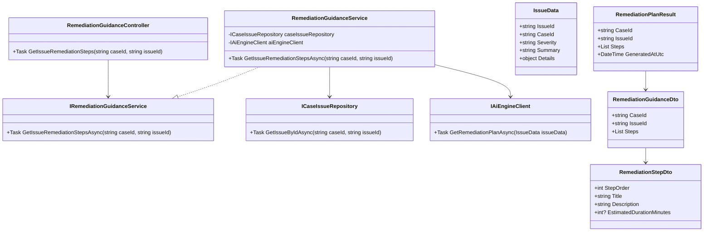
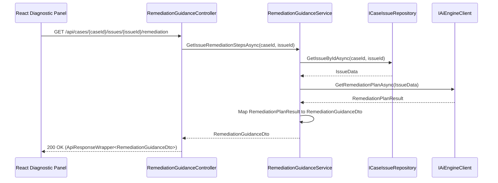
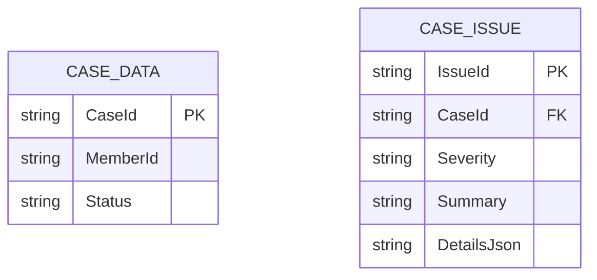

# Repository: APB_Demo
# Branch: DAVTEST1
# Folder: LLD
1. Objective
The objective is to provide AI-generated step-by-step remediation instructions for specific issues identified in the diagnostic panel.
This enables support agents to resolve member issues efficiently and consistently by following an ordered list of actionable steps.
The solution exposes backend APIs and a React UI that present remediation steps for a selected diagnostic issue.

2. Backend C# API Details
2.1. API Model
2.1.1. Common Components/Services
- IRemediationGuidanceService: Domain service interface responsible for retrieving remediation steps for a given diagnostic issue.
- RemediationGuidanceService: Implementation of IRemediationGuidanceService that interacts with the AI engine or internal rules to generate steps.
- ICaseIssueRepository: Abstraction to retrieve issues associated with a case from the data source.
- RemediationStepDto: Data transfer object representing a single remediation step.
- RemediationGuidanceDto: DTO aggregating remediation steps for a selected issue.
- ApiResponseWrapper<T>: Generic wrapper to standardize API responses.

2.1.2. API Details
| Operation | REST Method | Type | URL | Request JSON | Response JSON |
|----------|-------------|------|-----|--------------|---------------|
| GetIssueRemediationSteps | GET | Query | /api/cases/{caseId}/issues/{issueId}/remediation | N/A (caseId and issueId in route) | { "caseId": "string", "issueId": "string", "steps": [ { "stepOrder": 1, "title": "string", "description": "string", "estimatedDurationMinutes": 5 } ] } |

2.1.3. Exceptions
- CaseNotFoundException: Thrown when the specified caseId does not exist.
- IssueNotFoundException: Thrown when the specified issueId is not associated with the case.
- RemediationGuidanceUnavailableException: Thrown when AI guidance cannot be generated for the selected issue.

2.2. Functional Design
2.2.1. Class Diagram

2.2.2. UML Sequence Diagram

2.2.3. Components
| Component Name | Description | Existing/New |
|-----------------------------|-------------|-------------|
| RemediationGuidanceController | API controller exposing remediation steps endpoint. | New |
| RemediationGuidanceService | Service that orchestrates issue retrieval and AI remediation guidance. | New |
| CaseIssueRepository | Repository providing access to issues for a case. | New |
| AiEngineClient | HTTP client used to call AI engine for remediation plan. | Reused from diagnostics story |
| RemediationGuidanceDto | DTO aggregating remediation steps for the UI. | New |
| RemediationStepDto | DTO representing a single remediation step. | New |

2.3. Service Layer Business Logic
Service architecture & dependency injection:
- RemediationGuidanceController depends on IRemediationGuidanceService, registered in ASP.NET Core DI.
- RemediationGuidanceService depends on ICaseIssueRepository and IAiEngineClient, both registered as scoped services.

Workflow:
- Receive caseId and issueId from route parameters in RemediationGuidanceController.
- Validate identifiers and delegate to IRemediationGuidanceService.GetIssueRemediationStepsAsync(caseId, issueId).
- ICaseIssueRepository.GetIssueByIdAsync verifies that the issue belongs to the case; throw IssueNotFoundException if missing.
- IAiEngineClient.GetRemediationPlanAsync requests remediation plan from AI engine and returns RemediationPlanResult.
- Map RemediationPlanResult into RemediationGuidanceDto and ordered list of RemediationStepDto.
- Return ApiResponseWrapper<RemediationGuidanceDto> with HTTP 200.

Caching strategy:
- Minimal assumption: no server-side caching is applied; steps are retrieved on demand to remain current with AI guidance.

Validation rules
| Field Name | Validation | Error Message | Class Used |
|-----------|-----------|---------------|-----------|
| caseId | Must be non-empty and match expected case ID format. | "Invalid case identifier." | RemediationGuidanceController |
| issueId | Must be non-empty and match expected issue ID format. | "Invalid issue identifier." | RemediationGuidanceController |

2.4. Service Integrations
| System | Integrated For | Integration Type |
|--------|----------------|------------------|
| Case Issue Store | Retrieve issue details for a case | Internal repository (database or case API) |
| AI Engine | Generate remediation plan and steps | HTTP API via AiEngineClient |

3. Front End React Details
3.1. UI Component Architecture
- DiagnosticPanelPage: Parent page component showing issues for a case and allowing selection of an issue.
- RemediationSection: Component displayed when an issue is selected, showing step-by-step remediation instructions.
- RemediationStepList: Component rendering ordered list of RemediationStepCard components.
- RemediationStepCard: Component showing step order, title, description, and optional estimated duration.
- useRemediationGuidance hook: Custom hook encapsulating API calls, loading and error handling for remediation steps.
- State management: Selected issueId maintained in DiagnosticPanelPage; remediation data fetched via useRemediationGuidance when issueId changes.

3.2. UI Specifications
- Wireframes/Pages: DiagnosticPanelPage includes a remediation section that reveals when an issue is selected in the issues list.
- Responsive breakpoints: Steps are displayed in a single-column list on small screens and in split layout with issue details on larger screens.
- Form structures: No input forms; agents read and follow steps; potential future enhancements may include checkboxes, but not in this story.
- User interaction patterns: On selecting an issue, RemediationSection loads steps and displays loading indicator; errors show inline banner; steps are visually numbered.

3.3. API Integration
- HTTP client configuration: useRemediationGuidance uses shared axios-based client with base URL and auth interceptors.
- Call patterns: GET /api/cases/{caseId}/issues/{issueId}/remediation triggered whenever selected issueId changes and is non-empty.
- Error handling: 404 for case or issue shows specific "Issue not found" message; other errors show generic "Unable to load remediation steps".
- Loading states: While retrieving steps, RemediationSection shows spinner and placeholder cards.
- Data transformation: Response mapped to RemediationStepViewModel with formatted step titles and durations.

4. Database Details
4.1. ER Model

4.2. Database Validations
- CaseId in CASE_ISSUE must exist in CASE_DATA to maintain referential integrity.
- Severity must be constrained to allowed values (e.g., Low, Medium, High, Critical).
- DetailsJson must be valid JSON describing issue details.

5. Non-Functional Requirements
5.1. Performance
- Retrieval of remediation steps should complete within 2-3 seconds for a typical issue.
- Endpoint must handle concurrent requests across multiple agents without significant degradation.

5.2. Security (Authentication & Authorization)
- Access to remediation endpoint requires authenticated support agent identity via existing security mechanism.
- Authorization must ensure agents can only access remediation for cases they are allowed to view.

5.3. Logging (Application, Audit, Monitoring)
- Log each remediation guidance request with caseId, issueId, and response status.
- Log failures from AI engine and issue repository with correlation identifiers.
- Audit logs record which agent accessed remediation steps for a given case and time.

6. Dependencies
- ASP.NET Core Web API and DI container.
- HTTP client for AI engine integration.
- React, React Router, and shared HTTP client configuration.

7. Assumptions
- Case and issue entities already exist and are retrievable via repositories.
- AI engine is capable of generating step-by-step remediation instructions from issue data.
- No requirement to persist agent interaction with steps in this story.
