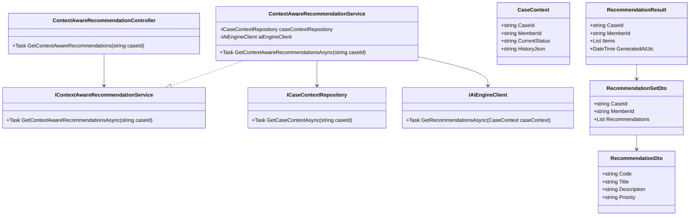
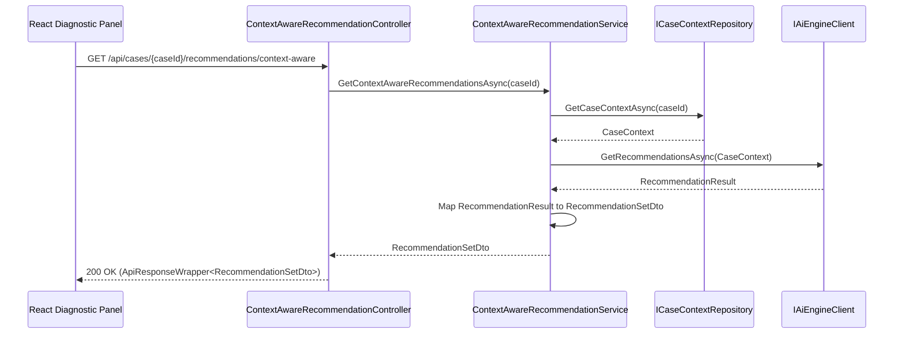
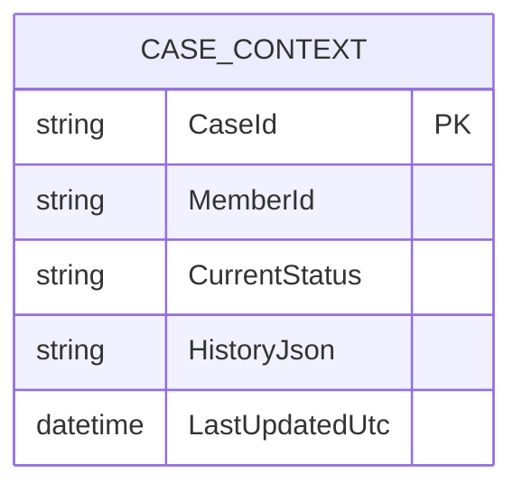

# Repository: APB_Demo
# Branch: DAVTEST1
# Folder: LLD
1. Objective
The objective is to provide AI-generated recommendations that are aware of the member’s case context, including historical and current data.
This ensures support agents receive accurate and relevant guidance tailored to the member’s situation when viewing a case.
The solution delivers backend APIs and React UI elements that surface context-aware recommendations inside a diagnostic panel.

2. Backend C# API Details
2.1. API Model
2.1.1. Common Components/Services
- IContextAwareRecommendationService: Domain service interface to generate recommendations based on case context.
- ContextAwareRecommendationService: Implementation responsible for aggregating case data and interacting with the AI engine.
- ICaseContextRepository: Abstraction to retrieve historical and current case data for a member.
- RecommendationDto: DTO representing a single recommendation item.
- RecommendationSetDto: DTO representing the collection of recommendations for a case.
- ApiResponseWrapper<T>: Generic wrapper for API responses.

2.1.2. API Details
| Operation | REST Method | Type | URL | Request JSON | Response JSON |
|----------|-------------|------|-----|--------------|---------------|
| GetContextAwareRecommendations | GET | Query | /api/cases/{caseId}/recommendations/context-aware | N/A (caseId in route) | { "caseId": "string", "memberId": "string", "recommendations": [ { "code": "string", "title": "string", "description": "string", "priority": "string" } ] } |

2.1.3. Exceptions
- CaseNotFoundException: Thrown when case context cannot be found for the given caseId.
- RecommendationUnavailableException: Thrown when AI recommendations cannot be generated.

2.2. Functional Design
2.2.1. Class Diagram

2.2.2. UML Sequence Diagram

2.2.3. Components
| Component Name | Description | Existing/New |
|-------------------------------|-------------|-------------|
| ContextAwareRecommendationController | API controller exposing context-aware recommendations endpoint. | New |
| ContextAwareRecommendationService | Service aggregating case context and AI recommendations. | New |
| CaseContextRepository | Repository providing historical and current case context data. | New |
| AiEngineClient | HTTP client communicating with AI engine. | Reused |
| RecommendationSetDto | DTO representing recommendations for a case. | New |
| RecommendationDto | DTO representing a single recommendation item. | New |

2.3. Service Layer Business Logic
Service architecture & dependency injection:
- ContextAwareRecommendationController depends on IContextAwareRecommendationService via constructor injection.
- ContextAwareRecommendationService depends on ICaseContextRepository and IAiEngineClient, registered as scoped services.

Workflow:
- Receive caseId in controller route.
- Validate caseId and invoke service GetContextAwareRecommendationsAsync(caseId).
- Retrieve CaseContext via ICaseContextRepository.GetCaseContextAsync(caseId); throw CaseNotFoundException if missing.
- IAiEngineClient.GetRecommendationsAsync(CaseContext) returns RecommendationResult based on contextual data.
- Map RecommendationResult to RecommendationSetDto, including memberId and recommendation list.
- Return ApiResponseWrapper<RecommendationSetDto> to client.

Caching strategy:
- Minimal assumption: no explicit caching; recommendations are generated on demand per request for accuracy.

Validation rules
| Field Name | Validation | Error Message | Class Used |
|-----------|-----------|---------------|-----------|
| caseId | Must be non-empty and conform to case ID format. | "Invalid case identifier." | ContextAwareRecommendationController |

2.4. Service Integrations
| System | Integrated For | Integration Type |
|--------|----------------|------------------|
| Case Context Store | Retrieve historical and current context for a case | Internal repository backed by database or case API |
| AI Engine | Generate context-aware recommendations | HTTP API via AiEngineClient |

3. Front End React Details
3.1. UI Component Architecture
- DiagnosticPanelPage: Overall page component hosting case overview, diagnostics, and recommendations.
- RecommendationSection: Component displaying context-aware recommendations for the current case.
- RecommendationList: Component rendering a list of RecommendationCard components.
- RecommendationCard: Component showing recommendation title, description, and priority.
- useContextAwareRecommendations hook: Custom hook managing API calls, state, and transformations for recommendations.
- State management: DiagnosticPanelPage obtains caseId from route and passes it to useContextAwareRecommendations; results flow via props to RecommendationSection and children.

3.2. UI Specifications
- Wireframes/Pages: On DiagnosticPanelPage, recommendations section appears beneath diagnostics, with labeled list of suggested actions.
- Responsive breakpoints: Recommendations stack in a single column on small screens and may use two-column layout on larger screens.
- Form structures: No forms; recommendations are read-only guidance; optional action buttons may be added later but not in this story.
- User interaction patterns: Recommendations auto-load when page mounts; agent can manually refresh recommendations using a button that re-triggers API call; errors show inline messages.

3.3. API Integration
- HTTP client configuration: useContextAwareRecommendations uses shared axios-based HTTP client with base URL and auth interceptors.
- Call patterns: GET /api/cases/{caseId}/recommendations/context-aware triggered on mount and on manual refresh.
- Error handling: 404 shows "Case context not found"; 503 or AI-related errors show "Recommendations temporarily unavailable".
- Loading states: During fetch, RecommendationSection shows loader; on completion, list is rendered.
- Data transformation: Raw response is mapped into RecommendationViewModel with formatted priority labels and truncated descriptions for display.

4. Database Details
4.1. ER Model

4.2. Database Validations
- CaseId is primary key and must be unique.
- MemberId must reference an existing member record.
- HistoryJson must contain valid JSON capturing case history entries.

5. Non-Functional Requirements
5.1. Performance
- Recommendations retrieval should complete within 3-4 seconds due to potentially complex AI processing.
- The endpoint must support multiple concurrent requests across agents.

5.2. Security (Authentication & Authorization)
- Endpoint requires authenticated agent identity using existing security mechanism.
- Authorization must ensure agents only access recommendations for cases they are permitted to view.

5.3. Logging (Application, Audit, Monitoring)
- Log each recommendations request with caseId and result status.
- Log AI engine failures with correlation IDs and details for monitoring.
- Audit logs capture which agent accessed recommendations for a case and timestamp.

6. Dependencies
- ASP.NET Core Web API runtime and DI.
- AI engine HTTP API and related configuration.
- React, React Router, and shared frontend HTTP client.

7. Assumptions
- Case context data is already maintained in a backing store accessible through ICaseContextRepository.
- AI engine can accept case context payloads and produce context-aware recommendations.
- No need to persist agent actions taken based on recommendations in this story.
