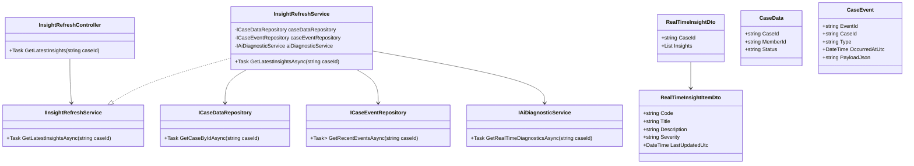
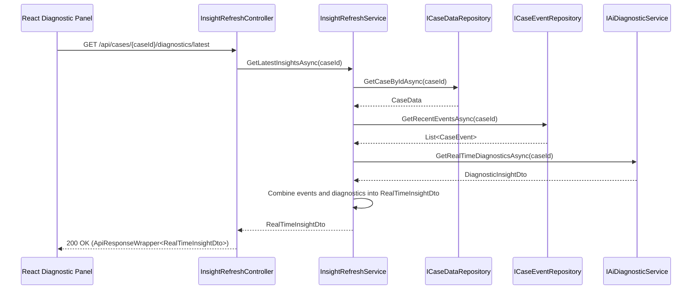
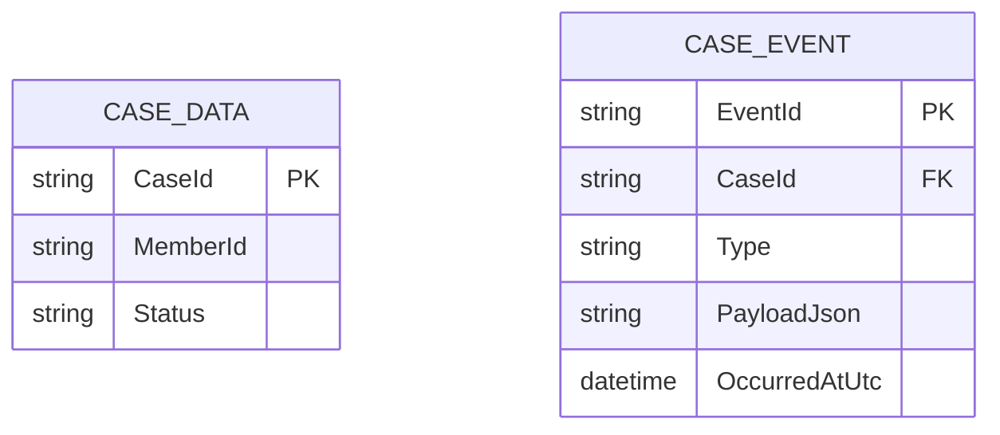

# Repository: APB_Demo
# Branch: DAVTEST1
# Folder: LLD
1. Objective
The objective is to enable the diagnostic panel to refresh AI insights in real time when new case data or events are recorded.
This allows support agents to work with up-to-date information without manually reloading the page.
The solution introduces backend support for event-driven updates and a React UI that responds to real-time insight changes.

2. Backend C# API Details
2.1. API Model
2.1.1. Common Components/Services
- IInsightRefreshService: Service interface responsible for providing latest diagnostic insights based on case events.
- InsightRefreshService: Implementation that uses case data and AI diagnostics to compute updated insights.
- ICaseEventRepository: Abstraction for retrieving recent case events that may influence diagnostics.
- RealTimeInsightDto: DTO representing the current set of insights for a case.
- IDiagnosticInsightStream: Interface abstracting a server-side push mechanism (e.g., SignalR hub).
- ApiResponseWrapper<T>: Generic wrapper for standard API responses.

2.1.2. API Details
| Operation | REST Method | Type | URL | Request JSON | Response JSON |
|----------|-------------|------|-----|--------------|---------------|
| GetLatestInsights | GET | Query | /api/cases/{caseId}/diagnostics/latest | N/A (caseId in route) | { "caseId": "string", "insights": [ { "code": "string", "title": "string", "description": "string", "severity": "string", "lastUpdatedUtc": "string" } ] } |
| SubscribeInsightStream | GET | Streaming | /api/cases/{caseId}/diagnostics/stream | N/A (caseId in route) | Server-sent events or SignalR messages with RealTimeInsightDto payload |

2.1.3. Exceptions
- CaseNotFoundException: Thrown when caseId does not correspond to a known case.
- InsightRefreshUnavailableException: Thrown when updated insights cannot be generated due to AI or data issues.

2.2. Functional Design
2.2.1. Class Diagram

2.2.2. UML Sequence Diagram

2.2.3. Components
| Component Name | Description | Existing/New |
|-------------------------------|-------------|-------------|
| InsightRefreshController | API controller exposing latest insights endpoint. | New |
| InsightRefreshService | Service orchestrating case data, events, and AI diagnostics. | New |
| CaseEventRepository | Repository providing access to recent case events. | New |
| IAiDiagnosticService | Service interface reused from diagnostics story. | Existing |
| RealTimeInsightDto | DTO representing current insights for a case. | New |
| RealTimeInsightItemDto | DTO representing a single insight item. | New |

2.3. Service Layer Business Logic
Service architecture & dependency injection:
- InsightRefreshController depends on IInsightRefreshService via DI.
- InsightRefreshService depends on ICaseDataRepository, ICaseEventRepository, and IAiDiagnosticService, registered as scoped services.

Workflow:
- Receive caseId in InsightRefreshController route.
- Validate caseId and call IInsightRefreshService.GetLatestInsightsAsync(caseId).
- ICaseDataRepository.GetCaseByIdAsync ensures the case exists.
- ICaseEventRepository.GetRecentEventsAsync retrieves events relevant to diagnostics.
- IAiDiagnosticService.GetRealTimeDiagnosticsAsync(caseId) returns fresh diagnostics.
- InsightRefreshService combines diagnostics and event metadata into RealTimeInsightDto.
- Controller returns ApiResponseWrapper<RealTimeInsightDto> with HTTP 200.

Caching strategy:
- Minimal assumption: short-lived in-memory cache may be applied to case events but diagnostics are always fetched fresh.

Validation rules
| Field Name | Validation | Error Message | Class Used |
|-----------|-----------|---------------|-----------|
| caseId | Must be non-empty and conform to case ID format. | "Invalid case identifier." | InsightRefreshController |

2.4. Service Integrations
| System | Integrated For | Integration Type |
|--------|----------------|------------------|
| Case Data Store | Retrieve case metadata for validation | Internal repository |
| Case Event Store | Retrieve recent case events | Internal repository backed by event table or log |
| AI Diagnostic Service | Generate updated diagnostic insights | Internal service integration |

3. Front End React Details
3.1. UI Component Architecture
- DiagnosticPanelPage: Page component with case header and diagnostic insights section.
- RealTimeInsightPanel: Component responsible for rendering and updating insights in real time.
- RealTimeInsightList: Component rendering list of RealTimeInsightCard components.
- RealTimeInsightCard: Component visualizing individual insight details and last updated time.
- useRealTimeInsights hook: Custom hook managing polling or push subscription to receive updated insights.
- State management: DiagnosticPanelPage passes caseId to useRealTimeInsights; the hook maintains insights, loading, and error state and exposes them to RealTimeInsightPanel.

3.2. UI Specifications
- Wireframes/Pages: DiagnosticPanel shows real-time insights area with timestamp of last refresh.
- Responsive breakpoints: Insights list is single column on narrow screens and multi-column grid on wide screens.
- Form structures: No explicit forms; content updates automatically when new data is available.
- User interaction patterns: On page load, insights are fetched and refreshed either via polling or server push; optional manual refresh button can trigger immediate fetch.

3.3. API Integration
- HTTP client configuration: useRealTimeInsights uses shared axios-based client for REST calls and optional SignalR client for streaming.
- Call patterns: Initial GET /api/cases/{caseId}/diagnostics/latest and subsequent periodic polling (e.g., every 15-30 seconds) or SignalR subscription.
- Error handling: Errors surface as inline notification and automatic retry with back-off for transient failures.
- Loading states: Spinner displays while initial insights are loading; subtle "Updating..." indicator appears on refresh.
- Data transformation: Backend RealTimeInsightDto mapped into RealTimeInsightViewModel with formatted timestamps and severity badges.

4. Database Details
4.1. ER Model

4.2. Database Validations
- CaseId in CASE_EVENT must exist in CASE_DATA.
- Type is constrained to known event types via enumeration.
- PayloadJson must be valid JSON.

5. Non-Functional Requirements
5.1. Performance
- Latest insights retrieval must complete within 2 seconds under normal conditions.
- Real-time updates should not significantly impact backend throughput; polling interval tuned to balance freshness and load.

5.2. Security (Authentication & Authorization)
- Endpoint requires authenticated agent access using existing security tokens.
- Authorization ensures agents only access insights for cases they are permitted to view.

5.3. Logging (Application, Audit, Monitoring)
- Log each insights refresh request with caseId and response time.
- Log case events processed for diagnostics for monitoring and troubleshooting.
- Audit logs track which agents accessed real-time insights and when.

6. Dependencies
- ASP.NET Core Web API, DI container, and optional SignalR for push updates.
- CaseDataRepository and CaseEventRepository implementations.
- React, React Router, axios, and optional SignalR client library.

7. Assumptions
- Case events are stored in a dedicated table accessible through ICaseEventRepository.
- AI diagnostics service is available and can be invoked on demand for each refresh.
- Real-time behavior is achieved primarily via short polling; SignalR may be introduced in future iterations.
