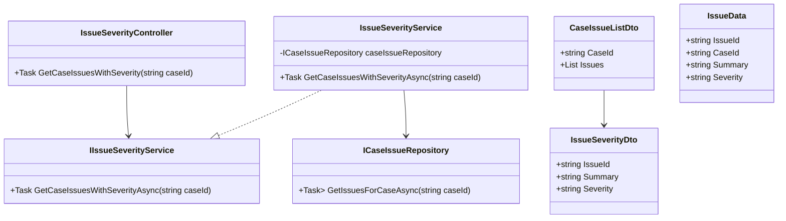
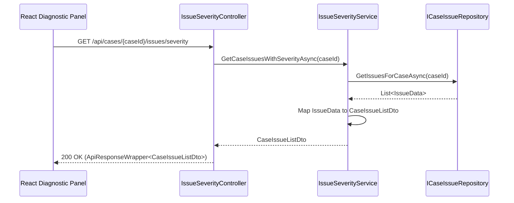
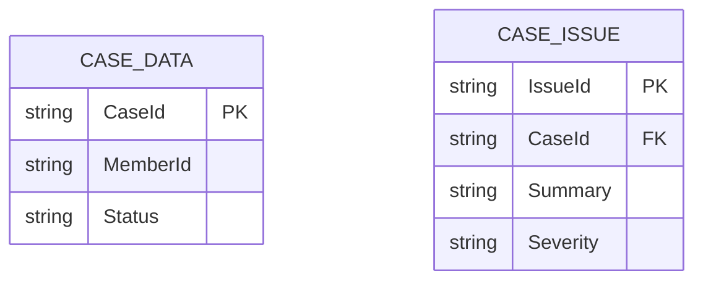

# Repository: APB_Demo
# Branch: DAVTEST1
# Folder: LLD
1. Objective
The objective is to clearly indicate issue severity in the diagnostic panel for all detected issues.
This helps support agents prioritize which issues to address first based on severity level.
The solution introduces backend support for severity labeling and React UI elements that visually display severity indicators.

2. Backend C# API Details
2.1. API Model
2.1.1. Common Components/Services
- IIssueSeverityService: Service interface responsible for providing severity information for issues in the diagnostic panel.
- IssueSeverityService: Implementation applying severity rules or AI output to categorize issues.
- ICaseIssueRepository: Repository abstraction to retrieve detected issues for a case.
- IssueSeverityDto: DTO representing severity details for a single issue.
- CaseIssueListDto: DTO aggregating issues and their severities for a case.
- ApiResponseWrapper<T>: Generic API response wrapper.

2.1.2. API Details
| Operation | REST Method | Type | URL | Request JSON | Response JSON |
|----------|-------------|------|-----|--------------|---------------|
| GetCaseIssuesWithSeverity | GET | Query | /api/cases/{caseId}/issues/severity | N/A (caseId in route) | { "caseId": "string", "issues": [ { "issueId": "string", "summary": "string", "severity": "string" } ] } |

2.1.3. Exceptions
- CaseNotFoundException: Thrown when caseId does not exist.
- IssuesNotFoundException: Thrown when no issues are detected for a case.

2.2. Functional Design
2.2.1. Class Diagram

2.2.2. UML Sequence Diagram

2.2.3. Components
| Component Name | Description | Existing/New |
|-------------------------------|-------------|-------------|
| IssueSeverityController | API controller exposing issues with severity. | New |
| IssueSeverityService | Service mapping issues to severity DTOs. | New |
| CaseIssueRepository | Repository providing access to case issues. | Existing or New depending on prior stories |
| CaseIssueListDto | DTO representing list of issues with severity. | New |
| IssueSeverityDto | DTO representing a single issue severity entry. | New |

2.3. Service Layer Business Logic
Service architecture & dependency injection:
- IssueSeverityController depends on IIssueSeverityService via DI.
- IssueSeverityService depends on ICaseIssueRepository, registered as scoped service.

Workflow:
- Receive caseId in controller.
- Validate caseId and call GetCaseIssuesWithSeverityAsync(caseId).
- ICaseIssueRepository.GetIssuesForCaseAsync retrieves issues for the case.
- IssueSeverityService maps IssueData to CaseIssueListDto including severity labels.
- Return ApiResponseWrapper<CaseIssueListDto> with HTTP 200.

Caching strategy:
- Minimal assumption: no dedicated cache; severity is derived directly from issue data, which may already be cached elsewhere.

Validation rules
| Field Name | Validation | Error Message | Class Used |
|-----------|-----------|---------------|-----------|
| caseId | Must be non-empty and conform to case ID format. | "Invalid case identifier." | IssueSeverityController |

2.4. Service Integrations
| System | Integrated For | Integration Type |
|--------|----------------|------------------|
| Case Issue Store | Retrieve issues and severity for a case | Internal repository backed by database or case API |

3. Front End React Details
3.1. UI Component Architecture
- DiagnosticPanelPage: Page component showing case insights and issues.
- IssueListSection: Component displaying all issues for the case.
- IssueSeverityList: Component rendering a list of IssueSeverityCard components.
- IssueSeverityCard: Component showing issue summary and severity indicator (badge or icon).
- useCaseIssuesWithSeverity hook: Custom hook calling backend endpoint and managing state for issues with severity.
- State management: DiagnosticPanelPage uses caseId from route, calls useCaseIssuesWithSeverity, and passes results to IssueListSection.

3.2. UI Specifications
- Wireframes/Pages: DiagnosticPanel includes a clearly labeled issues list area, each issue showing a severity badge (e.g., Low, Medium, High).
- Responsive breakpoints: Issues list is single column on small screens and two-column grid on larger screens.
- Form structures: No forms; content is read-only; agents simply view severity indicators.
- User interaction patterns: On page load, issues with severity are fetched; agents can optionally sort or filter by severity (minimal assumption: sort by severity descending).

3.3. API Integration
- HTTP client configuration: useCaseIssuesWithSeverity uses shared axios-based client.
- Call patterns: GET /api/cases/{caseId}/issues/severity on page load and on manual refresh if implemented.
- Error handling: If no issues found, show "No issues detected"; other errors show generic message; HTTP 404 indicates case not found.
- Loading states: Spin loader and skeleton cards while issues are loading.
- Data transformation: Response mapped into IssueSeverityViewModel with severity levels converted to CSS class names for badges.

4. Database Details
4.1. ER Model

4.2. Database Validations
- CaseId in CASE_ISSUE must exist in CASE_DATA.
- Severity constrained to configured enum values (e.g., Low, Medium, High, Critical).
- Summary must be non-empty text.

5. Non-Functional Requirements
5.1. Performance
- Retrieval of issues with severity must complete within 2 seconds under normal load.
- Endpoint should support concurrent access from many agents.

5.2. Security (Authentication & Authorization)
- Endpoint requires authenticated access using existing security framework.
- Authorization ensures agents only see issues for permitted cases.

5.3. Logging (Application, Audit, Monitoring)
- Log each request with caseId, number of issues returned, and response time.
- Log any failures in issue retrieval.
- Audit logs track which agents viewed issues for which cases and when.

6. Dependencies
- ASP.NET Core Web API and DI container.
- CaseIssueRepository backed by database or case service.
- React, React Router, and shared axios HTTP client.

7. Assumptions
- Severity values are already calculated and stored with issues, not computed on the fly by AI in this story.
- Case and issue tables exist and are populated by upstream processes.
- No requirement to change issue severity from the diagnostic panel in this story.
