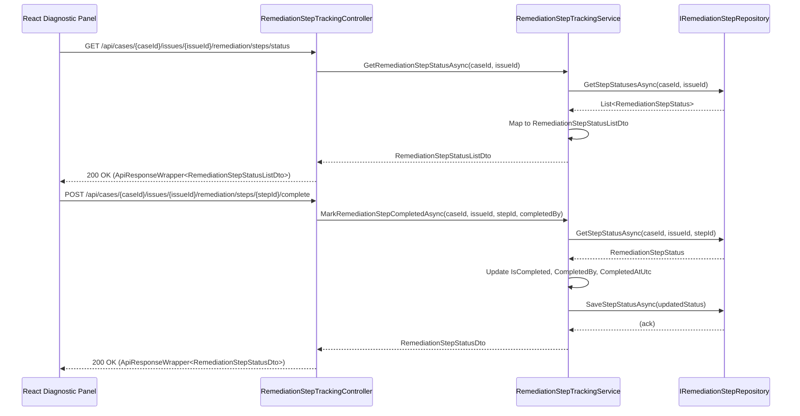
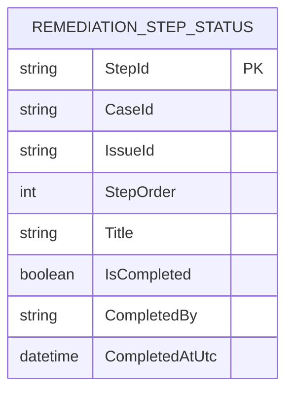

# Repository: APB_Demo
# Branch: DAVTEST1
# Folder: LLD
1. Objective
The objective is to allow support agents to track which AI-generated remediation steps have been completed for a member issue.
This ensures agents can verify that all required steps have been performed to fully resolve the issue.
The solution provides backend APIs and React UI elements that support marking steps as done and reflecting completion status in the diagnostic panel.

2. Backend C# API Details
2.1. API Model
2.1.1. Common Components/Services
- IRemediationStepTrackingService: Service interface responsible for tracking completion status of remediation steps.
- RemediationStepTrackingService: Implementation that updates and retrieves step completion state.
- IRemediationStepRepository: Repository abstraction to persist remediation step status per case and issue.
- RemediationStepStatusDto: DTO representing the completion status for a single remediation step.
- RemediationStepStatusListDto: DTO aggregating statuses for steps associated with a case issue.
- ApiResponseWrapper<T>: Generic wrapper for API responses.

2.1.2. API Details
| Operation | REST Method | Type | URL | Request JSON | Response JSON |
|----------|-------------|------|-----|--------------|---------------|
| GetRemediationStepStatus | GET | Query | /api/cases/{caseId}/issues/{issueId}/remediation/steps/status | N/A (caseId and issueId in route) | { "caseId": "string", "issueId": "string", "steps": [ { "stepId": "string", "stepOrder": 1, "title": "string", "isCompleted": true } ] } |
| MarkRemediationStepCompleted | POST | Command | /api/cases/{caseId}/issues/{issueId}/remediation/steps/{stepId}/complete | { "completedBy": "string" } | { "stepId": "string", "isCompleted": true, "completedBy": "string", "completedAtUtc": "string" } |

2.1.3. Exceptions
- CaseNotFoundException: Thrown when the case does not exist.
- IssueNotFoundException: Thrown when the issue does not exist for the case.
- StepNotFoundException: Thrown when the specified stepId does not exist in the remediation plan.

2.2. Functional Design
2.2.1. Class Diagram

```mermaid
classDiagram
    class RemediationStepTrackingController {
        +Task<IActionResult> GetRemediationStepStatus(string caseId, string issueId)
        +Task<IActionResult> MarkRemediationStepCompleted(string caseId, string issueId, string stepId, MarkStepCompletedRequest request)
    }

    class IRemediationStepTrackingService {
        +Task<RemediationStepStatusListDto> GetRemediationStepStatusAsync(string caseId, string issueId)
        +Task<RemediationStepStatusDto> MarkRemediationStepCompletedAsync(string caseId, string issueId, string stepId, string completedBy)
    }

    class RemediationStepTrackingService {
        -IRemediationStepRepository remediationStepRepository
        +Task<RemediationStepStatusListDto> GetRemediationStepStatusAsync(string caseId, string issueId)
        +Task<RemediationStepStatusDto> MarkRemediationStepCompletedAsync(string caseId, string issueId, string stepId, string completedBy)
    }

    class IRemediationStepRepository {
        +Task<List<RemediationStepStatus>> GetStepStatusesAsync(string caseId, string issueId)
        +Task<RemediationStepStatus> GetStepStatusAsync(string caseId, string issueId, string stepId)
        +Task SaveStepStatusAsync(RemediationStepStatus status)
    }

    class RemediationStepStatusListDto {
        +string CaseId
        +string IssueId
        +List<RemediationStepStatusDto> Steps
    }

    class RemediationStepStatusDto {
        +string StepId
        +int StepOrder
        +string Title
        +bool IsCompleted
        +string CompletedBy
        +DateTime? CompletedAtUtc
    }

    class RemediationStepStatus {
        +string StepId
        +string CaseId
        +string IssueId
        +int StepOrder
        +string Title
        +bool IsCompleted
        +string CompletedBy
        +DateTime? CompletedAtUtc
    }

    class MarkStepCompletedRequest {
        +string CompletedBy
    }

    RemediationStepTrackingController --> IRemediationStepTrackingService
    RemediationStepTrackingService ..|> IRemediationStepTrackingService
    RemediationStepTrackingService --> IRemediationStepRepository
    RemediationStepStatusListDto --> RemediationStepStatusDto
    RemediationStepRepository ..> RemediationStepStatus
```

2.2.2. UML Sequence Diagram

2.2.3. Components
| Component Name | Description | Existing/New |
|--------------------------------------|-------------|-------------|
| RemediationStepTrackingController | API controller for step status retrieval and completion updates. | New |
| RemediationStepTrackingService | Service implementing remediation step tracking logic. | New |
| RemediationStepRepository | Repository persisting step status per case and issue. | New |
| RemediationStepStatusListDto | DTO representing list of steps with completion state. | New |
| RemediationStepStatusDto | DTO representing a single step status. | New |
| MarkStepCompletedRequest | Request model capturing agent identity when completing a step. | New |

2.3. Service Layer Business Logic
Service architecture & dependency injection:
- RemediationStepTrackingController depends on IRemediationStepTrackingService via DI.
- RemediationStepTrackingService depends on IRemediationStepRepository, registered as scoped.

Workflow:
- To display completion status, controller calls GetRemediationStepStatusAsync(caseId, issueId) and returns mapped list.
- To mark a step done, controller accepts stepId and MarkStepCompletedRequest, then calls MarkRemediationStepCompletedAsync.
- Service loads existing status from repository, updates completion fields, and saves back.

Caching strategy:
- Minimal assumption: no caching; step statuses are directly read and written in the database.

Validation rules
| Field Name | Validation | Error Message | Class Used |
|-----------|-----------|---------------|-----------|
| caseId | Must be non-empty and conform to case ID format. | "Invalid case identifier." | RemediationStepTrackingController |
| issueId | Must be non-empty and conform to issue ID format. | "Invalid issue identifier." | RemediationStepTrackingController |
| stepId | Must be non-empty and conform to step ID format. | "Invalid step identifier." | RemediationStepTrackingController |
| completedBy | Must be non-empty and match authenticated agent identifier. | "CompletedBy is required." | RemediationStepTrackingController |

2.4. Service Integrations
| System | Integrated For | Integration Type |
|--------|----------------|------------------|
| Remediation Step Store | Persist completion status for steps | Internal repository backed by database |

3. Front End React Details
3.1. UI Component Architecture
- DiagnosticPanelPage: Parent page containing remediation guidance and completion tracking.
- RemediationSection: Component showing ordered remediation steps for a selected issue.
- RemediationStepList: Component rendering remediation steps with completion controls.
- RemediationStepItem: Component showing step details and a checkbox or toggle for marking completion.
- useRemediationStepTracking hook: Custom hook managing retrieval and update of step completion status.
- State management: DiagnosticPanelPage manages selected issueId; RemediationStepList uses useRemediationStepTracking to keep step statuses synchronized with backend.

3.2. UI Specifications
- Wireframes/Pages: Remediation section displays steps with a checkbox beside each, visually differentiating completed vs remaining steps.
- Responsive breakpoints: Steps list uses full-width layout on small screens and split layout with issue details on larger screens.
- Form structures: Each step has an interactive control (checkbox or toggle) for marking completion; updates occur on user interaction.
- User interaction patterns: When a checkbox is checked, POST call is made to mark completion and UI reflects status; errors show inline and revert the checkbox if update fails.

3.3. API Integration
- HTTP client configuration: useRemediationStepTracking uses shared axios-based client.
- Call patterns: Initial GET to /api/cases/{caseId}/issues/{issueId}/remediation/steps/status to load statuses; POST to /api/cases/{caseId}/issues/{issueId}/remediation/steps/{stepId}/complete on user action.
- Error handling: Display error notification if completion update fails; retry may be allowed; GET failures show generic error message.
- Loading states: Initial loading shows skeleton list; per-step update shows subtle loading indicator on the affected step.
- Data transformation: Response mapped into RemediationStepStatusViewModel including properties for UI state (e.g., disabled while updating).

4. Database Details
4.1. ER Model

4.2. Database Validations
- StepId is primary key and must be unique.
- CaseId and IssueId must correspond to existing case and issue entities.
- IsCompleted defaults to false when step is initially created.
- CompletedBy and CompletedAtUtc must be populated when IsCompleted becomes true.

5. Non-Functional Requirements
5.1. Performance
- Retrieval and update of step statuses should complete within 1-2 seconds.
- Endpoint should support rapid consecutive updates when agents mark multiple steps in sequence.

5.2. Security (Authentication & Authorization)
- Only authenticated agents may mark steps as completed.
- Authorization ensures agent has permission on the case and issue being updated.

5.3. Logging (Application, Audit, Monitoring)
- Log each status retrieval and update with caseId, issueId, and stepId.
- Maintain audit trail of which agent completed which step and when.
- Monitor error rates for remediation tracking operations.

6. Dependencies
- ASP.NET Core Web API runtime and DI.
- RemediationStepRepository with underlying database provider.
- React, React Router, and shared axios HTTP client.

7. Assumptions
- Remediation steps are already defined and identified via stepId before tracking begins.
- There is no requirement to unmark steps as completed in this story; completion is final.
- Time zone handling assumes UTC for CompletedAtUtc.
