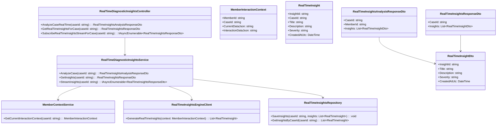
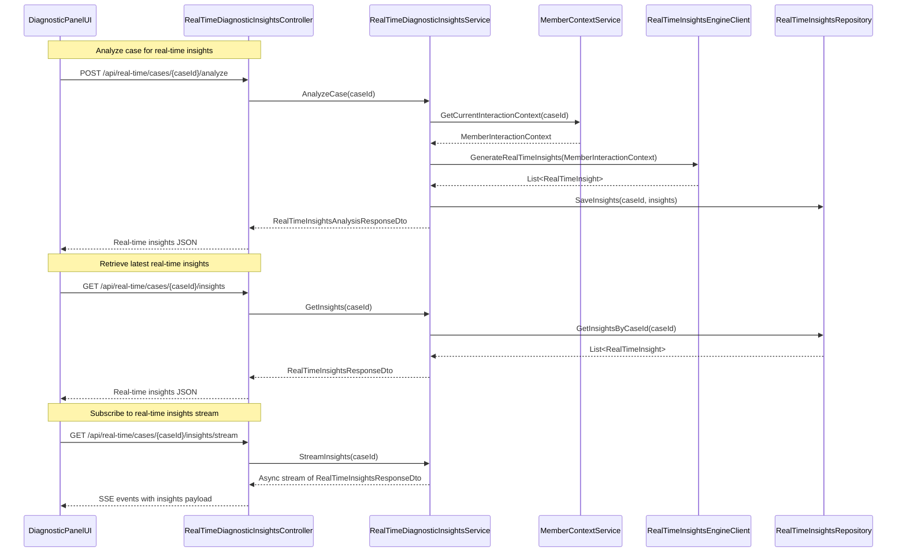
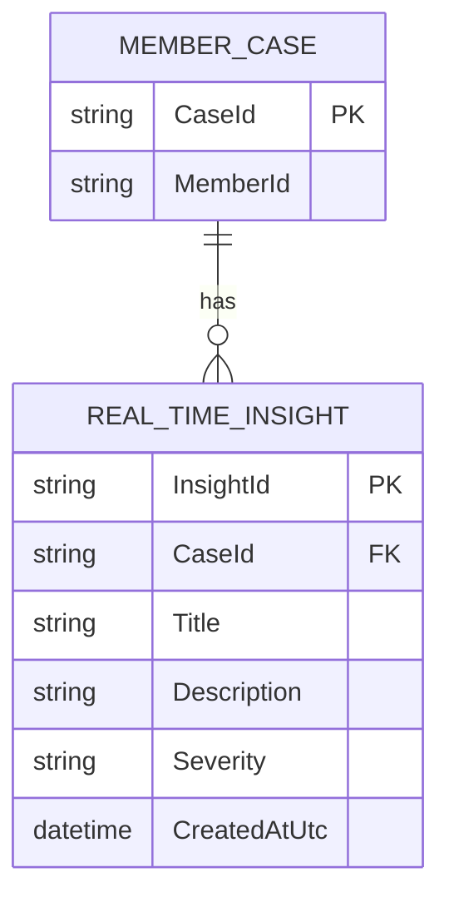

# Repository: APB_Demo
# Branch: INTTESTINGDEMO1
# Folder: LLD

1. Objective
As a support agent, the system must provide real-time diagnostic insights for active member cases in the diagnostic panel. The objective is to identify member issues quickly and accurately based on current data and interaction context, updating insights as the case evolves. This LLD defines backend C# APIs, React UI, and data model to support real-time diagnostic insights.

2. Backend C# API Details

2.1. API Model

2.1.1. Common Components/Services
- RealTimeDiagnosticInsightsController (ASP.NET Core API controller exposing real-time insight endpoints).
- RealTimeDiagnosticInsightsService (application service orchestrating real-time analysis and insight retrieval).
- MemberContextService (service aggregating current member data and interaction context for real-time analysis).
- RealTimeInsightsEngineClient (client integrating with AI engine that generates real-time insights).
- RealTimeInsightsRepository (data access layer for storing real-time insights per case).

2.1.2. API Details
| Operation                                | REST Method | Type   | URL                                                       | Request JSON                                                                                             | Response JSON                                                                                                                                                                            |
|------------------------------------------|------------|--------|-----------------------------------------------------------|----------------------------------------------------------------------------------------------------------|-------------------------------------------------------------------------------------------------------------------------------------------------------------------------------------------|
| AnalyzeCaseRealTime                      | POST       | Command| /api/real-time/cases/{caseId}/analyze                    | { "caseId": "string" }                                                                             | { "caseId": "string", "memberId": "string", "insights": [ { "insightId": "string", "title": "string", "description": "string", "severity": "string", "createdAtUtc": "string" } ] } |
| GetRealTimeInsightsForCase               | GET        | Query  | /api/real-time/cases/{caseId}/insights                   | N/A                                                                                                      | { "caseId": "string", "insights": [ { "insightId": "string", "title": "string", "description": "string", "severity": "string", "createdAtUtc": "string" } ] }                            |
| SubscribeRealTimeInsightsStreamForCase   | GET        | Query  | /api/real-time/cases/{caseId}/insights/stream            | N/A                                                                                                      | Server-Sent Events stream where each event payload is: { "caseId": "string", "insights": [ { "insightId": "string", "title": "string", "description": "string", "severity": "string", "createdAtUtc": "string" } ] } |

2.1.3. Exceptions
- CaseNotFoundException: Thrown when caseId is not associated with a valid member case.
- MemberContextUnavailableException: Thrown when current data or interaction context cannot be retrieved.
- RealTimeAnalysisFailedException: Thrown when AI engine fails to provide real-time insights.
- RealTimeInsightsStreamException: Thrown when continuous streaming of insights cannot be established.

2.2. Functional Design

2.2.1. Class Diagram

2.2.2. UML Sequence Diagram

2.2.3. Components
| Component Name                          | Description                                                                                 | Existing/New |
|----------------------------------------|---------------------------------------------------------------------------------------------|-------------|
| RealTimeDiagnosticInsightsController   | API controller for analyzing and retrieving real-time insights and streaming updates.      | New         |
| RealTimeDiagnosticInsightsService      | Service orchestrating real-time analysis and persistence of insights.                      | New         |
| MemberContextService                   | Aggregates current member and interaction data required for real-time analysis.            | New         |
| RealTimeInsightsEngineClient           | AI integration client generating real-time insights from interaction context.              | New         |
| RealTimeInsightsRepository             | Persists real-time insights per case for retrieval and streaming.                          | New         |
| RealTimeInsightsAnalysisResponseDto    | DTO representing results of a real-time analysis invocation.                               | New         |
| RealTimeInsightsResponseDto            | DTO representing latest insights per case.                                                 | New         |
| RealTimeInsightDto                     | DTO for individual insight fields used in UI.                                              | New         |

2.3. Service Layer Business Logic
- Service architecture & dependency injection:
  - RealTimeDiagnosticInsightsController depends on RealTimeDiagnosticInsightsService via constructor injection.
  - RealTimeDiagnosticInsightsService depends on MemberContextService, RealTimeInsightsEngineClient, and RealTimeInsightsRepository via DI.
  - RealTimeInsightsEngineClient is registered as a singleton HTTP client wrapper.

- Workflow:
  - AnalyzeCase: Build MemberInteractionContext from MemberContextService, send it to RealTimeInsightsEngineClient, persist returned insights using RealTimeInsightsRepository, and return RealTimeInsightsAnalysisResponseDto.
  - GetInsights: Fetch latest RealTimeInsight entities from RealTimeInsightsRepository and map to RealTimeInsightsResponseDto.
  - StreamInsights: Provide an asynchronous stream that periodically calls AI or checks repository changes and emits updated RealTimeInsightsResponseDto objects.

- Caching strategy:
  - In-memory cache per caseId storing the latest RealTimeInsightsResponseDto, used for quick GetInsights responses and initial stream payload.

- Validation rules
| Field Name     | Validation                                                        | Error Message                                                            | Class Used                        |
|----------------|-------------------------------------------------------------------|--------------------------------------------------------------------------|-----------------------------------|
| caseId         | Required; non-empty; must reference an existing member case       | "CaseId is required and must reference an existing member case."       | RealTimeDiagnosticInsightsService |
| MemberInteractionContext | Must contain CurrentDataJson and InteractionDataJson non-empty | "Interaction context must include current and interaction data."        | MemberContextService              |
| insights       | Non-empty list expected from AI for active cases                  | "No real-time diagnostic insights available for the active case."      | RealTimeDiagnosticInsightsService |

2.4. Service Integrations
| System                    | Integrated For                                  | Integration Type   |
|---------------------------|-------------------------------------------------|--------------------|
| Member Data Store         | Fetching current member data and interaction context | Synchronous HTTP/DB|
| Real-Time AI Engine       | Generating real-time diagnostic insights         | Synchronous HTTP   |
| Application Database      | Persisting real-time insights per case           | Synchronous DB ORM |

3. Front End React Details

3.1. UI Component Architecture
- Component hierarchy:
  - DiagnosticPanelPage
    - RealTimeInsightsHeader
    - RealTimeInsightsList
      - RealTimeInsightItem

- Data flow:
  - DiagnosticPanelPage passes caseId to real-time hooks and components.
  - RealTimeInsightsList receives an array of RealTimeInsightViewModel via props and renders RealTimeInsightItem components.

- State management:
  - useRealTimeInsights(caseId: string) maintains { insights, isLoading, error, isStreaming }.
  - DiagnosticPanelPage holds caseId and passes it to hooks.

- Props interfaces:
  - RealTimeInsightsListProps: { insights: RealTimeInsightViewModel[] }
  - RealTimeInsightItemProps: { insight: RealTimeInsightViewModel }

- Routing:
  - Route /cases/:caseId/diagnostic-panel uses DiagnosticPanelPage which includes real-time insights components.

3.2. UI Specifications
- Wireframes/pages:
  - RealTimeInsightsHeader shows label "Real-Time Insights" and a streaming status indicator.
  - RealTimeInsightsList shows each insight with title, description, severity badge, and timestamp.

- Responsive breakpoints:
  - Mobile: Real-time insights shown as stacked cards with severity badge and timestamp at top.
  - Tablet/Desktop: Insights displayed in a list with columns for title, severity, and time.

- Form structures with validation:
  - No explicit forms; user may trigger analysis via button "Analyze in real time" which sends AnalyzeCaseRealTime request.

- User interaction patterns:
  - Automatic updates occur via SSE stream; new insights animate briefly to draw attention.
  - Manual analyze button allows agent to trigger real-time recomputation on demand.

3.3. API Integration
- HTTP client configuration:
  - Shared Axios/fetch client with base URL /api.

- Call patterns and error handling:
  - On mount, useRealTimeInsights calls GET /api/real-time/cases/{caseId}/insights for initial data.
  - After initial load, it opens SSE connection to /api/real-time/cases/{caseId}/insights/stream to receive updates.
  - Analyze button calls POST /api/real-time/cases/{caseId}/analyze and results refresh repository and stream.
  - Errors set error state and show banners; SSE reconnect attempts occur with backoff.

- Loading states:
  - isLoading true until initial GET completes; skeleton placeholders shown.
  - isStreaming indicator shows connection status.

- Data transformation:
  - RealTimeInsightsResponseDto mapped to RealTimeInsightViewModel with formatted timestamps and severity labels.

4. Database Details

4.1. ER Model

4.2. Database Validations
- REAL_TIME_INSIGHT.CaseId must reference MEMBER_CASE.CaseId.
- REAL_TIME_INSIGHT.Severity must be one of allowed values (e.g., Info, Warning, Critical).

5. Non-Functional Requirements

5.1. Performance
- Real-time analysis requests must respond within 2 seconds for typical data sizes.
- Streaming updates should reflect backend changes within 2 seconds.

5.2. Security (Authentication & Authorization)
- Endpoints require authenticated support agents via JWT or equivalent.
- Authorization ensures agents can only view insights for cases they are allowed to access.

5.3. Logging (Application, Audit, Monitoring)
- Log each AnalyzeCaseRealTime invocation with caseId and number of insights generated.
- Log streaming connection start/stop events and any errors.

6. Dependencies
- ASP.NET Core 8 for API hosting.
- Entity Framework Core for database persistence.
- React 18 for diagnostic panel UI.
- External real-time AI engine that generates insights from interaction context.

7. Assumptions
- Member case and diagnostic panel exist and provide caseId and memberId.
- SSE is used for real-time streaming; fallback to polling is an optional enhancement not detailed here.
- Real-time engine can consume the interaction context schema provided by MemberContextService.
