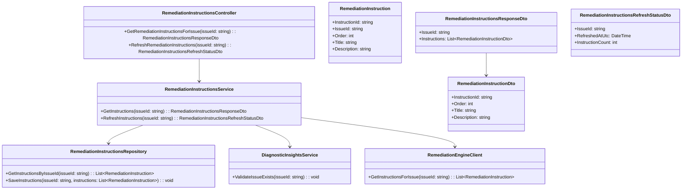
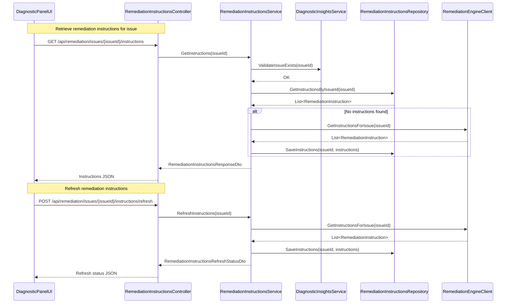
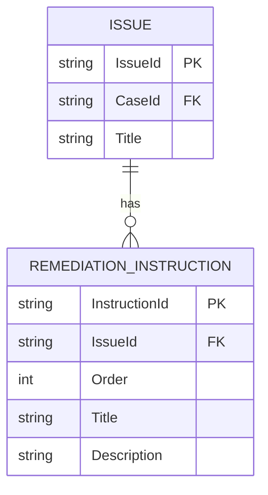

# Repository: APB_Demo
# Branch: INTTESTINGDEMO1
# Folder: LLD

1. Objective
As a support agent, the system must present AI-generated step-by-step remediation instructions in the diagnostic panel. The objective is to show a clear ordered list of remediation instructions associated with each detected member issue so that agents can resolve issues efficiently. This LLD defines backend C# APIs, React UI, and database elements to support AI-generated remediation steps.

2. Backend C# API Details

2.1. API Model

2.1.1. Common Components/Services
- RemediationInstructionsController (ASP.NET Core API controller to expose remediation instruction endpoints).
- RemediationInstructionsService (application service that retrieves AI-generated remediation instructions for a given issue).
- DiagnosticInsightsService (service that detects member issues and associates them with remediation instruction definitions).
- RemediationInstructionsRepository (data access layer storing remediation instructions per issue).

2.1.2. API Details
| Operation                          | REST Method | Type    | URL                                                   | Request JSON                                                                                              | Response JSON                                                                                                                                                                           |
|------------------------------------|------------|---------|-------------------------------------------------------|-----------------------------------------------------------------------------------------------------------|------------------------------------------------------------------------------------------------------------------------------------------------------------------------------------------|
| GetRemediationInstructionsForIssue | GET        | Query  | /api/remediation/issues/{issueId}/instructions       | N/A                                                                                                       | { "issueId": "string", "instructions": [ { "instructionId": "string", "order": "number", "title": "string", "description": "string" } ] }                                   |
| RefreshRemediationInstructions     | POST       | Command| /api/remediation/issues/{issueId}/instructions/refresh | { "issueId": "string" }                                                                             | { "issueId": "string", "refreshedAtUtc": "string", "instructionCount": "number" }                                                                                              |

2.1.3. Exceptions
- IssueNotFoundException: Thrown when issueId does not exist.
- RemediationInstructionsNotFoundException: Thrown when no remediation instructions are found for an issueId.
- RemediationInstructionsRefreshFailedException: Thrown when refresh from AI engine fails.

2.2. Functional Design

2.2.1. Class Diagram

2.2.2. UML Sequence Diagram

2.2.3. Components
| Component Name                          | Description                                                                                 | Existing/New |
|----------------------------------------|---------------------------------------------------------------------------------------------|-------------|
| RemediationInstructionsController      | Exposes endpoints to retrieve and refresh remediation instructions for an issue.           | New         |
| RemediationInstructionsService         | Implements business logic for loading and refreshing remediation instructions.             | New         |
| DiagnosticInsightsService              | Validates that an issue exists before remediation instructions are served.                 | Existing    |
| RemediationInstructionsRepository      | Persists remediation instructions per issue in the database.                               | New         |
| RemediationEngineClient                | Integrates with AI engine to fetch remediation instructions per issue.                     | New         |
| RemediationInstructionsResponseDto     | DTO representing ordered instructions for an issue.                                        | New         |
| RemediationInstructionsRefreshStatusDto| DTO representing result of refresh operation.                                              | New         |

2.3. Service Layer Business Logic
- Service architecture & dependency injection:
  - RemediationInstructionsController depends on RemediationInstructionsService via constructor injection.
  - RemediationInstructionsService depends on RemediationInstructionsRepository, DiagnosticInsightsService, and RemediationEngineClient via DI.
  - RemediationEngineClient is registered as a singleton HTTP client wrapper.

- Workflow:
  - GetInstructions: Validate issueId via DiagnosticInsightsService. Attempt to load instructions from RemediationInstructionsRepository. If none exist, call RemediationEngineClient.GetInstructionsForIssue, persist results, and return them.
  - RefreshInstructions: Call RemediationEngineClient.GetInstructionsForIssue and overwrite existing instructions in RemediationInstructionsRepository. Return a status object with timestamp and count.

- Caching strategy:
  - Instructions per issue can be cached in memory for a configurable duration (e.g., 30 minutes) to reduce database hits.

- Validation rules
| Field Name     | Validation                                                    | Error Message                                                        | Class Used                      |
|----------------|---------------------------------------------------------------|----------------------------------------------------------------------|---------------------------------|
| issueId        | Required; non-empty; must reference an existing issue        | "IssueId is required and must reference an existing issue."        | RemediationInstructionsService  |
| instructionId  | Required; non-empty                                          | "InstructionId is required."                                       | RemediationInstructionsService  |
| order          | Must be greater than 0; must be unique within an issue       | "Instruction order must be a positive number and unique per issue."| RemediationInstructionsService  |

2.4. Service Integrations
| System                | Integrated For                                         | Integration Type   |
|-----------------------|-------------------------------------------------------|--------------------|
| AI Remediation Engine | Generating remediation instructions per issue        | Synchronous HTTP   |
| Application Database  | Persisting remediation instructions per issue        | Synchronous DB ORM |

3. Front End React Details

3.1. UI Component Architecture
- Component hierarchy:
  - DiagnosticPanelPage
    - IssueSummaryHeader
    - RemediationInstructionsPanel
      - RemediationInstructionList
        - RemediationInstructionItem

- Data flow:
  - DiagnosticPanelPage passes issueId to RemediationInstructionsPanel.
  - RemediationInstructionsPanel uses a custom hook to fetch remediation instructions and passes them to RemediationInstructionList.
  - RemediationInstructionItem displays instruction title and description in sequence order.

- State management:
  - useRemediationInstructions(issueId: string) manages { instructions, isLoading, error }.
  - DiagnosticPanelPage maintains currently selected issueId.

- Props interfaces:
  - RemediationInstructionsPanelProps: { issueId: string }
  - RemediationInstructionListProps: { instructions: RemediationInstructionViewModel[] }
  - RemediationInstructionItemProps: { instruction: RemediationInstructionViewModel }

- Routing:
  - Route /cases/:caseId/issues/:issueId/diagnostic-panel displays RemediationInstructionsPanel for selected issue.

3.2. UI Specifications
- Wireframes/pages:
  - RemediationInstructionsPanel shows a numbered list of instructions with title and description.
  - Optionally a "Refresh instructions" button triggers refresh API call.

- Responsive breakpoints:
  - Mobile: Instructions displayed as stacked cards with prominent numbering.
  - Tablet/Desktop: Instructions displayed in a single column list with clear bulleting and numbering.

- Form structures with validation:
  - No data-entry form; interactions are limited to viewing and optional refresh actions.

- User interaction patterns:
  - Clicking refresh button reloads instructions and indicates timestamp of last refresh.

3.3. API Integration
- HTTP client configuration:
  - Use shared Axios/fetch client configured with /api base path and authorization headers.

- Call patterns and error handling:
  - On mount, useRemediationInstructions sends GET /api/remediation/issues/{issueId}/instructions.
  - Refresh button sends POST /api/remediation/issues/{issueId}/instructions/refresh, then refetches instructions.
  - Errors display error banner and allow retry.

- Loading states:
  - Spinner displayed in RemediationInstructionsPanel while instructions are loading or refreshing.

- Data transformation:
  - RemediationInstructionsResponseDto mapped to RemediationInstructionViewModel ordered by instruction.order.

4. Database Details

4.1. ER Model

4.2. Database Validations
- REMEDIATION_INSTRUCTION.IssueId must reference an existing ISSUE.IssueId.
- REMEDIATION_INSTRUCTION.Order must be greater than 0 and unique per IssueId.

5. Non-Functional Requirements

5.1. Performance
- Retrieving remediation instructions must complete within 700 ms under normal load.
- Refreshing remediation instructions via AI engine must complete within 2 seconds under normal load.

5.2. Security (Authentication & Authorization)
- Endpoints must require authenticated support agent identity via JWT or equivalent.
- Authorization must ensure agents can only access remediation instructions for issues within permitted cases.

5.3. Logging (Application, Audit, Monitoring)
- Log each retrieval and refresh operation with issueId and instructionCount.
- Log errors from AI engine integration and database persistence.

6. Dependencies
- ASP.NET Core 8 for API hosting.
- Entity Framework Core for database persistence.
- React 18 for diagnostic panel UI.
- External AI remediation engine capable of returning ordered remediation instructions per issue.

7. Assumptions
- Issues are already identified via diagnostic panel and have unique issueId values.
- AI engine returns remediation instructions in a stable order that maps to the Order field.
- Single set of remediation instructions exists per issue at a given time.
