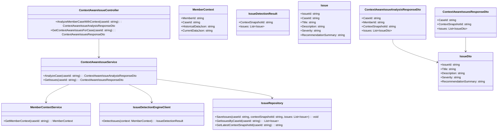
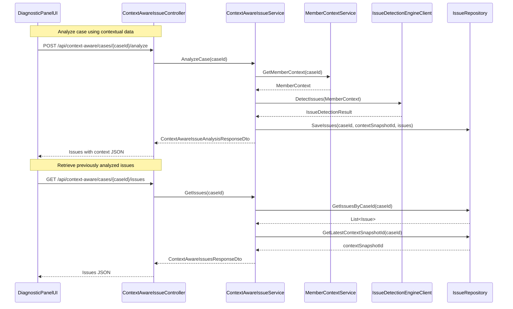
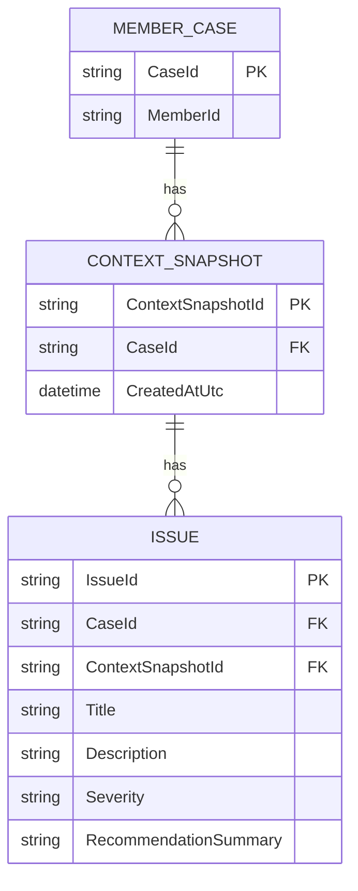

# Repository: APB_Demo
# Branch: INTTESTINGDEMO1
# Folder: LLD

1. Objective
As a support agent, the system must use member contextual data when identifying issues in the diagnostic panel. The objective is to ensure that detected issues and recommendations reflect both historical and current member context. This LLD defines backend C# APIs, React UI changes, and database structures to support context-aware issue identification.

2. Backend C# API Details

2.1. API Model

2.1.1. Common Components/Services
- ContextAwareIssueController (ASP.NET Core API controller to expose context-aware issue identification endpoints).
- ContextAwareIssueService (application service that orchestrates retrieval of context and delegates issue detection to an AI engine).
- MemberContextService (service responsible for aggregating historical and current member data used for issue detection).
- IssueDetectionEngineClient (integration client that sends member context to an external AI engine and receives detected issues and recommendations).
- IssueRepository (data access layer for persisting detected issues and context snapshot metadata).

2.1.2. API Details
| Operation                          | REST Method | Type   | URL                                             | Request JSON                                                                                                           | Response JSON                                                                                                                                                                   |
|------------------------------------|------------|--------|-------------------------------------------------|------------------------------------------------------------------------------------------------------------------------|----------------------------------------------------------------------------------------------------------------------------------------------------------------------------------|
| AnalyzeMemberCaseWithContext       | POST       | Command| /api/context-aware/cases/{caseId}/analyze       | { "caseId": "string" }                                                                                              | { "caseId": "string", "memberId": "string", "contextSnapshotId": "string", "issues": [ { "issueId": "string", "title": "string", "description": "string", "severity": "string", "recommendationSummary": "string" } ] } |
| GetContextAwareIssuesForCase       | GET        | Query  | /api/context-aware/cases/{caseId}/issues        | N/A                                                                                                                    | { "caseId": "string", "contextSnapshotId": "string", "issues": [ { "issueId": "string", "title": "string", "description": "string", "severity": "string", "recommendationSummary": "string" } ] }                              |

2.1.3. Exceptions
- CaseNotFoundException: Thrown when caseId does not exist or is not associated with a member.
- MemberContextUnavailableException: Thrown when historical or current data cannot be retrieved from MemberContextService.
- IssueDetectionFailedException: Thrown when IssueDetectionEngineClient fails to return issues.

2.2. Functional Design

2.2.1. Class Diagram

2.2.2. UML Sequence Diagram

2.2.3. Components
| Component Name                          | Description                                                                                 | Existing/New |
|----------------------------------------|---------------------------------------------------------------------------------------------|-------------|
| ContextAwareIssueController            | API controller for initiating context-aware analysis and retrieving issues for a case.     | New         |
| ContextAwareIssueService               | Service implementing context-aware issue detection workflow.                               | New         |
| MemberContextService                   | Aggregates member historical and current data used as input to issue detection.            | New         |
| IssueDetectionEngineClient             | Integration client to AI engine that detect issues based on member context.                | New         |
| IssueRepository                        | Persists detected issues and context snapshot metadata per case.                           | New         |
| ContextAwareIssueAnalysisResponseDto   | DTO representing one analysis execution and its issues.                                    | New         |
| ContextAwareIssuesResponseDto          | DTO for returning latest context-aware issues for a case.                                  | New         |
| IssueDto                               | DTO representing an issue for UI consumption.                                              | New         |

2.3. Service Layer Business Logic
- Service architecture & dependency injection:
  - ContextAwareIssueController depends on ContextAwareIssueService via constructor injection.
  - ContextAwareIssueService depends on MemberContextService, IssueDetectionEngineClient, and IssueRepository via DI.
  - MemberContextService depends on underlying data sources (e.g., member data store) via repository interfaces.

- Workflow:
  - AnalyzeCase: For a given caseId, MemberContextService builds a MemberContext including historical and current data. ContextAwareIssueService sends MemberContext to IssueDetectionEngineClient.DetectIssues. The returned IssueDetectionResult contains a contextSnapshotId and a list of issues, which ContextAwareIssueService persists using IssueRepository. A ContextAwareIssueAnalysisResponseDto is returned to the controller.
  - GetIssues: For a given caseId, ContextAwareIssueService reads issues from IssueRepository and obtains the latest contextSnapshotId, returning them in ContextAwareIssuesResponseDto.

- Caching strategy:
  - MemberContextService may cache MemberContext per caseId for a short period during active case handling to avoid repeated data aggregation.

- Validation rules
| Field Name      | Validation                                                          | Error Message                                                   | Class Used               |
|-----------------|---------------------------------------------------------------------|-----------------------------------------------------------------|--------------------------|
| caseId          | Required; non-empty; must reference an existing member case         | "CaseId is required and must reference an existing member case." | ContextAwareIssueService |
| MemberContext   | Must contain both HistoricalDataJson and CurrentDataJson non-empty  | "Member context must include historical and current data."     | MemberContextService     |
| issues          | Non-empty list expected when IssueDetectionEngineClient succeeds    | "No issues detected for the given context."                    | ContextAwareIssueService |

2.4. Service Integrations
| System                | Integrated For                                       | Integration Type   |
|-----------------------|-----------------------------------------------------|--------------------|
| Member Data Store     | Retrieving historical and current member data       | Synchronous HTTP/DB|
| AI Issue Detection Engine | Detecting issues and recommendations from context | Synchronous HTTP   |
| Application Database  | Persisting context-aware issues and snapshot metadata| Synchronous DB ORM |

3. Front End React Details

3.1. UI Component Architecture
- Component hierarchy:
  - DiagnosticPanelPage
    - MemberContextSummaryPanel
    - ContextAwareIssuesList
      - ContextAwareIssueItem

- Data flow:
  - DiagnosticPanelPage passes caseId to MemberContextSummaryPanel and ContextAwareIssuesList.
  - MemberContextSummaryPanel receives aggregated context summary from a custom hook and displays key historical and current data.
  - ContextAwareIssuesList uses a custom hook to call context-aware issue APIs and renders ContextAwareIssueItem components.

- State management:
  - DiagnosticPanelPage manages selected caseId and ensures hooks are invoked when case changes.
  - useContextAwareIssues(caseId: string) maintains { issues, isLoading, error }.
  - useMemberContextSummary(caseId: string) maintains { summary, isLoading, error }.

- Props interfaces:
  - MemberContextSummaryPanelProps: { summary: MemberContextSummaryViewModel | null }
  - ContextAwareIssuesListProps: { issues: ContextAwareIssueViewModel[] }
  - ContextAwareIssueItemProps: { issue: ContextAwareIssueViewModel }

- Routing:
  - Route /cases/:caseId/diagnostic-panel loads DiagnosticPanelPage which includes context-aware components.

3.2. UI Specifications
- Wireframes/pages:
  - MemberContextSummaryPanel shows key contextual attributes (e.g., recent interactions, important historical flags).
  - ContextAwareIssuesList displays identified issues with severity badges and recommendation summary text.

- Responsive breakpoints:
  - Mobile: Context summary collapsible above issues list; items displayed as cards.
  - Tablet/Desktop: Context summary and issues list displayed side-by-side or stacked based on available width.

- Form structures with validation:
  - No explicit forms; user triggers analysis via a button that sends AnalyzeMemberCaseWithContext request.

- User interaction patterns:
  - Button "Analyze with context" initiates POST /api/context-aware/cases/{caseId}/analyze and refreshes issues list.
  - Clicking an issue item may show additional details in a drawer or modal (implementation beyond scope of story).

3.3. API Integration
- HTTP client configuration:
  - Use shared Axios/fetch client with base URL /api.

- Call patterns and error handling:
  - useContextAwareIssues first sends POST /api/context-aware/cases/{caseId}/analyze when user triggers analysis, then GET /api/context-aware/cases/{caseId}/issues.
  - Errors display inline banners and optionally allow retry.

- Loading states:
  - Spinner shown in ContextAwareIssuesList while analysis or retrieval is in progress.
  - Skeleton placeholders used in MemberContextSummaryPanel while context is loading.

- Data transformation:
  - ContextAwareIssueAnalysisResponseDto and ContextAwareIssuesResponseDto mapped to ContextAwareIssueViewModel.
  - MemberContextSummaryViewModel derived by summarizing MemberContext attributes exposed via backend (assumed separate endpoint).

4. Database Details

4.1. ER Model

4.2. Database Validations
- CONTEXT_SNAPSHOT.CaseId must reference MEMBER_CASE.CaseId.
- ISSUE.CaseId must reference MEMBER_CASE.CaseId; ContextSnapshotId must reference CONTEXT_SNAPSHOT.ContextSnapshotId.
- ISSUE.Severity must be one of allowed values (e.g., Low, Medium, High, Critical).

5. Non-Functional Requirements

5.1. Performance
- Context-aware analysis must complete within 2 seconds under normal load.
- Retrieval of previously stored issues must respond within 500 ms.

5.2. Security (Authentication & Authorization)
- Endpoints must require authenticated support agents via JWT or equivalent.
- Authorization must ensure agents can only analyze or view issues for cases they are permitted to access.

5.3. Logging (Application, Audit, Monitoring)
- Log each context-aware analysis request with caseId and whether analysis succeeded.
- Log number of issues detected and contextSnapshotId for monitoring accuracy trends.

6. Dependencies
- ASP.NET Core 8 for API hosting.
- Entity Framework Core for database access.
- React 18 for diagnostic panel UI.
- External AI issue detection engine reachable via HTTP.
- Member data store providing historical and current data for MemberContextService.

7. Assumptions
- Member case and basic diagnostic panel exist and provide caseId and memberId.
- Member context is represented as JSON blobs fetched from existing systems and aggregated by MemberContextService.
- Issue detection AI engine already knows how to interpret the provided context JSON structures.
