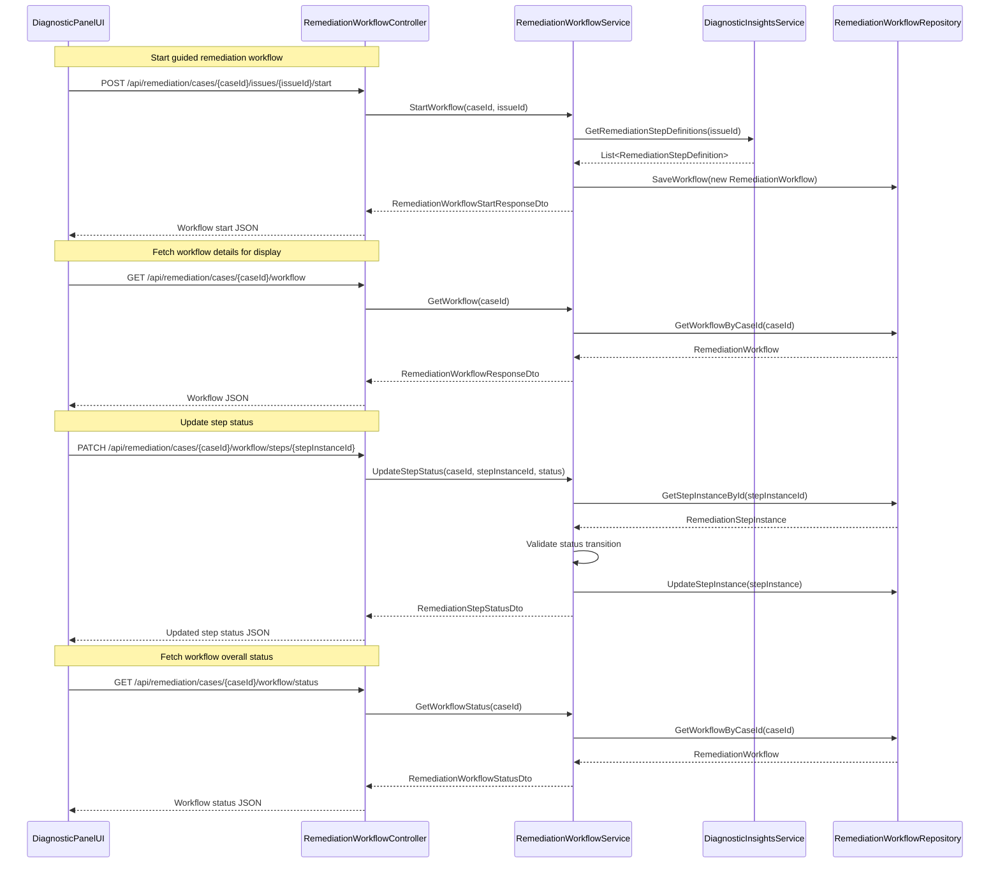
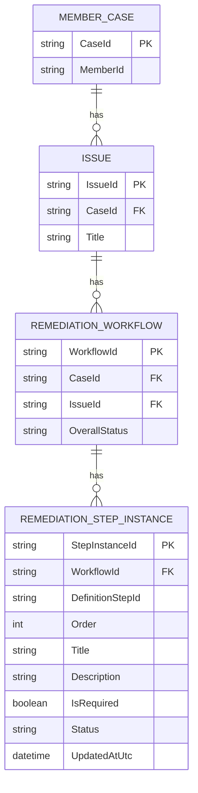

# Repository: APB_Demo
# Branch: INTTESTINGDEMO1
# Folder: LLD

1. Objective
As a support agent, the system must provide a guided workflow in the diagnostic panel to resolve member issues efficiently. The objective is to surface AI-generated remediation steps as a structured workflow, clearly indicating required actions and completion status until the issue is resolved. This LLD defines backend C# APIs, React UI, and database changes to support an efficient issue resolution workflow.

2. Backend C# API Details

2.1. API Model

2.1.1. Common Components/Services
- RemediationWorkflowController (ASP.NET Core API controller for remediation workflow operations).
- RemediationWorkflowService (application service implementing business logic for generating and tracking remediation workflows).
- DiagnosticInsightsService (service providing detected issues and associated remediation step definitions).
- RemediationWorkflowRepository (data access layer to persist workflow instances and step completion state per member case).

2.1.2. API Details
| Operation                              | REST Method | Type    | URL                                                       | Request JSON                                                                                              | Response JSON                                                                                                                                                                         |
|----------------------------------------|------------|---------|-----------------------------------------------------------|-----------------------------------------------------------------------------------------------------------|--------------------------------------------------------------------------------------------------------------------------------------------------------------------------------------|
| GetRemediationWorkflowForCase          | GET        | Query  | /api/remediation/cases/{caseId}/workflow                 | N/A                                                                                                       | { "caseId": "string", "issueId": "string", "steps": [ { "stepInstanceId": "string", "definitionStepId": "string", "order": "number", "title": "string", "description": "string", "isRequired": "boolean", "status": "string" } ], "overallStatus": "string" } |
| StartRemediationWorkflowForIssue       | POST       | Command| /api/remediation/cases/{caseId}/issues/{issueId}/start   | { "caseId": "string", "issueId": "string" }                                                          | { "caseId": "string", "issueId": "string", "workflowId": "string", "overallStatus": "string" }                                                                            |
| UpdateRemediationStepStatus            | PATCH      | Command| /api/remediation/cases/{caseId}/workflow/steps/{stepInstanceId} | { "status": "string" }                                                                            | { "stepInstanceId": "string", "status": "string", "updatedAtUtc": "string" }                                                                                                |
| GetRemediationWorkflowStatusForCase    | GET        | Query  | /api/remediation/cases/{caseId}/workflow/status          | N/A                                                                                                       | { "caseId": "string", "workflowId": "string", "overallStatus": "string", "completedStepCount": "number", "totalStepCount": "number" }                                 |

2.1.3. Exceptions
- WorkflowNotFoundException: Thrown when no remediation workflow exists for the given caseId and issueId.
- StepInstanceNotFoundException: Thrown when the specified stepInstanceId cannot be found in the workflow.
- InvalidStepStatusTransitionException: Thrown when an update attempts an invalid status transition (e.g., Completed -> NotStarted).

2.2. Functional Design

2.2.1. Class Diagram

```mermaid
classDiagram
    class RemediationWorkflowController {
        +GetRemediationWorkflowForCase(caseId: string): RemediationWorkflowResponseDto
        +StartRemediationWorkflowForIssue(caseId: string, issueId: string): RemediationWorkflowStartResponseDto
        +UpdateRemediationStepStatus(caseId: string, stepInstanceId: string, status: string): RemediationStepStatusDto
        +GetRemediationWorkflowStatusForCase(caseId: string): RemediationWorkflowStatusDto
    }

    class RemediationWorkflowService {
        +GetWorkflow(caseId: string): RemediationWorkflowResponseDto
        +StartWorkflow(caseId: string, issueId: string): RemediationWorkflowStartResponseDto
        +UpdateStepStatus(caseId: string, stepInstanceId: string, status: string): RemediationStepStatusDto
        +GetWorkflowStatus(caseId: string): RemediationWorkflowStatusDto
    }

    class DiagnosticInsightsService {
        +GetRemediationStepDefinitions(issueId: string): List~RemediationStepDefinition~
    }

    class RemediationWorkflowRepository {
        +GetWorkflowByCaseId(caseId: string): RemediationWorkflow
        +SaveWorkflow(workflow: RemediationWorkflow): void
        +GetStepInstanceById(stepInstanceId: string): RemediationStepInstance
        +UpdateStepInstance(stepInstance: RemediationStepInstance): void
    }

    class RemediationWorkflow {
        +WorkflowId: string
        +CaseId: string
        +IssueId: string
        +Steps: List~RemediationStepInstance~
        +OverallStatus: string
    }

    class RemediationStepDefinition {
        +DefinitionStepId: string
        +Order: int
        +Title: string
        +Description: string
        +IsRequired: bool
    }

    class RemediationStepInstance {
        +StepInstanceId: string
        +DefinitionStepId: string
        +Order: int
        +Title: string
        +Description: string
        +IsRequired: bool
        +Status: string
        +UpdatedAtUtc: DateTime
    }

    class RemediationWorkflowResponseDto {
        +CaseId: string
        +IssueId: string
        +Steps: List~RemediationStepInstanceDto~
        +OverallStatus: string
    }

    class RemediationStepInstanceDto {
        +StepInstanceId: string
        +DefinitionStepId: string
        +Order: int
        +Title: string
        +Description: string
        +IsRequired: bool
        +Status: string
    }

    class RemediationWorkflowStartResponseDto {
        +CaseId: string
        +IssueId: string
        +WorkflowId: string
        +OverallStatus: string
    }

    class RemediationStepStatusDto {
        +StepInstanceId: string
        +Status: string
        +UpdatedAtUtc: DateTime
    }

    class RemediationWorkflowStatusDto {
        +CaseId: string
        +WorkflowId: string
        +OverallStatus: string
        +CompletedStepCount: int
        +TotalStepCount: int
    }

    RemediationWorkflowController --> RemediationWorkflowService
    RemediationWorkflowService --> DiagnosticInsightsService
    RemediationWorkflowService --> RemediationWorkflowRepository
    RemediationWorkflowResponseDto --> RemediationStepInstanceDto
```

2.2.2. UML Sequence Diagram

2.2.3. Components
| Component Name                     | Description                                                                                       | Existing/New |
|-----------------------------------|---------------------------------------------------------------------------------------------------|-------------|
| RemediationWorkflowController     | Exposes endpoints for starting and managing remediation workflows per case and issue.            | New         |
| RemediationWorkflowService        | Implements business logic for workflow creation, retrieval, and step status updates.             | New         |
| DiagnosticInsightsService         | Provides issue-level remediation step definitions from AI insights.                              | Existing    |
| RemediationWorkflowRepository     | Persists remediation workflows and step instances in the database.                               | New         |
| RemediationWorkflowResponseDto    | DTO representing workflow details for display in the UI.                                         | New         |
| RemediationWorkflowStartResponseDto| DTO representing workflow start information.                                                     | New         |
| RemediationStepStatusDto          | DTO representing updated status of an individual step.                                           | New         |
| RemediationWorkflowStatusDto      | DTO summarizing workflow progress and completion statistics.                                     | New         |

2.3. Service Layer Business Logic
- Service architecture & dependency injection:
  - RemediationWorkflowController depends on RemediationWorkflowService via constructor injection.
  - RemediationWorkflowService depends on DiagnosticInsightsService and RemediationWorkflowRepository via DI.
  - RemediationWorkflowRepository implements a repository interface backed by EF Core.

- Workflow:
  - StartWorkflow: For a given caseId and issueId, retrieve step definitions from DiagnosticInsightsService, create RemediationStepInstance items with NotStarted status, and persist a new RemediationWorkflow with OverallStatus = "NotStarted".
  - GetWorkflow: Retrieve persisted RemediationWorkflow for a caseId and map it to RemediationWorkflowResponseDto.
  - UpdateStepStatus: Validate allowed transitions (NotStarted -> InProgress -> Completed). If valid, update step status and UpdatedAtUtc, then recompute OverallStatus based on required steps completion.
  - GetWorkflowStatus: Aggregate step statuses to compute completedStepCount, totalStepCount, and overallStatus.

- Caching strategy:
  - No additional caching; workflows are read and written via database with typical EF Core tracking.

- Validation rules
| Field Name        | Validation                                                                                 | Error Message                                                          | Class Used                  |
|-------------------|--------------------------------------------------------------------------------------------|------------------------------------------------------------------------|-----------------------------|
| caseId            | Required; non-empty; must match valid case identifier pattern                              | "CaseId is required and must be valid."                               | RemediationWorkflowService  |
| issueId           | Required; non-empty; must be associated with an existing diagnostic issue for the case     | "IssueId is required and must be associated with the case."           | RemediationWorkflowService  |
| stepInstanceId    | Required; non-empty; must exist in the workflow                                            | "StepInstanceId is required and must reference an existing step."     | RemediationWorkflowService  |
| status            | Must be one of NotStarted, InProgress, Completed; must follow allowed transition sequence  | "Invalid step status or status transition."                           | RemediationWorkflowService  |

2.4. Service Integrations
| System              | Integrated For                                  | Integration Type   |
|---------------------|--------------------------------------------------|--------------------|
| Application Database| Persisting remediation workflows and step instances | Synchronous DB ORM |
| AI Engine           | Providing remediation step definitions per issue | Synchronous HTTP   |

3. Front End React Details

3.1. UI Component Architecture
- Component hierarchy:
  - DiagnosticPanelPage
    - IssueSummaryHeader
    - RemediationWorkflowPanel
      - RemediationWorkflowStepList
        - RemediationWorkflowStepItem
    - WorkflowProgressSummaryBar

- Data flow:
  - DiagnosticPanelPage passes caseId and issueId to RemediationWorkflowPanel.
  - RemediationWorkflowPanel uses RemediationWorkflow hooks to start and fetch the workflow, then provides steps to RemediationWorkflowStepList.
  - RemediationWorkflowStepItem receives individual step properties and exposes actions to mark step status changes.
  - WorkflowProgressSummaryBar receives overallStatus, completedStepCount, and totalStepCount via props.

- State management:
  - RemediationWorkflowPanel maintains state: { workflow, isLoading, error } using useState.
  - A custom hook useRemediationWorkflow(caseId: string, issueId: string) encapsulates API calls for starting and fetching workflow.
  - Step-level status updates trigger state updates via immutable state patterns.

- Props interfaces:
  - RemediationWorkflowPanelProps: { caseId: string; issueId: string }
  - RemediationWorkflowStepListProps: { steps: RemediationWorkflowStepViewModel[]; onUpdateStepStatus: (stepInstanceId: string, status: string) => void }
  - RemediationWorkflowStepItemProps: { step: RemediationWorkflowStepViewModel; onStatusChange: (stepInstanceId: string, status: string) => void }
  - WorkflowProgressSummaryBarProps: { overallStatus: string; completedStepCount: number; totalStepCount: number }

- Routing:
  - Route /cases/:caseId/issues/:issueId/diagnostic-panel uses DiagnosticPanelPage which renders RemediationWorkflowPanel for the active issue.

3.2. UI Specifications
- Wireframes/pages:
  - RemediationWorkflowPanel displays steps in a vertical list with step titles, descriptions, required flags, and status chips.
  - WorkflowProgressSummaryBar shows a progress bar and textual summary (e.g., "3 of 5 steps completed").

- Responsive breakpoints:
  - Mobile: Steps displayed as collapsible cards; actions accessible via buttons inside each card.
  - Tablet/Desktop: Steps displayed as full-width rows with inline status and action controls.

- Form structures with validation:
  - Step status updates initiated via buttons (Start, Complete) and validated client-side against allowed transitions before calling API.

- User interaction patterns:
  - Clicking "Start" sets step status to InProgress; clicking "Complete" sets status to Completed.
  - Completed steps visually distinguished (e.g., check icon and muted color).
  - Overall workflow status shows "In Progress" until all required steps are completed; then "Resolved".

3.3. API Integration
- HTTP client configuration:
  - Use shared Axios/fetch client with base URL /api and authorization headers.

- Call patterns and error handling:
  - On mount, useRemediationWorkflow sends POST /api/remediation/cases/{caseId}/issues/{issueId}/start if no workflow exists, then GET /api/remediation/cases/{caseId}/workflow.
  - Step status changes call PATCH /api/remediation/cases/{caseId}/workflow/steps/{stepInstanceId} with new status.
  - Errors returned from API set error state and show inline error banners in RemediationWorkflowPanel.

- Loading states:
  - Skeleton or spinner shown while workflow is being created or loaded.
  - Buttons disabled while step status update is in flight.

- Data transformation:
  - RemediationWorkflowResponseDto mapped to RemediationWorkflowStepViewModel with view-friendly labels and derived flags.

4. Database Details

4.1. ER Model

4.2. Database Validations
- ISSUE.CaseId must reference an existing MEMBER_CASE.CaseId.
- REMEDIATION_WORKFLOW.CaseId must reference MEMBER_CASE.CaseId; IssueId must reference ISSUE.IssueId.
- REMEDIATION_STEP_INSTANCE.WorkflowId must reference REMEDIATION_WORKFLOW.WorkflowId.
- REMEDIATION_STEP_INSTANCE.Order must be greater than 0 and unique within a workflow.

5. Non-Functional Requirements

5.1. Performance
- Starting a remediation workflow must complete within 1 second under normal load.
- Step status updates must be processed and persisted within 500 ms.

5.2. Security (Authentication & Authorization)
- All remediation endpoints require authenticated support agent identity via JWT or equivalent.
- Authorization ensures agents can only start or modify workflows for cases they are assigned or permitted to manage.

5.3. Logging (Application, Audit, Monitoring)
- Log workflow creation per caseId and issueId.
- Log step status changes with agent identity and timestamps as audit records.
- Capture metrics for average time to resolve workflows and step completion rates.

6. Dependencies
- ASP.NET Core 8 for API hosting.
- Entity Framework Core for workflow persistence.
- React 18 for diagnostic panel UI.
- Existing AI engine providing remediation step definitions per issue.

7. Assumptions
- Issues are already identified in the diagnostic panel and have unique issueId values per member case.
- AI-generated remediation step definitions are available via DiagnosticInsightsService.
- Only one active remediation workflow exists per caseId and issueId combination.
