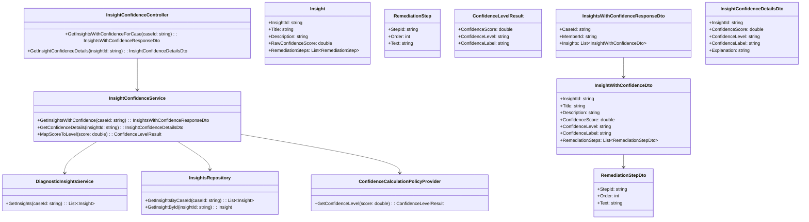
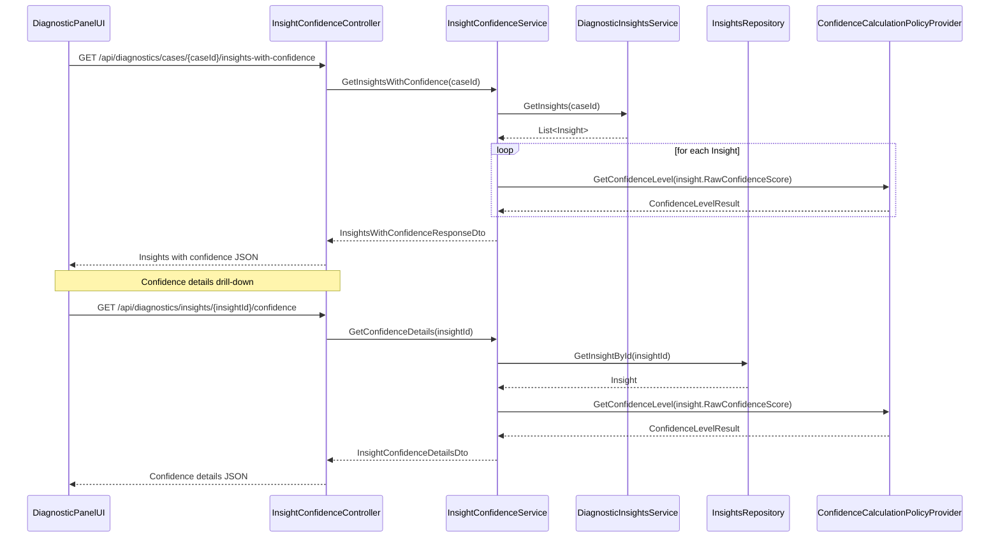
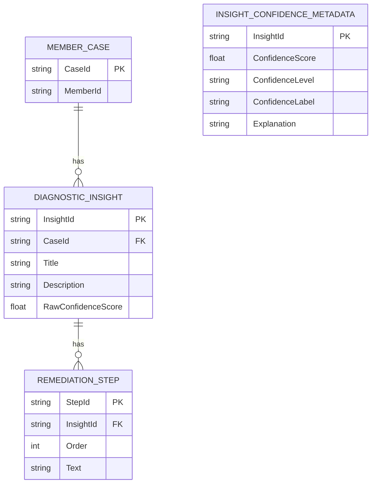

# Repository: APB_Demo
# Branch: INTTESTINGDEMO1
# Folder: LLD

1. Objective
As a support agent, the system must display confidence indicators on AI-generated diagnostic insights within the diagnostic panel. The objective is to allow agents to quickly judge the strength of underlying analysis and decide how strongly to rely on recommendations. This LLD defines the backend C# APIs, React UI, and data model required to surface confidence levels for each insight.

2. Backend C# API Details

2.1. API Model

2.1.1. Common Components/Services
- InsightConfidenceController (ASP.NET Core API controller to expose insight confidence-related endpoints).
- InsightConfidenceService (application service to calculate and format insight confidence levels for display).
- DiagnosticInsightsService (existing service that retrieves AI diagnostic insights and remediation steps for a member case).
- InsightsRepository (data access layer storing raw insights and confidence metadata per insight).
- ConfidenceCalculationPolicyProvider (component that encapsulates rules for mapping AI engine confidence outputs into standardized confidence levels).

2.1.2. API Details
| Operation                          | REST Method | Type   | URL                                                     | Request JSON                                                                                 | Response JSON                                                                                                                                    |
|------------------------------------|------------|--------|---------------------------------------------------------|----------------------------------------------------------------------------------------------|--------------------------------------------------------------------------------------------------------------------------------------------------|
| GetInsightsWithConfidenceForCase   | GET        | Query | /api/diagnostics/cases/{caseId}/insights-with-confidence | N/A                                                                                          | { "caseId": "string", "memberId": "string", "insights": [ { "insightId": "string", "title": "string", "description": "string", "confidenceScore": "number", "confidenceLevel": "string", "confidenceLabel": "string", "remediationSteps": [ { "stepId": "string", "order": "number", "text": "string" } ] } ] } |
| GetInsightConfidenceDetails        | GET        | Query | /api/diagnostics/insights/{insightId}/confidence        | N/A                                                                                          | { "insightId": "string", "confidenceScore": "number", "confidenceLevel": "string", "confidenceLabel": "string", "explanation": "string" }                                      |

2.1.3. Exceptions
- InsightNotFoundException: Thrown when an insightId does not exist in InsightsRepository.
- ConfidenceCalculationException: Thrown when mapping AI confidence to standardized confidence levels fails.

2.2. Functional Design

2.2.1. Class Diagram

2.2.2. UML Sequence Diagram

2.2.3. Components
| Component Name                        | Description                                                                                       | Existing/New |
|--------------------------------------|---------------------------------------------------------------------------------------------------|-------------|
| InsightConfidenceController          | Exposes endpoints to retrieve insights with confidence and confidence details per insight.       | New         |
| InsightConfidenceService             | Applies confidence calculation rules and prepares DTOs for UI consumption.                       | New         |
| DiagnosticInsightsService            | Provides list of base Insight domain objects per case.                                           | Existing    |
| InsightsRepository                   | Persists and retrieves Insight entities including raw confidence score.                          | Existing    |
| ConfidenceCalculationPolicyProvider  | Centralizes mapping between raw AI confidence values and standardized confidence levels/labels. | New         |
| InsightsWithConfidenceResponseDto    | DTO returned for case-level insights with confidence.                                            | New         |
| InsightConfidenceDetailsDto          | DTO returned for detailed confidence information for a single insight.                           | New         |

2.3. Service Layer Business Logic
- Service architecture & dependency injection:
  - InsightConfidenceController depends on InsightConfidenceService via constructor injection.
  - InsightConfidenceService depends on DiagnosticInsightsService, InsightsRepository, and ConfidenceCalculationPolicyProvider via DI.
  - ConfidenceCalculationPolicyProvider is registered as singleton because mapping rules are stateless.

- Workflow:
  - For a given caseId, InsightConfidenceService calls DiagnosticInsightsService.GetInsights to retrieve raw Insight entities.
  - For each Insight, InsightConfidenceService sends Insight.RawConfidenceScore to ConfidenceCalculationPolicyProvider.GetConfidenceLevel.
  - ConfidenceCalculationPolicyProvider returns ConfidenceLevelResult, which is combined with Insight data to form InsightWithConfidenceDto.
  - The collection of InsightWithConfidenceDto objects is wrapped in InsightsWithConfidenceResponseDto and returned to the controller.
  - Confidence details endpoint retrieves a single Insight by insightId and runs the same mapping, adding a textual explanation for the confidence label.

- Caching strategy:
  - Case-level insights with confidence are cached per caseId for a short duration (e.g., 60 seconds) to avoid redundant recalculations.
  - Single-insight confidence details are not cached initially; they rely on cached case-level results where possible.

- Validation rules
| Field Name        | Validation                                                      | Error Message                                                  | Class Used                   |
|-------------------|-----------------------------------------------------------------|----------------------------------------------------------------|------------------------------|
| caseId            | Required; non-empty; must match valid case identifier pattern   | "CaseId is required and must be valid."                       | InsightConfidenceService     |
| insightId         | Required; non-empty; must exist in InsightsRepository           | "InsightId is required and must reference an existing insight."| InsightConfidenceService     |
| RawConfidenceScore| Must be between 0.0 and 1.0 inclusive                           | "Confidence score must be between 0.0 and 1.0."               | ConfidenceCalculationPolicyProvider |

2.4. Service Integrations
| System             | Integrated For                            | Integration Type   |
|--------------------|--------------------------------------------|--------------------|
| Application Database| Persisting raw confidence scores per insight | Synchronous DB ORM |
| AI Engine           | Providing raw confidence values           | Synchronous HTTP   |

3. Front End React Details

3.1. UI Component Architecture
- Component hierarchy:
  - DiagnosticPanelPage
    - DiagnosticInsightsList
      - DiagnosticInsightItem
        - InsightConfidenceIndicator
        - RemediationStepsList
    - InsightConfidenceDetailsModal

- Data flow:
  - DiagnosticPanelPage fetches insights with confidence via GetInsightsWithConfidenceForCase.
  - DiagnosticInsightsList receives InsightWithConfidenceViewModel[] via props.
  - DiagnosticInsightItem passes confidenceScore, confidenceLevel, and confidenceLabel to InsightConfidenceIndicator.
  - InsightConfidenceIndicator displays visual representation of confidence and can trigger opening InsightConfidenceDetailsModal.
  - InsightConfidenceDetailsModal requests detailed confidence info using insightId when opened.

- State management:
  - DiagnosticPanelPage state: { insightsWithConfidence, isLoading, error, selectedInsightId, isConfidenceDetailsOpen }.
  - A custom hook useInsightsWithConfidence(caseId: string) encapsulates fetching of case-level insights with confidence.
  - A custom hook useInsightConfidenceDetails(insightId: string | null) fetches confidence details when modal is opened.

- Props interfaces:
  - DiagnosticInsightsListProps: { insights: InsightWithConfidenceViewModel[] }
  - DiagnosticInsightItemProps: { insight: InsightWithConfidenceViewModel; onShowConfidenceDetails: (insightId: string) => void }
  - InsightConfidenceIndicatorProps: { confidenceScore: number; confidenceLevel: string; confidenceLabel: string }
  - InsightConfidenceDetailsModalProps: { isOpen: boolean; insightId: string | null; onClose: () => void }

- Routing:
  - Route /cases/:caseId/diagnostic-panel continues to host confidence indicators inside existing diagnostic panel.

3.2. UI Specifications
- Wireframes/pages:
  - DiagnosticPanelPage lists insights with a confidence badge (e.g., Low/Medium/High) and numeric score icon.
  - Clicking the confidence indicator opens InsightConfidenceDetailsModal with textual explanation.

- Responsive breakpoints:
  - Mobile: Confidence indicator shown as colored pill with short text; modal uses full-screen overlay.
  - Tablet/Desktop: Confidence indicator shows icon, score, and label; modal centered with fixed width.

- Form structures with validation:
  - No new input forms; interactions are primarily click actions to open details.

- User interaction patterns:
  - Hover over confidence indicator shows tooltip with confidenceLabel.
  - Click on indicator opens modal; ESC or close button dismisses modal.

3.3. API Integration
- HTTP client configuration:
  - Use shared Axios/fetch client pointed at /api with authorization headers.

- Call patterns and error handling:
  - On mount, useInsightsWithConfidence calls GET /api/diagnostics/cases/{caseId}/insights-with-confidence.
  - On selection of an insight, useInsightConfidenceDetails calls GET /api/diagnostics/insights/{insightId}/confidence.
  - Any 4xx/5xx errors set error state and render inline error banner; modal shows a message if confidence details fail to load.

- Loading states:
  - Skeleton placeholders displayed while insights with confidence are loading.
  - Spinner inside InsightConfidenceDetailsModal while confidence details are being fetched.

- Data transformation:
  - InsightsWithConfidenceResponseDto mapped to InsightWithConfidenceViewModel with preformatted labels and thresholds for color coding.
  - InsightConfidenceDetailsDto mapped to view model used in modal.

4. Database Details

4.1. ER Model

4.2. Database Validations
- DIAGNOSTIC_INSIGHT.CaseId must reference an existing MEMBER_CASE.CaseId.
- DIAGNOSTIC_INSIGHT.RawConfidenceScore must be between 0.0 and 1.0.
- INSIGHT_CONFIDENCE_METADATA.InsightId must reference an existing DIAGNOSTIC_INSIGHT.InsightId.

5. Non-Functional Requirements

5.1. Performance
- Retrieving insights with confidence for a case must complete within 700 ms under normal load.
- Confidence calculation must be in-memory and O(n) relative to the number of insights.

5.2. Security (Authentication & Authorization)
- Endpoints must require authenticated support agent identity via JWT or equivalent.
- Authorization must ensure agents can only view confidence for cases they are allowed to access.

5.3. Logging (Application, Audit, Monitoring)
- Log each request to GetInsightsWithConfidenceForCase with caseId and number of insights returned.
- Log errors from ConfidenceCalculationPolicyProvider, including invalid scores.
- Audit logs when agents open confidence details for an insight.

6. Dependencies
- ASP.NET Core 8 for API hosting.
- Entity Framework Core for database access.
- React 18 for diagnostic panel UI.
- Existing AI engine capable of returning raw confidence scores per insight.

7. Assumptions
- Base diagnostic insights retrieval is already implemented by DiagnosticInsightsService.
- Raw confidence scores are available per insight from the AI engine and stored in DIAGNOSTIC_INSIGHT.RawConfidenceScore.
- Confidence levels initially follow three tiers (Low, Medium, High) based on simple numeric thresholds.
