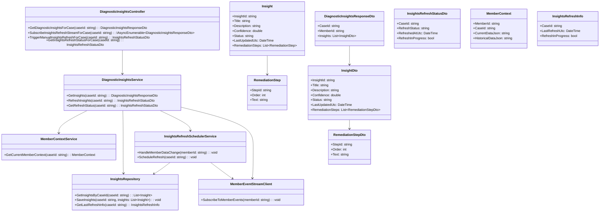
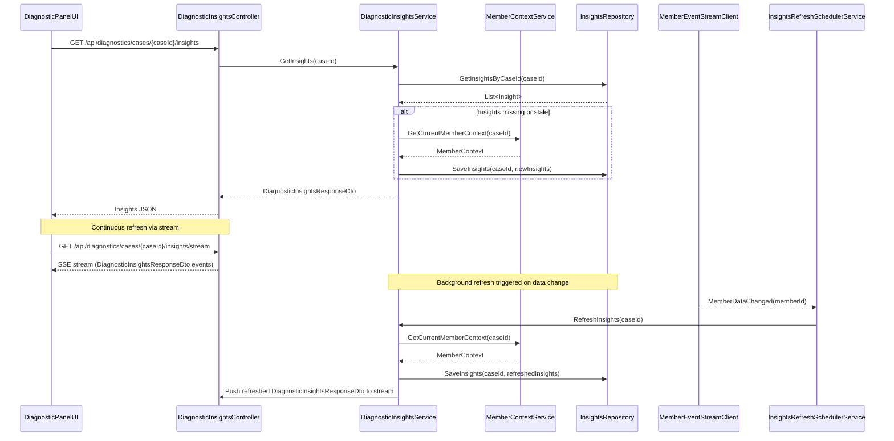
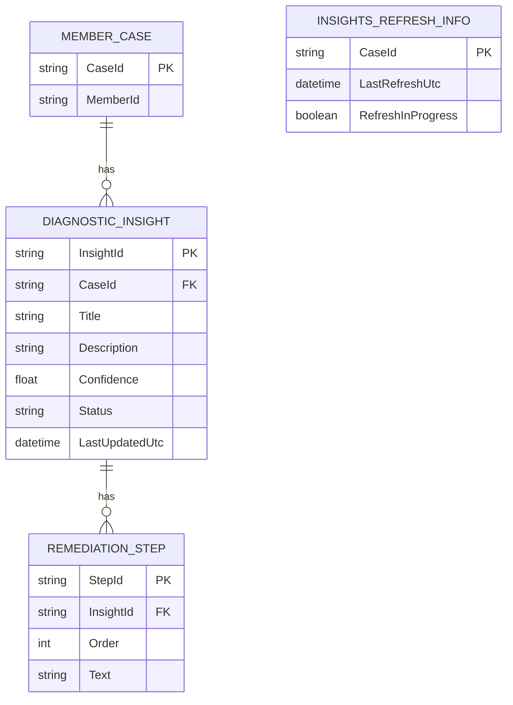

# Repository: APB_Demo
# Branch: INTTESTINGDEMO1
# Folder: LLD

1. Objective
As a support agent, the system must refresh diagnostic insights in the diagnostic panel automatically without requiring manual reload. The objective is to keep insights and remediation instructions in sync with the latest member data in near real time. This LLD defines the backend C# APIs, React UI changes, and data model required to support continuous insight refresh for an open member case.

2. Backend C# API Details

2.1. API Model

2.1.1. Common Components/Services
- DiagnosticInsightsController (ASP.NET Core API controller to manage insight retrieval and refresh endpoints).
- DiagnosticInsightsService (application service providing business logic for retrieving and refreshing insights for a member case).
- MemberContextService (service responsible for retrieving current and historical member data required for insight analysis refresh).
- InsightsRefreshSchedulerService (background service that detects relevant member data changes and triggers insight recomputation).
- InsightsRepository (data access layer for persisting and retrieving diagnostic insights and remediation instructions for a member case).
- MemberEventStreamClient (integration client to consume member data change events from an external event stream or message bus).

2.1.2. API Details
| Operation                                 | REST Method | Type   | URL                                                  | Request JSON                                                                                  | Response JSON                                                                                                                      |
|-------------------------------------------|------------|--------|------------------------------------------------------|-----------------------------------------------------------------------------------------------|-------------------------------------------------------------------------------------------------------------------------------------|
| GetDiagnosticInsightsForCase              | GET        | Query | /api/diagnostics/cases/{caseId}/insights            | N/A                                                                                           | { "caseId": "string", "memberId": "string", "insights": [ { "insightId": "string", "title": "string", "description": "string", "confidence": "number", "status": "string", "lastUpdatedUtc": "string", "remediationSteps": [ { "stepId": "string", "order": "number", "text": "string" } ] } ] } |
| SubscribeInsightsRefreshStreamForCase     | GET        | Query | /api/diagnostics/cases/{caseId}/insights/stream     | N/A                                                                                           | Server-Sent Events stream where each event data payload is: { "caseId": "string", "insights": [ { "insightId": "string", "title": "string", "description": "string", "confidence": "number", "status": "string", "lastUpdatedUtc": "string", "remediationSteps": [ { "stepId": "string", "order": "number", "text": "string" } ] } ] } |
| TriggerManualInsightsRefreshForCase       | POST       | Command| /api/diagnostics/cases/{caseId}/insights/refresh    | { "caseId": "string" }                                                                     | { "caseId": "string", "refreshStatus": "string", "refreshedAtUtc": "string" }                                                                                     |
| GetInsightsRefreshStatusForCase           | GET        | Query | /api/diagnostics/cases/{caseId}/insights/refreshStatus | N/A                                                                                        | { "caseId": "string", "lastRefreshUtc": "string", "refreshInProgress": "boolean" }                                                                               |

2.1.3. Exceptions
- CaseNotFoundException: Thrown when the specified caseId does not exist or is not associated with a diagnostic panel.
- MemberDataUnavailableException: Thrown when required member data cannot be retrieved from MemberContextService during refresh.
- InsightsRefreshFailedException: Thrown when the recomputation of insights fails due to downstream errors.
- InsightsStreamSubscriptionException: Thrown when the server fails to establish a stream connection for continuous refresh.

2.2. Functional Design

2.2.1. Class Diagram

2.2.2. UML Sequence Diagram

2.2.3. Components
| Component Name                    | Description                                                                                   | Existing/New |
|----------------------------------|-----------------------------------------------------------------------------------------------|-------------|
| DiagnosticInsightsController     | Exposes REST endpoints for retrieving and streaming diagnostic insights for a case.          | New         |
| DiagnosticInsightsService        | Implements business logic for insight retrieval and refresh based on member data changes.    | New         |
| InsightsRepository               | Persists and retrieves diagnostic insights and refresh metadata per case.                    | New         |
| MemberContextService             | Provides consolidated member context data used for insight computation.                      | New         |
| MemberEventStreamClient          | Listens to external member data change events to trigger insight refresh.                    | New         |
| InsightsRefreshSchedulerService  | Orchestrates refresh scheduling upon incoming member events and updates the stream.          | New         |
| DiagnosticInsightsResponseDto    | DTO for returning insights and remediation steps to the client.                              | New         |
| InsightsRefreshStatusDto         | DTO for returning refresh status info for a case.                                             | New         |

2.3. Service Layer Business Logic
- Service architecture & dependency injection:
  - DiagnosticInsightsController depends on DiagnosticInsightsService via constructor injection.
  - DiagnosticInsightsService depends on InsightsRepository, MemberContextService, MemberEventStreamClient, and InsightsRefreshSchedulerService via DI.
  - MemberEventStreamClient and InsightsRefreshSchedulerService are registered as singleton services to maintain long-lived event subscriptions.
  - InsightsRepository is registered as a scoped service using the application DbContext.

- Workflow:
  - When UI requests current insights, DiagnosticInsightsService queries InsightsRepository by caseId.
  - If no insights exist or the last refresh timestamp is older than a configured freshness threshold, DiagnosticInsightsService retrieves MemberContext from MemberContextService and recomputes insights, saving them via InsightsRepository.
  - UI can subscribe to an SSE stream endpoint. The controller uses an asynchronous stream of DiagnosticInsightsResponseDto objects to push updates when InsightsRepository changes for the caseId.
  - MemberEventStreamClient listens to member data change events. On relevant events, InsightsRefreshSchedulerService determines impacted caseIds and calls DiagnosticInsightsService.RefreshInsights for each.

- Caching strategy:
  - In-memory cache keyed by caseId storing the latest DiagnosticInsightsResponseDto for quick retrieval.
  - Cache entries have a short TTL (e.g., 30 seconds) and are invalidated on member data change events.

- Validation rules
| Field Name       | Validation                                                 | Error Message                                         | Class Used                         |
|------------------|------------------------------------------------------------|------------------------------------------------------|------------------------------------|
| caseId           | Required; non-empty; matches configured caseId format      | "CaseId is required and must be a valid identifier."| DiagnosticInsightsService          |
| memberId         | Required when building MemberContext; non-empty            | "MemberId is required for insight refresh."         | MemberContextService               |
| insights         | At least one insight required for refresh status success   | "No diagnostic insights available for this case."   | DiagnosticInsightsService          |
| remediationSteps | Steps must be ordered sequentially starting at 1           | "Remediation steps must have a valid order sequence."| DiagnosticInsightsService         |

2.4. Service Integrations
| System                    | Integrated For                            | Integration Type     |
|---------------------------|--------------------------------------------|----------------------|
| Member Data Store         | Retrieving current and historical member data | Synchronous HTTP/DB  |
| Member Event Stream       | Receiving member data change notifications | Asynchronous event   |
| Application Database      | Persisting diagnostic insights and refresh metadata | Synchronous DB ORM |

3. Front End React Details

3.1. UI Component Architecture
- Component hierarchy:
  - DiagnosticPanelPage
    - DiagnosticInsightsHeader
    - DiagnosticInsightsList
      - DiagnosticInsightItem
        - RemediationStepsList
    - InsightsRefreshStatusBar

- Data flow:
  - DiagnosticPanelPage fetches initial insights via GetDiagnosticInsightsForCase and subscribes to the insights stream using caseId.
  - DiagnosticInsightsList receives insights array as props and renders DiagnosticInsightItem components.
  - RemediationStepsList receives remediation steps as props from DiagnosticInsightItem.
  - InsightsRefreshStatusBar receives last refresh time and refresh status as props.

- State management:
  - DiagnosticPanelPage manages state: { insights, isLoading, error, refreshStatus, lastRefreshUtc } via React useState.
  - A custom hook useDiagnosticInsights(caseId: string) encapsulates API calls and SSE subscription logic.

- Props interfaces:
  - DiagnosticInsightsListProps: { insights: InsightViewModel[] }
  - DiagnosticInsightItemProps: { insight: InsightViewModel }
  - RemediationStepsListProps: { steps: RemediationStepViewModel[] }
  - InsightsRefreshStatusBarProps: { lastRefreshUtc: string; refreshInProgress: boolean }

- Routing:
  - Route: /cases/:caseId/diagnostic-panel mapped to DiagnosticPanelPage component.

3.2. UI Specifications
- Wireframes/pages:
  - DiagnosticPanelPage displays a header with case and member details, a list of insights with remediation steps, and a status bar showing "Last refreshed" timestamp and a spinner when refresh is in progress.

- Responsive breakpoints:
  - Mobile: Single-column layout, DiagnosticInsightsList stacked, remediation steps collapsed into accordions.
  - Tablet/Desktop: Two-column layout where insights list is primary and remediation steps can expand inline.

- Form structures with validation:
  - No user input forms introduced by this story; manual refresh button (if present) triggers API without data entry.

- User interaction patterns:
  - Insights list updates automatically when stream events are received; items briefly highlight to indicate updates.
  - Manual refresh button (optional) calls TriggerManualInsightsRefreshForCase and updates status bar.
  - Errors in stream or API are shown as inline non-blocking banners in DiagnosticPanelPage.

3.3. API Integration
- HTTP client configuration:
  - Use a shared Axios instance or fetch wrapper configured with base URL /api and authorization headers.

- Call patterns and error handling:
  - On mount, useDiagnosticInsights calls GET /api/diagnostics/cases/{caseId}/insights to load initial data.
  - If successful, it sets insights and lastRefreshUtc; then opens SSE connection to /api/diagnostics/cases/{caseId}/insights/stream.
  - On SSE message, parse DiagnosticInsightsResponseDto and update insights state and lastRefreshUtc.
  - On HTTP or SSE error, set error state and optionally retry SSE connection with exponential backoff.

- Loading states:
  - isLoading is true until initial insights are loaded; skeleton placeholders shown in DiagnosticInsightsList.
  - Separate isStreaming state indicates whether SSE connection is active.

- Data transformation:
  - DiagnosticInsightsResponseDto mapped to InsightViewModel with formatted timestamps and simplified status labels.
  - RemediationStepDto mapped to RemediationStepViewModel preserving order and text.

4. Database Details

4.1. ER Model

4.2. Database Validations
- DIAGNOSTIC_INSIGHT.CaseId must reference an existing MEMBER_CASE.CaseId.
- REMEDIATION_STEP.InsightId must reference an existing DIAGNOSTIC_INSIGHT.InsightId.
- REMEDIATION_STEP.Order must be greater than 0 and unique per InsightId.
- INSIGHTS_REFRESH_INFO.CaseId must reference an existing MEMBER_CASE.CaseId.

5. Non-Functional Requirements

5.1. Performance
- Initial insights retrieval for a case must respond within 500 ms under normal load.
- SSE stream should deliver updates within 2 seconds of underlying data changes.
- Background refresh operations must not block main API threads and should be processed asynchronously.

5.2. Security (Authentication & Authorization)
- All endpoints must require authenticated support agent identity via JWT or equivalent mechanism.
- Authorization policy ensures agents can access only cases assigned to them or within their allowed scope.
- SSE stream must reuse authenticated session and must not expose data for other caseIds.

5.3. Logging (Application, Audit, Monitoring)
- Log insight refresh start and completion per caseId including duration and outcome.
- Log member data change events handled and any errors during refresh.
- Audit log entries when agents subscribe to or manually refresh insights.
- Expose metrics for number of active insight streams and average refresh time for monitoring.

6. Dependencies
- ASP.NET Core 8 for API hosting.
- Entity Framework Core for data access to diagnostic insights tables.
- A message bus or event streaming platform (e.g., Azure Service Bus or Kafka) for MemberEventStreamClient.
- React 18 and React Router for diagnostic panel UI.

7. Assumptions
- Member cases and basic diagnostic panel UI already exist and provide caseId and memberId to the new components.
- SSE is used for continuous refresh; if unsupported, the client falls back to periodic polling (not detailed here).
- Confidence values and insight computation algorithms are provided by an existing AI engine invoked indirectly via MemberContextService.
